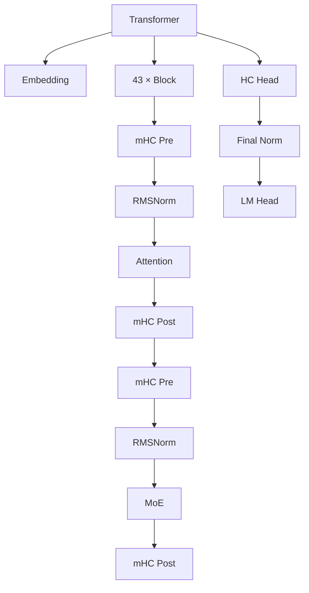
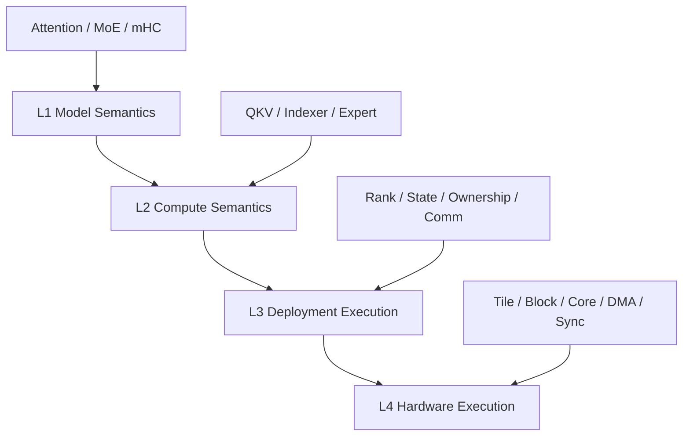
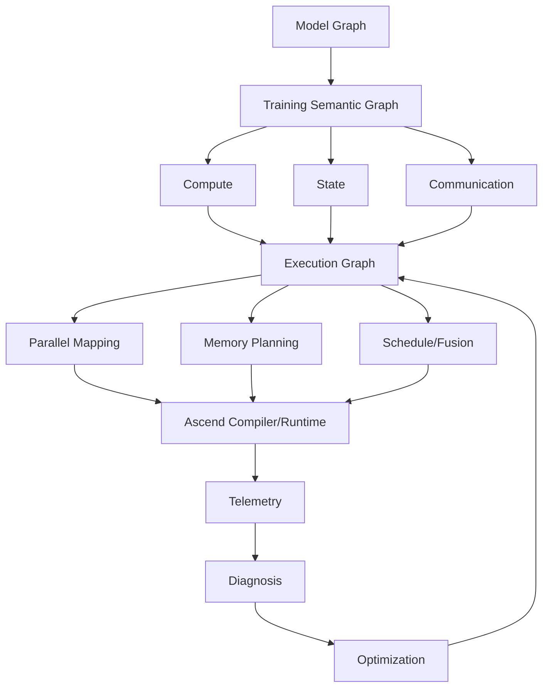
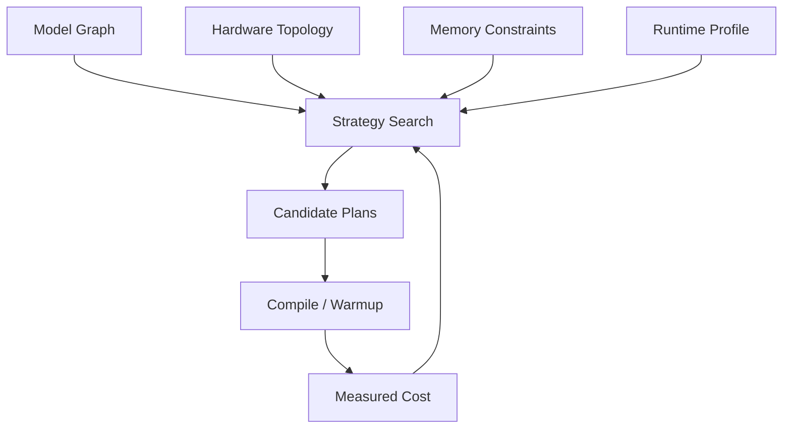
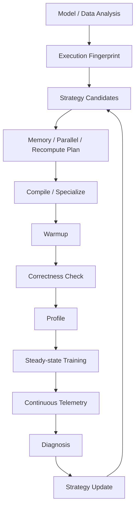
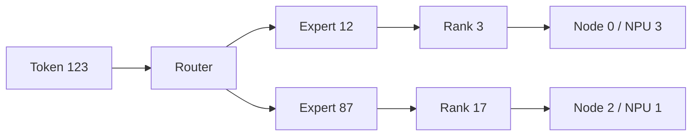
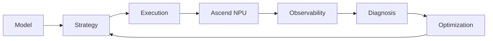

# 问答1 通信视图
按知识库的并行抽象，一个 MoE layer 的跨-rank 通信主要来自 TP、CP、EP、DP/EDP；PP 只在该 layer 恰好位于 stage 边界时发生。

设：

```text
TP size  = T
CP size  = C
EP size  = P
EDP size = Dₑ
普通数据并行度 = D
```

## 层内前向与反向通信

| 模块 | 阶段 | 通信事件 | 传输内容 | 通信范围 |
|---|---|---|---|---:|
| Attention | 前向 | TP All-Reduce | `W_O` 行切后，各 TP rank 算出的部分和 | 同一 TP group，`T` 个 rank |
| Attention | 反向 | TP All-Reduce / Reduce-Scatter | QKV 列切产生的输入梯度部分和 | 同一 TP group，`T` 个 rank |
| Attention | 前向/反向 | CP Ring Send/Recv | 分块的 K/V，以及反向时相应梯度 | 同一 CP group，`C` 个 rank |
| Attention | 前向/反向 | CP All-to-All | Ulysses 实现中重新排列 Q/K/V 和 Attention 输出 | 同一 CP group，`C` 个 rank |
| Router | 前向 | 通常无通信 | 每个 rank 对自己的 token 本地算专家分数 | 本地 |
| Router | 前向 | 可选 All-Reduce | 专家 token 计数、负载均衡统计 | 通常 EP group，`P` 个 rank；依实现而定 |
| Routed MoE | 前向 | All-to-All Dispatch | token 隐状态及路由信息，从原始 rank 发往专家所在 rank | 同一 EP group，`P` 个 rank |
| Routed MoE | 前向 | All-to-All Combine | 专家输出从专家 rank 返回 token 原始 rank | 同一 EP group，`P` 个 rank |
| Routed MoE | 反向 | 反向 Combine All-to-All | 输出梯度从 token 原始 rank 发回专家 rank | 同一 EP group，`P` 个 rank |
| Routed MoE | 反向 | 反向 Dispatch All-to-All | 专家计算出的输入梯度发回 token 原始 rank | 同一 EP group，`P` 个 rank |
| Routed Expert | 前向/反向 | ETP All-Reduce 等 | 专家内部张量并行产生的部分结果或梯度 | 同一 ETP group，`ETP` 个 rank |
| Shared Expert | 前向/反向 | TP All-Reduce 等 | 共享专家 MLP 的部分结果或梯度 | 同一 TP group，`T` 个 rank；不走 EP All-to-All |

知识库中的 Attention TP 前向链路见 [Transformer结构与并行策略知识库.md](D:/Projects/compute-graph-viewer-wzh/Profiling_Insight_and_Tool/ParallelDemo/Transformer结构与并行策略知识库.md:1082)，MoE 的两次前向 All-to-All 见 [同一文件](D:/Projects/compute-graph-viewer-wzh/Profiling_Insight_and_Tool/ParallelDemo/Transformer结构与并行策略知识库.md:1140)。

### EP 通信最直观的四个事件

一次完整训练经过某个 MoE layer，会有：

```text
前向：
1. Dispatch All-to-All
2. Combine  All-to-All

反向：
3. Combine 的反向 All-to-All
4. Dispatch 的反向 All-to-All
```

因此基础实现中，一个 MoE layer 每个 micro-batch 通常有 **4 次 EP All-to-All**，前向两次、反向两次。融合实现可能在 trace 中显示为不同名字或拆成多段，但数据流仍是这四个方向。

以 `Total Routed Experts=256、EP=64` 为例：

```text
EP group 通信范围 = 64 ranks
每个 rank 每层持有 = 256 / 64 = 4 个 routed experts
```

一次 Dispatch 的集体参与者是 64 个 rank，但单个 token 只会被送到其 Top-K 专家所在的 rank，不代表每个 token 都发给全部 64 个 rank。

## 层外或参数同步通信

下面这些由该 layer 产生，但不一定紧挨着该 layer 显示在 trace 中：

| 对象 | 通信事件 | 通信范围 | 说明 |
|---|---|---:|---|
| Attention 参数梯度 | DP All-Reduce / Reduce-Scatter | `D` 个 rank | 同一 Attention 权重副本同步梯度 |
| Router 参数梯度 | DP All-Reduce / Reduce-Scatter | `D` 个 rank | Router 通常不按 EP 切，需在普通 DP 域同步 |
| Shared Expert 参数梯度 | DP All-Reduce / Reduce-Scatter | `D` 个 rank | 共享专家不参与 EP 切分 |
| Routed Expert 参数梯度 | EDP All-Reduce / Reduce-Scatter | `Dₑ` 个 rank | 只在持有同一份本地专家的副本之间同步 |
| stage 边界前向 | PP Send/Recv | 相邻两个 PP rank | 发送 `[B,S,H]` 边界激活 |
| stage 边界反向 | PP Send/Recv | 相邻两个 PP rank | 反向发送 `dL/dx [B,S,H]` |

知识库中的横向 EP group 与纵向 EDP group 区别见 [同一文件](D:/Projects/compute-graph-viewer-wzh/Profiling_Insight_and_Tool/ParallelDemo/Transformer结构与并行策略知识库.md:1294)。

其中：

```text
EP group：同一层的一整套不同专家分片
          → token Dispatch/Combine All-to-All

EDP group：同一个专家分片的多个数据副本
           → routed expert 梯度同步
```

例如 `DP=512、EP=64` 的切出口径：

```text
EP size = 64       → EP All-to-All 每组 64 ranks
EDP = 512/64 = 8   → 同一本地专家分片在 8 ranks 间同步梯度
```

## 一个常见配置下的通信清单

假设：

```text
TP=2、CP=1、EP=64、ETP=1
该 layer 不在 PP stage 边界
```

那么每个 micro-batch 的核心通信可概括为：

| 阶段 | Attention | Routed MoE |
|---|---|---|
| 前向 | 1 次 TP All-Reduce，范围 2 ranks | 2 次 EP All-to-All，范围 64 ranks |
| 反向 | 约 1 次 TP collective，范围 2 ranks | 2 次 EP All-to-All，范围 64 ranks |
| 梯度同步 | Attention 梯度在 DP 域同步 | 专家梯度在 EDP 域同步；Router 在 DP 域同步 |

最后需要修正知识库第 164 行的措辞：“4 个专家在一组”不准确。这里应理解为：

> 每个 MoE layer 中，一个 EP group 有 64 个 rank；每个 EP rank 持有该层的 4 个本地专家。


# 问答2 # DeepSeek-V4 × PyPTO × Ascend：从推理算子工程到 Model-to-NPU 训练工程 https://chatgpt.com/share/6a9a735c-3d9c-83eb-bf44-0443fd5535b4

> 本文基于前述多轮讨论重新校验、补全并扩展。目标不是简单复述问答，而是形成一份可继续在 VSCode 中编辑、拆分、喂给代码助手或作为系统设计输入的 Markdown 长文。
>
> 重点回答四个问题：
>
> 1. DeepSeek-V4 官方整网源码与 PyPTO3 `DeepseekV4` 工程到底是什么关系？
> 2. 这种工程模式真正创新在哪里，为什么它与 Ascend NPU 特别匹配？
> 3. 这种工程思想进入训练后，会如何改变基于 Megatron/MindSpeed 的 Ascend 训练工程、训练流程与策略？
> 4. 可观测系统应该如何从“Profiler”升级为 Model-to-NPU Training Observatory？

---

## 0. 先给最终结论

前面几轮讨论的核心判断是成立的，但需要更严格地区分三类内容：

- **事实层**：DeepSeek-V4 官方论文、官方推理源码、PyPTO 官方文档、MindSpeed 官方仓库能够直接验证的内容。
- **工程解释层**：根据源码结构和编译/运行机制推导出来的架构定位。
- **方案层**：面向 Ascend/Megatron/可观测系统提出的演进建议。

最重要的一句话可以收敛为：

> PyPTO3 的 DeepSeekV4 工程不是 DeepSeek-V4 的另一套模型定义，而是把模型语义进一步 lower 成面向 Ascend/PyPTO 的执行工程：它把 Prefill/Decode、SWA/CSA/HCA、状态、缓存、通信、数据所有权与可编译边界显式化。其核心创新不在“文件拆得多”，而在于让 **Execution Semantics 成为模型工程的一等公民**。

而 DeepSeek-V4 官方技术报告从另一条技术栈独立验证了同一趋势：

> 大模型优化对象已经从“单个算子”扩大为“计算 + 状态 + 通信 + 内存 + 调度”的完整执行阶段；训练系统也开始采用 fine-grained EP、Muon hybrid ZeRO、mHC 重计算/融合、two-stage CP、tensor-level checkpointing 等专门化执行策略。

因此，Ascend 基于 Megatron/MindSpeed 的下一步真正值得做的事情，不只是继续增加 TP/PP/EP/CP、融合算子和优化开关，而是构建：

> **Model Semantics → Training Execution Graph → Data/State Ownership → Parallel Strategy → Compiler/Runtime → NPU → Telemetry → Diagnosis → Optimization**

这一整条闭环。

---

# 1. 前述几轮结论的事实校验

## 1.1 需要保留的结论

以下判断经过重新校验后仍然成立：

| 结论 | 校验结果 | 说明 |
|---|---|---|
| PyPTO3 `deepseek_v4_flash_dspark` 目录共有 49 个 Python 文件 | 成立 | 当前 GitHub 目录可直接计数 |
| `config.py`、`utils.py`、`dspark_prefill.py` 不含 PyPTO JIT | 成立 | 后者主要承担运行/验证入口 |
| DeepSeek-V4-Flash 主干 43 层 | 成立 | 官方 inference config |
| `hc_mult=4` | 成立 | 官方 inference config |
| 256 routed experts、每 token 激活 6 个 expert | 成立 | 官方 inference config |
| 主干 attention 可以按代码路径归类为 2 SWA + 21 CSA + 20 HCA | 成立 | 来自 `compress_ratios` 配置与 `Attention` 分支 |
| 官方参考实现主要是 `Transformer → Block → Attention/MoE` | 成立 | 官方 `model.py` |
| PyPTO 工程将 Prefill/Decode、SWA/CSA/HCA、Compressor、Indexer、MoE 等进一步拆成可编译程序 | 成立 | 当前仓库源码 |
| 一次 Python/JIT 调用不等于一次 NPU Kernel | 成立 | PyPTO 多级编译图决定最终设备任务 |

---

## 1.2 必须修正的结论

### 修正 1：`decode_fwd → decode_layer → ...` 不是当前源码真实调用链

前面把调用关系简化成：

```text
decode_fwd
  ↓
decode_layer
  ↓
SWA / HCA / CSA
  ↓
MoE
```

这张图作为**模型语义层级图**没有问题，但不是当前 PyPTO3 的真实 Python 调用链。

实际情况更接近：

```text
decode_fwd
  ├─ decode_swa
  ├─ decode_csa
  ├─ decode_hca
  └─ moe
```

也就是说：

- `decode_fwd.py` 直接展开 43 层的 attention/MoE 调度。
- `decode_layer.py` 更像单层 Decoder 的集成/编译/验证边界。
- `prefill_fwd.py` 也采用类似方式直接编排各类 Prefill Attention 与 MoE。

因此以后必须区分：

### 模型语义图

```text
Decode Forward
  → Decoder Layer × 43
    → Attention + MoE
```

### 当前源码调用图

```text
decode_fwd
  → decode_swa / decode_csa / decode_hca / moe
```

### 编译运行图

```text
JIT Program
  → Tensor Graph
  → Tile Graph
  → Block Graph
  → Execute Graph
  → 多个设备任务 / kernel / DMA / sync
```

---

### 修正 2：PyPTO3 不是 DeepSeek 官方 V4 实现

这是最重要的事实边界。

PyPTO3 是社区/第三方仓库中的 Ascend/PyPTO 工程实现。

DeepSeek-V4 官方技术报告公开描述的高性能基础设施采用了自己的训练/推理框架与 TileLang 等技术。

因此准确的关系应当写成：

> PyPTO3 DeepSeekV4 与 DeepSeek 官方实现体现了相似的 execution-centric 工程思想，但它们不是同一套官方代码，也不存在“DeepSeek 官方采用 PyPTO”的事实依据。

---

### 修正 3：训练侧很多“建议”其实已经是 DeepSeek-V4 官方事实

前面我们把一些训练方向写成：

> “未来应该做 fine-grained recompute、Muon-aware sharding、two-stage CP……”

更准确的说法是：

> DeepSeek-V4 官方训练基础设施已经实现了这些方向中的相当一部分。

包括：

- fine-grained EP mega-kernel；
- 通信、计算、内存访问的 wave-based overlap；
- Muon hybrid ZeRO；
- mHC recomputation / fusion；
- two-stage Context Parallel；
- tensor-level activation checkpointing；
- 长上下文训练阶段化 curriculum；
- sparse attention / indexer warmup。

所以对 Ascend 的问题不是“这些方向有没有意义”，而是：

> **如何把这些已经验证的模型专用 execution strategy，用 Ascend 原生执行模型重新实现、产品化、可观测化。**

---

## 1.3 MindSpeed 当前 V4 支持也需要准确表述

当前公开的 MindSpeed-LLM DeepSeek-V4-Flash 支持仍处于 preview / prototype 阶段。

大致可以概括为：

| 能力 | 当前公开状态 |
|---|---|
| 定长预训练 | 已支持 |
| TP | 已支持 |
| PP | 已支持 |
| EP | 已支持 |
| CP | 仍在推进 |
| pack | 仍在推进 |
| 变长数据 | 仍在推进 |
| Muon | 仍在推进 |
| 全参/LoRA 微调 | README 仍处于持续完善状态 |

因此：

> DeepSeek 官方 V4 训练工程已经进入“模型专用执行策略”阶段，而 Ascend/MindSpeed 当前 V4 支持仍更接近“在 Megatron/MCore 上完成模型接入并逐项补齐 feature”。

这正是后续工程升级的出发点。

---

# 2. DeepSeek 官方整网源码与 PyPTO3 工程的根本区别

## 2.1 官方参考实现：Model Semantics First

官方模型源码首先关心：

> 模型在数学上如何计算？

所以基本结构仍然是：



官方 `Attention` 内部会根据 `compress_ratio` 选择不同实现。

可以抽象成：

```text
compress_ratio = 0
  → pure sliding-window path

compress_ratio = 4
  → Compressor
  → Indexer
  → sparse selected attention

compress_ratio = 128
  → aggressive Compressor
  → compressed attention
```

这类代码的特点是：

- module hierarchy 清晰；
- 参数归属清晰；
- 数学结构清晰；
- serving runtime 的大量物理事实被后端/框架隐藏。

---

## 2.2 PyPTO3：Execution Semantics First

PyPTO3 关心的是另一个问题：

> 同样的数学结构，到了 NPU 上，应该拆成哪些实际可编译、可复用、可调度、可通信、可缓存的执行阶段？

于是一个模型里的 `Attention` 会继续拆成：

```text
SWA
CSA
HCA
```

其中 CSA 又可能拆成：

```text
HC Pre
RMSNorm
CP Token AllGather
QKV Projection
RoPE
Raw KV write
Compressor
Indexer Compressor
Indexer
TopK
Sparse Attention
Cross-rank exchange
O Projection
HC Post
```

MoE 则会进一步显式化：

```text
Gate
Dispatch
Routed Expert
Combine
Shared Expert
```

因此：

> PyPTO3 不是简单“把大模块拆成小模块”，而是在做 **Execution Decomposition**。

---

# 3. 为什么文件数量会增加：不是“模型层更多”，而是四类 specialization

## 3.1 Phase specialization

```text
prefill_csa
decode_csa

prefill_hca
decode_hca

prefill_swa
decode_swa
```

因为 Prefill 和 Decode 在硬件上的性能目标不同。

### Prefill

- token 多；
- GEMM 大；
- throughput 优先；
- 批量建立缓存/状态；
- 适合大 tile、大规模并行。

### Decode

- token 少；
- 高频执行；
- latency 优先；
- cache lookup 多；
- memory/communication sensitive；
- 小矩阵与调度开销更突出。

因此：

> Prefill / Decode 分离，本质上是把 runtime branch 提升成 compile-time specialization。

---

## 3.2 Algorithm specialization

同一个 `Attention` 类中的不同算法分支被拆成：

- SWA；
- CSA；
- HCA。

这样编译器看到的不再是：

```python
if ratio == 4:
    ...
elif ratio == 128:
    ...
else:
    ...
```

而是确定的数据流程序。

这意味着：

- shape 更确定；
- state 更确定；
- fusion 更容易；
- memory plan 更确定；
- schedule search 空间更容易约束。

---

## 3.3 State specialization

PyPTO 工程开始把传统模型内部 buffer 显式化：

```text
Raw KV
Compressed KV
Indexer KV
Compressor State
Slot Mapping
Block Table
Sequence Length
Scale
Metadata
```

这意味着：

> KV cache 已经不是一个 `Attention` 内部 buffer，而是 serving runtime 的 memory system。

这个变化非常关键。

---

## 3.4 Communication specialization

通信被显式化为程序的一部分：

```text
CP AllGather
remote_store
notify
wait
dispatch
combine
head exchange
```

所以：

> Communication 不再只是“某个算子后面插一个 collective”，而是执行图的一等对象。

---

# 4. 从三层架构升级为四层架构

前面我们曾经用三层理解：

1. 模型架构；
2. 算子工程架构；
3. 编译运行架构。

更准确的方式是拆成四层。

| 层级 | 核心问题 | 典型对象 |
|---|---|---|
| L1 模型数学架构 | 模型是什么 | Block / Attention / MoE / mHC |
| L2 计算语义图 | 具体怎么算 | QKV / Compressor / Indexer / Expert |
| L3 部署执行图 | 数据在哪、谁拥有、如何通信与缓存 | Rank / State / Slot / Block / Dispatch |
| L4 硬件执行图 | 如何 tile、分核、存储、同步与调度 | Tile / Block / AI Core / DMA / Task |

可以画成：



PyPTO3 最大的价值在于：

> 它把 L3 显式得非常多。

而 PyPTO compiler 则继续负责：

> L3 → L4。

---

# 5. 这种工程模式真正创新在哪里

我建议把它定义为：

> **Hardware-Aware Model Execution Engineering**

或者：

> **Model-to-Hardware Co-Design Engineering**

核心不是“算子更多”，而是七个范式变化。

---

## 5.1 从 Model-centric 到 Execution-centric

传统工程对象：

```text
Transformer
Layer
Attention
MoE
```

新的工程对象：

```text
Execution Stage
State
Communication
Ownership
Schedule
```

传统问题：

> “模型有几个 Layer？”

新的问题：

> “这个 Layer 在 NPU 上被拆成哪些执行阶段，这些阶段之间有哪些状态、数据运动和同步依赖？”

---

## 5.2 从 Runtime Condition 到 Compile-time Specialization

传统：

```python
if prefill:
    ...
else:
    ...
```

新的工程模式：

```text
prefill_program
decode_program
```

传统：

```python
if compress_ratio == 4:
    ...
elif compress_ratio == 128:
    ...
```

新的工程模式：

```text
CSA program
HCA program
```

其本质是：

> 提前确定 execution signature。

---

## 5.3 从 Tensor-first 到 State-first

传统 Tensor：

```text
shape
dtype
device
```

新的 Tensor/State Identity：

```yaml
layer_id: 17
semantic_role: activation
execution_stage: CSA.Indexer
owner: CP-rank-3
dtype: bf16
layout: ...
storage: HBM
lifetime: forward -> backward
producer: ...
consumers: ...
recompute_policy: ...
```

这对训练尤其重要。

---

## 5.4 从 Parallel Size 到 Data Ownership

传统：

```text
TP = 4
EP = 16
CP = 8
```

新的问题：

```text
parameter 属于谁？
activation 属于谁？
token 属于谁？
expert 属于谁？
sequence 属于谁？
哪些数据必须跨 rank 迁移？
```

于是并行策略开始变成：

> **Data Ownership Strategy**

---

## 5.5 从 Communication as Side Effect 到 First-class Object

通信对象包括：

- AllGather；
- ReduceScatter；
- AllReduce；
- AllToAll；
- P2P；
- Dispatch；
- Combine；
- remote store；
- notify/wait。

真正的执行图变成：

```text
Compute
Memory
Communication
Synchronization
State
```

共同组成一个 Execution Graph。

---

## 5.6 从 Operator Fusion 到 Execution-stage Fusion

传统融合：

```text
MatMul + Add + RMSNorm
```

新的融合目标：

```text
Projection
→ RoPE
→ Cache Write
→ Compression
→ Indexer
```

或者：

```text
Dispatch
→ Expert Compute
→ Combine
```

也就是说：

> 融合对象从“几个算子”扩大成“完整数据流阶段”。

---

## 5.7 Compiler/Profiler 不再是后端黑盒

PyPTO 的多级编译链：

```text
Tensor Graph
→ Tile Graph
→ Block Graph
→ Execute Graph
```

意味着开发者可以看到：

- 高层计算语义；
- Tile；
- 内存层级；
- Block；
- AI Core 子图；
- 同步依赖；
- runtime timeline。

这使：

> 编译器 IR 和运行时 trace 成为模型工程资产。

---

# 6. 为什么这种模式特别适合 Ascend NPU

## 6.1 根因一：性能瓶颈已经不是单个算子的 FLOPs

DeepSeek-V4 的 MoE 是最好的例子。

真正的执行流程：

```text
Router
→ Dispatch
→ Expert Linear-1
→ Expert Linear-2
→ Combine
```

但高性能实现的重点并不是：

> “每个 Linear 单独最快。”

而是：

> “Dispatch、Expert Compute、Combine 能否形成持续流水，并让通信、计算、内存访问重叠。”

这已经是 execution pipeline 问题。

---

## 6.2 根因二：多级存储要求更早决定数据布局

Tensor 只告诉系统：

```text
我要算什么。
```

Tile/Block 开始告诉系统：

```text
一次处理多少？
数据放哪一层存储？
怎么搬？
谁处理？
何时同步？
能否复用？
```

所以 Tile 的意义不是简单的“Tensor 切块”。

它实际上是：

> **逻辑 Tensor 与 NPU Execution Resource 的桥。**

---

## 6.3 根因三：长上下文和 MoE 会让 Data Ownership 变复杂

在普通 dense Transformer 中，很多数据分片可以相对静态。

但在：

- CSA；
- HCA；
- Indexer；
- MoE；
- CP；
- EP；

场景下，真正的问题变成：

```text
哪个 rank 拥有什么？
什么时候需要补齐？
什么时候需要 gather？
什么时候可以只看局部数据？
```

这迫使系统从：

> Parallelism

升级为：

> Ownership + Movement。

---

## 6.4 根因四：模型创新速度超过固定算子库

如果模型每次出现新结构都必须等待：

```text
框架算子
→ 后端算子
→ kernel
→ profiler
```

层层适配，模型创新速度会被系统拖慢。

DeepSeek 官方使用 TileLang，本质上也是为了缩短：

```text
Model Idea
→ Kernel
→ Performance Feedback
```

的路径。

PyPTO 则试图形成：

```text
Python Model Program
→ Multi-level Graph
→ NPU Execution
```

的连续路径。

---

# 7. 对训练的影响：Execution-centric 思想会改变 Megatron 的核心抽象

传统 Megatron：

```text
Model
→ Transformer Layer
→ TP / PP / EP / CP / DP
→ Collective
→ Kernel
```

主要回答：

> 模型怎么切，才能训练起来？

而新的问题是：

> 模型语义应该如何被映射成一组最适合 Ascend 的训练执行程序？

所以训练系统需要新增：

> **Training Execution Graph**

---

# 8. Training Execution Graph 应该长什么样



它不只描述 Forward。

而是同时描述：

```text
Forward
Backward
Recompute
Gradient Communication
Optimizer
Weight Update
```

---

# 9. 训练中 State-first 比推理更重要

推理状态：

```text
weights
KV cache
runtime metadata
```

训练状态：

```text
weights
activations
gradients
optimizer states
master weights
momentum
routing metadata
communication buffers
recompute state
checkpoint state
```

所以训练系统必须知道：

> 某个 Tensor 是什么状态。

而不仅仅知道：

> 它是一个 BF16 Tensor。

---

# 10. 并行策略应该从“配置参数”升级成“Ownership Strategy”

传统：

```yaml
tensor_model_parallel_size: 2
pipeline_model_parallel_size: 8
expert_model_parallel_size: 16
context_parallel_size: 4
```

未来应当解释成：

| Parallel | 本质问题 |
|---|---|
| TP | Parameter / activation shard 如何拥有与聚合 |
| EP | Expert 如何放置，token 如何迁移 |
| CP | Sequence 如何拥有，KV visibility 如何形成 |
| PP | Execution stage 如何切分与流水 |
| DP/FSDP | Parameter/gradient/optimizer state 如何复制或分片 |

这意味着：

> 并行策略自动搜索不应该只搜索整数。

---

# 11. EP/MoE 的训练工程会如何改变

传统 EP 直觉：

```text
256 experts
÷ EP=32
= 每个 rank 8 experts
```

真正 execution：


真正应该优化的是：

```text
Token
→ Expert
→ Rank
→ Node
→ NPU
→ Core
```

所以 Ascend 侧应优先做：

### 11.1 Wave-based MoE Execution

不要等所有 expert 的数据都到齐再开始计算。

而应当：

```text
Wave 0 Dispatch Done
→ Wave 0 Compute

同时：

Wave 1 Dispatch

同时：

Wave -1 Combine
```

形成：

```text
communication
compute
communication
```

交叠流水。

---

### 11.2 Topology-aware Expert Placement

expert placement 不应只考虑：

```text
每个 rank expert 数量相等
```

还要考虑：

```text
token routing distribution
node topology
NIC / HCCS path
cross-node traffic
tail rank
```

---

### 11.3 Observability 必须看 Token Skew

传统只看：

```text
AllToAll = 80 ms
```

未来要看：

```text
哪个 expert 热？
哪个 rank token 多？
哪个 node 成为热点？
尾部等待来自哪里？
communication hidden ratio 多少？
```

---

# 12. Context Parallel 会如何变化

DeepSeek-V4 的 attention 已经不是普通 dense attention。

CSA/HCA 有：

```text
compression
compressed KV
Indexer
visibility
selection
```

因此 CP 也不能只是普通：

```text
sequence split
→ ring
```

DeepSeek-V4 官方 two-stage CP 给出的方向很清楚。

## Stage 1

相邻 CP rank 先交换必要的 uncompressed tail KV：

```text
Rank i
  ←→
Rank i+1
```

目的是：

> 补齐 compression window 跨 rank 的边界。

---

## Stage 2

各 rank 本地完成 compression 后：

```text
Compressed KV
→ AllGather
→ select-and-pad
```

形成最终可见 KV。

因此 Ascend V4 CP 的目标应是：

```text
Compression-aware CP
```

而不是简单把通用 CP 算法直接套上去。

---

# 13. Pipeline Parallel 应该从“按层均分”升级为 Execution-aware Partition

传统：

```text
Stage 0: Layer 0-10
Stage 1: Layer 11-20
Stage 2: Layer 21-30
Stage 3: Layer 31-42
```

隐含假设：

> 每层代价差不多。

但 V4 中：

```text
SWA
CSA
HCA
MoE load
```

成本并不一样。

因此 Pipeline partition 应根据：

```text
Forward Compute
Backward Compute
Activation Memory
Gradient Memory
EP Communication
CP Communication
Recompute Cost
Bubble
```

进行平衡。

新的目标：

```text
不是 layer count balanced
而是 execution cost balanced
```

---

# 14. Recompute 会从“开关”变成执行策略

传统：

```text
recompute = True
```

未来应该细到：

```text
Layer 17
  CSA Indexer output: store
  mHC intermediate: recompute
  sparse-attn intermediate: selective
```

真正要比较：

```text
Store Cost
vs
Recompute FLOPs
vs
HBM Pressure
vs
Communication Stall
```

DeepSeek-V4 官方 tensor-level checkpointing 已经证明：

> 最合理的 checkpoint 粒度不一定是 Module。

---

# 15. Muon 会迫使 Optimizer 进入 Execution Graph

传统 Optimizer：

```text
Backward
→ grad
→ optimizer.step()
```

新的理解：

```text
Gradient
→ Ownership
→ Matrix Grouping
→ Newton-Schulz / Orthogonalization
→ Communication
→ Weight Update
```

因此 Muon 不应该只是：

```yaml
optimizer: muon
```

而应该是一个：

> Optimizer Execution Stage。

Ascend 侧要解决：

- 参数分类；
- Muon/AdamW state ownership；
- NS matrix batch；
- communication；
- BF16/FP32 稳定性；
- DP/FSDP shard；
- weight update。

---

# 16. mHC 会改变 Activation 与 Recompute 策略

mHC 的核心特点是：

```text
hidden stream × hc_mult
```

例如 `hc_mult=4`。

这意味着：

- activation 规模更大；
- residual state 更复杂；
- PP send/recv 可能增加；
- 保存全部中间态成本更高。

所以合理策略是：

```text
mHC pre/post
+ norm
+ adjacent attention/FFN
```

被视为一个：

> 可融合、可重算、可追踪的 Execution Subgraph。

---

# 17. 训练 curriculum 本身也成为 execution strategy

DeepSeek-V4 官方训练不是直接从最终状态开始。

训练过程大致体现出：

```text
4K
→ 16K
→ 64K
→ 1M
```

同时：

```text
Dense Attention
→ Sparse Attention
→ Indexer Warmup
→ Sparse Main Training
```

这意味着：

> 训练阶段变化时，最优 CP、kernel、recompute、microbatch、memory plan 也应该变化。

所以：

```text
Training Curriculum
```

不只是算法策略。

它还应该成为：

```text
Execution Plan Versioning
```

---

# 18. 当前 Ascend Megatron/MindSpeed 最大的问题不一定是“能力缺失”

MindSpeed 已经有很多能力：

- TP；
- PP；
- EP；
- CP；
- FSDP；
- Recompute；
- Fusion；
- Custom Ops；
- Profiler；
- Determinism；
- Weight Conversion；
- Precision Debug。

真正的问题可能是：

> 这些能力更像一组 Feature，而不是统一 Execution Model 的不同策略。

所以用户看到的是：

```text
--tensor-model-parallel-size
--pipeline-model-parallel-size
--expert-model-parallel-size
--context-parallel-size
--recompute-method
--overlap-grad-reduce
...
```

但系统没有显式回答：

```text
这些参数最终如何改变 Layer 17 的 CSA？
如何改变 Rank 3 的 ownership？
如何改变 NPU 上的 task timeline？
```

---

# 19. 建议 Ascend Megatron 引入 Training Execution IR

不需要推翻 Megatron。

可以新增一层：

```text
Megatron Model
→ Training Execution Metadata / IR
→ MindSpeed Strategy
→ Compiler / Runtime
```

每个 Stage 应至少描述：

```yaml
stage_id:
stage_type:
phase:
model_layer:
inputs:
outputs:
state_inputs:
state_outputs:
parallel_domain:
communication_contract:
recompute_policy:
compiled_program_id:
```

例如：

```yaml
stage_id: layer17.csa.indexer.fwd
stage_type: csa_indexer
phase: forward
layer: 17
parallel_domain:
  cp: 4
  tp: 2
state_inputs:
  - index_kv
  - position
communication:
  - cp_allgather
recompute_policy: store_topk
```

---

# 20. 这会改变训练策略搜索

传统搜索：

```text
TP=?
PP=?
EP=?
CP=?
```

未来搜索：

```text
Parallel
+ Recompute
+ Fusion
+ Memory
+ Expert Placement
+ Wave Size
+ Kernel Variant
+ Microbatch
+ VPP Schedule
+ Data Pack
+ Muon Sharding
```

可以写成：



这比 Auto Parallel 更广。

更准确的名字是：

> **Auto Execution Strategy Search**

---

# 21. 但自动搜索不能太早做

如果没有：

```text
stable execution IR
stable trace mapping
reliable cost attribution
```

直接搜索：

```text
1000 组配置
```

本质上仍然是：

> 黑盒 benchmark。

所以实施顺序应该是：

```text
Mapping
→ Attribution
→ Cost Model
→ Search
```

而不是：

```text
Search First
```

---

# 22. 训练流程应该被重新设计

传统：

```text
Environment
→ Dataset
→ Model
→ Parallel Config
→ Train
→ Checkpoint
```

建议：



---

# 23. Model Execution Fingerprint 应成为训练启动前的标准产物

例如 V4-Flash：

```yaml
model:
  layers: 43
  hc_mult: 4

attention:
  swa: 2
  csa: 21
  hca: 20

moe:
  routed_experts: 256
  activated_experts: 6

training:
  optimizer:
    muon_params: ...
    adamw_params: ...
  sequence_length: ...
  curriculum_stage: ...

parallel_constraints:
  tp: ...
  pp: ...
  ep: ...
  cp: ...
```

然后系统进一步估算：

```text
Compute Density
Memory Density
Communication Density
State Density
```

---

# 24. 训练 KPI 也应该升级

传统：

```text
tokens/sec
step time
NPU utilization
```

仍然重要，但不足以诊断。

建议加入：

| KPI | 含义 |
|---|---|
| Compute Efficiency | 各 Execution Stage 的计算效率 |
| Communication Hidden Ratio | 被计算覆盖的通信比例 |
| Pipeline Efficiency | 有效执行时间 / wall time |
| Memory Efficiency | state 分类、峰值、复用、recompute |
| Load Balance Efficiency | token→expert→rank 偏斜 |
| Execution Efficiency | compute/comm/memory/sync/idle 的整体效率 |
| Training Progress Efficiency | NPU-hour / energy 对 loss/token progress 的贡献 |

---

# 25. 可观测系统最大的变化：不是增加更多指标，而是建立 Mapping

当前 Profiler 常见入口：

```text
Operator
Communication
Memory
Timeline
```

但是工程师真正想问：

```text
这个算子属于哪个模型层？
为什么这个 Layer 慢？
它由哪个并行策略产生？
哪个 rank 在等？
是 memory、communication 还是 load imbalance？
```

所以真正需要的是：

> **Model Semantics ↔ Execution Stage ↔ Tensor/State ↔ Rank ↔ Compiled Program ↔ Hardware Task ↔ Timeline**

---

# 26. 下一代可观测系统：Model-to-NPU Training Observatory

我建议产品定位不再只是：

> NPU Profiler

也不是：

> Training Performance Analyzer

而是：

> **Model-to-NPU Training Observatory**

---

# 27. 第一张核心图：Model → NPU Drill-down

```text
DeepSeek-V4
  ↓
Layer 17
  ↓
CSA
  ↓
Indexer
  ↓
CP Rank 3
  ↓
Compiled Program
  ↓
Block / Task
  ↓
AIC / AIV / DMA
  ↓
Timeline
```

同时要支持反向：

```text
AIV Task 37
  ↓
Compiled Program
  ↓
CSA Indexer
  ↓
Layer 17
  ↓
DeepSeek-V4
```

---

# 28. 第二张核心图：Training Step Waterfall

一张统一时间轴显示：

```text
Forward
Backward
Recompute
Optimizer
TP Comm
EP Comm
CP Comm
DP Comm
DMA
Idle
```

用户要能直接看到：

> 哪些通信被覆盖了，哪些没有？

---

# 29. 第三张核心图：Data Ownership Map

例如 MoE：



用户可以直接看到：

```text
Token Distribution
→ Expert Distribution
→ Rank Distribution
→ Node Distribution
```

---

# 30. 第四张核心图：State & Memory Graph

传统：

```text
HBM 92%
```

新的系统：

```text
HBM
├─ Parameters
├─ Activations
├─ Gradients
├─ Optimizer States
├─ Communication Buffers
├─ Recompute State
└─ Temporary
```

继续下钻：

```text
Layer 17
  ├─ CSA activation
  ├─ Indexer state
  ├─ Gradient
  ├─ mHC residual state
  └─ temporary
```

这样才能真正回答：

> 为什么 OOM？

---

# 31. 第五张核心图：Bottleneck Tree

```text
Step slowdown
├─ Compute-bound
├─ Communication-bound
│  ├─ TP
│  ├─ EP
│  │  ├─ Dispatch
│  │  └─ Combine
│  └─ CP
├─ Memory-bound
├─ Synchronization-bound
├─ Load imbalance
└─ Pipeline bubble
```

进一步：

```text
Communication-bound
→ EP
→ Dispatch
→ Rank 17
→ Expert Token Skew
→ Node 3
```

---

# 32. 诊断必须升级成“Root Cause + Recommendation”

例如：

```yaml
root_cause:
  type: EP_TOKEN_SKEW
  stage: layer17.moe.dispatch
  rank: 17
  node: 3

evidence:
  communication_hidden_ratio: 0.42
  tail_wait_ms: 31
  expert_87_token_ratio: 2.8x

recommendations:
  - rebalance_expert_placement
  - tune_wave_size
  - evaluate_microbatch
  - inspect_topology_mapping
```

这才是真正闭环。

---

# 33. 可观测系统还必须覆盖正确性

未来不能只有：

```text
快不快？
```

还要回答：

```text
对不对？
稳定不稳定？
什么时候开始偏？
```

需要包括：

- layer input/output diff；
- cross-rank state consistency；
- determinism；
- batch invariance；
- first divergence stage；
- recompute correctness；
- compiler pass 前后 tensor diff；
- runtime dependency correctness。

---

# 34. DeepSeek-V4 的训练稳定性也应该被纳入观测

MoE 的 outlier/routing 可能导致训练稳定性问题。

所以未来：

```text
Loss Spike
```

不应该只关联：

```text
Gradient Norm
```

还应关联：

```text
Router Distribution
Expert Load
Rank Skew
Communication Tail
Numerical Precision
```

也就是说：

> 模型质量观测与系统执行观测开始融合。

---

# 35. Ascend 训练工程的实施路线

## P0：先建立 Mapping

目标：

> 不改变太多训练逻辑，先让所有执行事件有上下文。

做：

- model/layer/stage trace metadata；
- profiler event 与模型节点绑定；
- state 分类；
- EP token/expert/rank dashboard；
- SWA/CSA/HCA/MoE/mHC stage-level baseline；
- 补齐 V4 CP/Muon/pack/varlen 时同步加 trace。

---

## P1：建立 Execution Strategy 层

做：

- execution stage metadata；
- state contract；
- communication contract；
- execution-cost PP partition；
- tensor/stage-level recompute；
- compression-aware CP；
- Muon execution stage；
- wave-based MoE pipeline。

---

## P2：建立 Model-to-NPU 闭环

```text
Model
→ Strategy
→ Execution
→ Observe
→ Diagnose
→ Optimize
→ New Strategy
```

最终形成：

> **Training Execution Closed Loop**

---

# 36. 对 Ascend 软件栈定位的影响

传统理解：

```text
Megatron
+ MindSpeed
+ CANN
+ NPU Kernel
```

未来更合理：

```text
Model
↓
Training Semantic Graph
↓
Execution Strategy IR
↓
Parallel / State / Memory / Communication
↓
Compiler / Kernel
↓
Runtime
↓
Telemetry
↓
Diagnosis
↓
Strategy Optimizer
```

MindSpeed 不只是：

> Megatron for Ascend。

而可能演进为：

> **Ascend Training Execution System**

---

# 37. 对 PyPTO 的启示

PyPTO 当前在推理/算子工程里体现的：

```text
Tensor
→ Tile
→ Block
→ Execute
```

如果向训练上延伸，最有价值的不是：

> 直接用 PyPTO 重写整个 Megatron。

而是：

> 让 Training Execution IR 与 PyPTO/AscendNPU IR/自定义高性能程序形成稳定接口。

即：

```text
Megatron / MCore
    ↓
Training Execution Semantics
    ↓
PyPTO / Custom Graph / Ascend Compiler
    ↓
NPU
```

这样既保留 Megatron 的生态和并行能力，又能让模型专用执行阶段进入硬件感知编译。

---

# 38. 不应过度推导的几个地方

## 38.1 不要说 PyPTO3 是 DeepSeek 官方代码

错误。

应写：

> 社区 Ascend/PyPTO 工程，对齐 DeepSeek-V4-Flash 模型语义。

---

## 38.2 不要说每个 Python 文件就是一个 NPU Kernel

错误。

应写：

> Python/JIT 是程序/计算图边界，最终 kernel/task 由 compiler lower、fusion、split 决定。

---

## 38.3 不要认为拆得越细越先进

错误。

真正有价值的是：

> 拆分是否对应稳定 execution concern。

例如：

- phase；
- state；
- communication；
- ownership；
- compile specialization。

---

## 38.4 不要把推理工程原样复制到训练

训练额外存在：

```text
Backward
Activation
Gradient
Optimizer State
Recompute
```

所以训练的 execution model 必须更完整。

---

## 38.5 不要认为 Ascend 优化就是让开发者手写更多底层细节

真正目标应该相反：

> 暴露必要的 execution fact，但让 Tile、memory、sync、schedule 尽量由 compiler 自动完成。

---

# 39. 最终工程模式定义

可以把整个模式正式定义为：

## Hardware-Aware Model Execution Engineering

核心对象：

```text
1. Model Semantics
2. Execution Stage
3. State
4. Data Ownership
5. Hardware Mapping
6. Telemetry
```

核心闭环：



---

# 40. 最终对 Ascend 训练工程的定义

可以把未来形态定义为：

> **Ascend Model-to-NPU Training Engineering**

即：

```text
Model Semantics
+
Execution Stage
+
State
+
Data Ownership
+
Parallel Strategy
+
Compiler / Hardware Mapping
+
Telemetry
```

并通过：

```text
Strategy
→ Execution
→ Observe
→ Diagnose
→ Optimize
```

持续闭环。

---

# 41. 最终对可观测产品的定义

不是：

> NPU Profiler UI

也不是：

> Megatron Performance Dashboard

而是：

> **Ascend Model-to-NPU Training Observatory**

它必须回答：

| 问题 | 系统应回答 |
|---|---|
| 模型哪里慢？ | Model Graph |
| 为什么慢？ | Execution Graph |
| 哪个 State 导致？ | State Graph |
| 哪个 Rank 有问题？ | Distributed Graph |
| 哪个 NPU/Core 有问题？ | Hardware Graph |
| 为什么没有 overlap？ | Timeline |
| 下一步怎么改？ | Strategy Recommendation |

最终用户应该可以从：

```text
Loss spike
```

一路钻到：

```text
Layer 17
→ MoE Router
→ Expert 87 token skew
→ Rank 17
→ Node 3
→ communication tail
```

也可以从：

```text
AIV Core 37 low utilization
```

反向回溯到：

```text
Core 37
→ Task
→ Compiled Stage
→ CSA Indexer
→ Layer 17
→ DeepSeek-V4
```

这才是真正的：

> **模型语言与硬件语言双向映射。**

---

# 42. 一句话总结全文

> DeepSeek-V4 与 PyPTO3 共同揭示了一种新的工程趋势：大模型系统的核心抽象正在从 Layer、Operator 和 Parallel Size，升级为 Execution Stage、State、Data Ownership 与 Hardware Mapping。对 Ascend 来说，真正有战略价值的不是再做一个“更快的算子库”，而是把 Megatron/MindSpeed 的模型与并行语义、PyPTO/编译器的硬件执行语义、以及 Profiler 的运行时数据统一到同一个 Model-to-NPU Execution Model 中，并形成自动诊断和策略优化闭环。

---

# 附录 A：DeepSeek-V4 官方语义到 PyPTO3 文件映射

| 模型语义 | 官方参考实现 | PyPTO3 |
|---|---|---|
| 整网 | Transformer / forward | decode_fwd.py / prefill_fwd.py |
| Layer | Block | decode_layer.py / prefill_layer.py |
| SWA | ratio=0 branch | decode_swa.py / prefill_swa.py |
| CSA | ratio=4 + Indexer | decode_csa.py / prefill_csa.py |
| HCA | ratio=128 | decode_hca.py / prefill_hca.py |
| Compressor | Compressor | ratio4 / ratio128 compressor |
| Indexer | Indexer | indexer + indexer_compressor |
| Sparse Attention | sparse selection/attention | sparse_attn files |
| Projection/RoPE | q/k/v/o + RoPE | qkv_proj_rope / o_proj / rope_interleave |
| mHC | hc_pre/hc_post/hc_head | hc_pre / hc_post / hc_head |
| MoE | Gate + experts | moe / gate / expert_routed / expert_shared |
| Embedding/Head | embedding/head | lookup_embedding / lm_head |
| DSpark | target hidden + draft/Markov | dspark_* |

---

# 附录 B：建议的 Training Execution Observability 数据模型

## ModelNode

```yaml
model_id:
module_path:
layer_id:
semantic_type:
```

## ExecutionStage

```yaml
stage_id:
parent_model_node:
phase:
stage_type:
compiled_program_id:
```

## TensorState

```yaml
tensor_id:
role:
shape:
dtype:
owner:
storage:
lifetime:
recompute_policy:
```

## ParallelDomain

```yaml
type: TP | PP | EP | CP | DP
group_id:
ranks:
topology:
```

## CommunicationEvent

```yaml
type:
bytes:
peers:
start:
end:
hidden_time:
exposed_time:
```

## HardwareTask

```yaml
device:
stream:
aic_aiv:
core:
task_id:
kernel_id:
start:
end:
```

## OptimizationDecision

```yaml
strategy_version:
target_stage:
rationale:
expected_gain:
observed_gain:
```

---

# 参考资料

1. DeepSeek-V4 Technical Report  
   https://arxiv.org/abs/2606.19348

2. DeepSeek-V4-Flash official inference config  
   https://huggingface.co/deepseek-ai/DeepSeek-V4-Flash/blob/main/inference/config.json

3. DeepSeek-V4-Flash official inference model.py  
   https://huggingface.co/deepseek-ai/DeepSeek-V4-Flash/blob/main/inference/model.py

4. DeepSeek-V4-Flash-DSpark official inference config  
   https://huggingface.co/deepseek-ai/DeepSeek-V4-Flash-DSpark/blob/main/inference/config.json

5. PyPTO3 DeepseekV4 community implementation  
   https://github.com/yinyucheng0601/PyPTO3/tree/main/Data/DeepseekV4/deepseek_v4_flash_dspark

6. PyPTO3 decode_fwd.py  
   https://github.com/yinyucheng0601/PyPTO3/blob/main/Data/DeepseekV4/deepseek_v4_flash_dspark/decode_fwd.py

7. PyPTO documentation  
   https://pypto.gitcode.com/

8. MindSpeed-LLM DeepSeek-V4-Flash README  
   https://github.com/Ascend/MindSpeed-LLM/blob/master/examples/mcore/deepseek4_flash/README.md

9. MindSpeed-LLM profiling documentation  
   https://github.com/Ascend/MindSpeed-LLM/blob/master/docs/zh/pytorch/tools/profiling.md

10. Ascend MindSpeed  
    https://github.com/Ascend/MindSpeed

---

## 资料边界说明

本文中：

- DeepSeek-V4 模型/训练机制相关事实，优先以 DeepSeek 官方技术报告与官方推理源码为依据。
- PyPTO 编译机制，以 PyPTO 官方文档为依据。
- PyPTO3 目录结构和调用关系，以当前社区仓库源码为依据。
- MindSpeed V4 支持状态，以 Ascend 官方仓库当前 README 为依据。
- “Hardware-Aware Model Execution Engineering”
- “Training Execution IR”
- “Auto Execution Strategy”
- “Model-to-NPU Training Observatory”

这些属于本文用于总结和产品/系统设计的分析术语，不代表 DeepSeek、PyPTO 或华为官方产品命名。


# 问答3 https://chatgpt.com/s/t_6a96c397a3888191ab0a47a70d0fcc89 大模型训练 Rank 状态观测：正确性校验与总结

## 1. 结论

**核心结论成立：大模型训练观测体系有必要支持 Rank 级的训练状态映射。**

但更准确的目标不是“展示某个 Rank 上所有 Tensor 的完整数值”，而是建立：

> **Rank ↔ Model Object ↔ Training State ↔ Shard / Residency ↔ Lifecycle ↔ Memory ↔ Communication**

的可观测关系。

其中：

- **Weight / Parameter**：重点观测参数是否分片、当前 Rank 持有哪一段、当前是 sharded 还是临时 unsharded/full。
- **Gradient**：重点观测梯度对应关系、reduce-scatter / all-reduce 状态、累积与同步状态。
- **Optimizer State**：重点观测本 Rank 持有的 optimizer state shard，例如 Adam 的 `exp_avg`、`exp_avg_sq`、FP32 main/master parameter 等。
- **Activation**：也应观测，但不能简单套用 Weight 的“ownership shard”模型。重点应是 **producer/consumer、micro-batch、生命周期、checkpoint/recompute/offload 和物理驻留**。

---

## 2. 原回答中正确的部分

### 2.1 FSDP FULL_SHARD 的描述基本正确

PyTorch 官方对 `FULL_SHARD` 的定义明确包含：

- parameters sharded
- gradients sharded
- optimizer states sharded
- forward 前对参数 all-gather / unshard
- forward 后 reshard
- backward 前再次 unshard
- backward 后 gradient reduce-scatter
- 各 Rank 本地更新对应的 optimizer state shard

因此，**“Rank 当前持有什么状态”是随训练阶段变化的，而不是静态 inventory。**

这支持 Rank State Map 的必要性。

---

### 2.2 ZeRO 1/2/3 的分层描述正确

DeepSpeed 官方定义：

| ZeRO Stage | 分片对象 |
|---|---|
| Stage 1 | Optimizer states |
| Stage 2 | Optimizer states + gradients |
| Stage 3 | Optimizer states + gradients + parameters |

因此，对于 ZeRO-3，Rank 级展示 Parameter / Gradient / Optimizer shard 的对应关系具有明确工程意义。

---

### 2.3 Megatron Distributed Optimizer 的 Rank ownership 描述基本正确

Megatron Core 官方实现中确实维护：

- parameter 与 grad buffer 的映射
- DP Rank 对连续 buffer region 的 ownership
- Rank-local gradient shard
- parameter shard range
- optimizer shard

官方还定义了类似：

- `gbuf_world`
- `gbuf_world_in_bucket`
- `gbuf_local`
- `param`

的 range 映射。

这说明 **Rank → shard range → parameter** 并非人为抽象，而是框架内部真实存在的数据关系。

---

## 3. 需要修正或降调的部分

### 3.1 Activation 不应直接和 Weight / Gradient / Optimizer 并列为同一种“分片状态”

这是原回答最重要的修正。

Weight、Gradient、Optimizer State 在 FSDP / ZeRO / Distributed Optimizer 中具有比较明确的：

> ownership / shard mapping

而 Activation 的状态主要取决于：

- Tensor Parallel
- Sequence / Context Parallel
- Pipeline Parallel
- micro-batch schedule
- activation checkpointing
- recomputation
- CPU/offload
- 算子实现和 temporary tensor

DeepSpeed 确实支持 **activation checkpoint partitioning across model-parallel GPUs**，但这并不意味着所有 activation 都天然具有类似 ZeRO parameter shard 的固定 ownership。

因此更准确的分类是：

```text
Training State
├── Persistent / Model-related State
│   ├── Parameter
│   ├── Gradient
│   └── Optimizer State
│
└── Execution State
    └── Activation / Saved Tensor / Temporary
```

Activation 的观测重点应是：

> **lifetime + residency + producer/consumer + micro-batch + checkpoint/recompute**

而不是只问“这个 activation 属于哪个 Rank shard”。

---

### 3.2 “某 Rank 上有什么”必须带时间语义

对于 FSDP FULL_SHARD：

一个 Rank 平时可能只持有参数 shard，但在某个 FSDP unit 进入 forward/backward 前，会通过 all-gather 暂时恢复该 unit 的完整参数。

因此：

```text
Rank 7 → Layer 20 Weight → FULL
```

如果没有时间/阶段信息，很容易误解成：

> Rank 7 永久拥有 Layer 20 的完整权重。

正确表达应该类似：

```text
Rank 7
Layer 20
Parameter state = UNSHARDED / FULL
Reason = pre-forward all-gather
Lifetime = 2.1 ms
After forward = RESHARD
```

所以 Rank State Map 必须至少包含：

- training step
- forward / backward / optimizer phase
- operation/event timestamp
- state transition

---

### 3.3 “某个 Parameter shard 完整落在某 Rank”并不总成立

Megatron Distributed Optimizer 的默认连续 buffer 分片 **不保证 shard boundary 与 parameter boundary 对齐**。

官方明确指出：

> conceptual partitioning does not respect parameter boundaries.

因此一个 parameter 可能跨越 shard boundary。

所以 UI 最好不要总画成：

```text
Rank 0 → Parameter A
Rank 1 → Parameter B
```

而应该允许：

```text
Parameter A
├── Rank 0: [0 : 32768)
└── Rank 1: [32768 : 49152)
```

即观测单位最好支持：

> **parameter range / buffer range**

而不仅是“整个 Parameter”。

---

### 3.4 Optimizer State 的具体组成不能固定写死

原回答示例中写：

```text
exp_avg
exp_avg_sq
master_weight
```

这对常见 mixed-precision Adam 场景具有代表性，但不能当成所有 optimizer 的固定结构。

不同 optimizer、dtype 和训练框架可能使用：

- momentum
- variance
- FP32 main parameter
- master weight
- scale / quantization metadata
- factored statistics
- 其他 optimizer-specific state

因此产品数据模型应该使用：

> `optimizer_state[name]`

而不是写死“三种 optimizer tensor”。

---

### 3.5 “Expected vs Actual”很有价值，但 Expected 不是总能简单计算

原回答提出：

```text
Expected Memory vs Actual Memory
```

方向很好，但实际需要区分：

#### 理论状态占用
例如：
- 参数 numel × dtype
- gradient numel × dtype
- optimizer states 数量 × dtype
- DP shard ratio

#### 实际 allocator 占用
还可能包含：
- padding / alignment
- bucket
- temporary full parameters
- communication buffers
- workspace
- allocator fragmentation
- CUDA/NPU runtime 内存
- fused kernel scratch space

因此应把：

```text
Logical State Bytes
Physical Allocated Bytes
```

分开，而不能简单认为二者应该完全相等。

---

## 4. 建议的正确数据模型

### 4.1 第一层：Logical Model

```text
Model
└── Layer
    └── Module
        └── Parameter
```

回答：

> 这是模型中的什么对象？

---

### 4.2 第二层：Parallel Mapping

```text
DP
TP
PP
EP
CP / SP
FSDP / ZeRO
```

回答：

> 为什么它被映射到这些 Rank？

需要注意：不能简单使用：

```text
world_size = DP × TP × PP × EP × CP
```

作为所有系统的无条件公式。

不同并行维度可能存在嵌套、复用、overlap 或独立 process group。

更准确的产品建模方式是：

> **World → Rank → Process Groups → Parallel Roles**

---

### 4.3 第三层：Rank State

建议至少包含：

```text
Rank
├── Parameter State
├── Gradient State
├── Optimizer State
├── Activation / Saved Tensor
├── Communication Buffer
└── Workspace / Temporary
```

---

### 4.4 第四层：State Residency

每个对象记录：

```text
logical_object
state_type
rank
device
memory_tier
dtype
shape
numel
byte_size
buffer
offset / range
shard_group
```

memory tier 可包括：

```text
HBM / GPU-NPU Memory
Host Memory
Pinned Memory
NVMe
```

如果做硬件深度诊断，再继续向：

```text
HBM → cache → on-chip buffer
```

扩展。

但不建议把 L2 / UB / L0 与 Parameter shard 当成同一种长期 residency 来展示，因为这些更接近 kernel execution 层面的瞬时数据流。

---

### 4.5 第五层：Lifecycle

这是 Rank State Map 真正有诊断价值的关键。

#### Parameter

```text
SHARDED
→ ALL_GATHER
→ UNSHARDED / FULL
→ COMPUTE
→ RESHARD / RELEASE
```

#### Gradient

```text
GENERATED
→ ACCUMULATING
→ REDUCING
→ REDUCE_SCATTERED / ALL_REDUCED
→ READY_FOR_OPTIMIZER
→ CLEARED
```

具体状态依框架和并行策略不同。

#### Optimizer State

```text
LOCAL SHARD
→ OPTIMIZER STEP
→ PARAM UPDATED
```

并可能发生：

```text
GPU ↔ CPU ↔ NVMe
```

offload。

#### Activation

```text
PRODUCED
→ SAVED / RETAINED
→ CHECKPOINTED
→ OFFLOADED
→ RECOMPUTED
→ CONSUMED BY BACKWARD
→ RELEASED
```

---

## 5. 推荐的 Rank State Map

建议 Rank 详情页表达成：

```text
Rank 37
────────────────────────────────────

Parallel Identity
DP rank     4 / 8
TP rank     2 / 4
PP stage    3 / 8
EP rank     1 / 8

Current Phase
Backward
Micro-batch 7
Layer 36

State Residency
────────────────────────────────────

Parameter
  qkv.weight
  logical range: [...]
  local shard: [...]
  state: UNSHARDED
  reason: backward all-gather
  logical bytes: ...

Gradient
  qkv.weight.grad
  local range: [...]
  state: REDUCE_SCATTERED
  bytes: ...

Optimizer
  qkv.weight
    exp_avg      ...
    exp_avg_sq   ...
    fp32_param   ...

Activation
  producer: Layer35.Attention
  consumer: Layer36...
  micro-batch: 7
  state: RETAINED
  checkpoint: true
  bytes: ...

Other Memory
  communication buffer
  workspace
  allocator overhead
```

---

## 6. Rank State Map 最应该回答的 5 个问题

### Q1. 这个 Rank 当前为什么占这么多显存？

从：

```text
Rank memory
```

下钻到：

```text
Parameter
Gradient
Optimizer
Activation
Communication
Workspace
Other
```

---

### Q2. 这个 Rank 当前具体负责模型的哪一部分？

回答：

```text
Rank
→ parallel role
→ layer/module
→ parameter
→ local range
```

---

### Q3. 为什么这个 Rank 与其他 Rank 不一样？

支持：

```text
Rank 0 vs Rank 1
Rank in same DP group
Rank in same TP group
Rank in same PP stage
```

进行差异分析。

---

### Q4. 这块状态是长期驻留还是暂时出现？

必须区分：

```text
persistent shard
temporary full parameter
saved activation
communication buffer
workspace
```

否则无法正确解释峰值内存。

---

### Q5. 哪个训练事件导致内存增加？

最终应该能够建立：

```text
Memory spike
    ↓
Tensor / Buffer
    ↓
State transition
    ↓
Collective / Operator
    ↓
Layer
    ↓
Parallel strategy
```

这才从“监控”进入“诊断”。

---

## 7. 推荐的整体训练可观测架构

```text
Model Graph
    ↕
Parallel Topology
    ↕
Rank State Map
    ↕
Execution Timeline
    ↕
Memory / Communication
    ↕
Operator / Kernel
    ↕
Hardware
```

其中 **Rank State Map 是逻辑模型与物理执行之间的重要中间层。**

它解决的是：

> “模型的训练状态，为什么会以当前这种方式存在于这个 Rank / Device 上？”

而传统 GPU/NPU Memory 曲线只能回答：

> “这个 Device 现在用了多少内存？”

---

## 8. 最终判断

### 是否需要看到某个 Rank 上的 Weight / Gradient / Optimizer / Activation？

**需要。**

但推荐把产品需求定义为：

> **Rank Training State Observability**

而不是：

> Rank Tensor Viewer

核心观测对象应是：

```text
Rank
× Model Object
× State Type
× Shard / Range
× Lifecycle
× Residency
× Memory
× Communication
```

### 四类状态的观测重点

| 状态 | 主要问题 |
|---|---|
| Parameter | 谁持有哪一段？当前 sharded 还是临时 full？ |
| Gradient | 当前生成、累积、同步还是 reduce-scattered？ |
| Optimizer | 哪些 optimizer state shard 在本 Rank？ |
| Activation | 谁产生、谁消费、哪个 micro-batch、保存多久、是否 checkpoint/recompute/offload？ |

因此，原回答的产品方向是正确的，但应将：

> **“Rank 上存在哪些张量分片”**

升级为：

> **“Rank 上当前有哪些训练状态，它们为什么在这里、处于什么生命周期、占用多少资源、与哪个模型对象和通信事件对应。”**

这会更加准确，也更适合真正的大模型训练故障定位。

---

## 9. 官方依据

1. **PyTorch FSDP — FullyShardedDataParallel / ShardingStrategy**
   - https://docs.pytorch.org/docs/stable/fsdp
   - `FULL_SHARD`：parameters、gradients、optimizer states 均分片；参数在 forward/backward 前 unshard，在相应阶段后 reshard。

2. **PyTorch FSDP Tutorial**
   - https://docs.pytorch.org/tutorials/intermediate/FSDP1_tutorial.html

3. **DeepSpeed ZeRO**
   - https://www.deepspeed.ai/tutorials/zero/
   - Stage 1/2/3 分别逐步 partition optimizer state、gradient、parameter。

4. **DeepSpeed Configuration**
   - https://www.deepspeed.ai/docs/config-json/
   - 包含 ZeRO state partition、offload、stage-3 live parameter 等配置。

5. **DeepSpeed Activation Checkpointing**
   - https://deepspeed.readthedocs.io/en/stable/activation-checkpointing.html
   - activation checkpoint 支持 model-parallel GPU 间 partition、CPU checkpoint、contiguous memory optimization。

6. **Megatron Core Distributed Optimizer**
   - https://docs.nvidia.com/megatron-core/developer-guide/latest/user-guide/features/dist_optimizer.html

7. **Megatron Core Distributed Optimizer API**
   - https://docs.nvidia.com/megatron-core/developer-guide/latest/apidocs/core/core.optimizer.distrib_optimizer.html
   - 描述 DP Rank owned contiguous region、parameter/grad-buffer range mapping，以及 parameter shard 可能跨越边界的机制。

---

## 一句话总结

> **大模型训练需要 Rank 级状态观测，但真正有价值的不是“看 Rank 上有哪些 Tensor”，而是看清 Model Object → Parallel Mapping → Rank → State/Shard → Lifecycle → Memory/Communication 的完整因果链。**


# 问答4 大模型训练通信观测：TP、MoE-EP 与 Rank 数据流 https://chatgpt.com/s/t_6a96c501ba888191b160edce9739a683

## 1. 结论

训练通信观测不应只回答“哪个 collective 慢、带宽多少”，而应回答：

> **谁（Rank / Parallel Group）因为哪个模型对象，把什么 Tensor / Token，按照什么分布或路由规则，通过什么通信操作，发送到哪里，并形成什么新的数据状态。**

建议把通信统一抽象为：

```text
Model Object
    ↓
Input Tensor / Token State
    ↓
Rank-local Ownership
    ↓
Communication / Data Movement
    ↓
New Rank-local Ownership
    ↓
Next Compute
```

其核心是：

> **Parallelism = Data Ownership Transformation（数据所有权/分布状态变换）**

---

# 2. 正确性校验与关键修正

## 2.1 Rank 内与 Rank 间应区分

### Rank 内
Rank 内更多属于**数据搬运 / Memory Dataflow**，例如：

```text
HBM → DMA → UB/Cache → Compute Core → UB/Cache → HBM
```

这里关注：

- 数据位于哪一级存储
- 搬运字节数
- DMA / Load / Store 时间
- Compute 与 Memory 是否重叠
- 带宽利用率
- Stall 原因

它通常不属于分布式意义上的“Rank 间通信”。

### Rank 间
Rank 间通信则需要关联：

- TP：Tensor Parallel
- EP：Expert Parallel
- PP：Pipeline Parallel
- DP：Data Parallel
- CP：Context Parallel
- FSDP / ZeRO 等

Rank 间通信的核心问题不是简单的：

> Rank 0 发了多少数据给 Rank 1？

而是：

> **为什么这批数据需要跨 Rank？它对应哪一种并行语义？**

---

# 3. 建议的统一 Communication Event 模型

```text
Communication Event
│
├─ Model Context
│   ├─ Step / Micro-batch
│   ├─ Layer
│   ├─ Module / Operator
│   └─ Parallel Type
│
├─ Source
│   ├─ Rank
│   ├─ Parallel Group
│   └─ Device
│
├─ Input State
│   ├─ Tensor / Token
│   ├─ Shape
│   ├─ DType
│   ├─ Shard / Layout
│   ├─ Token Count
│   └─ Bytes
│
├─ Mapping / Routing
│   ├─ Tensor Dimension Mapping
│   ├─ Token → Expert
│   ├─ Expert → Rank
│   └─ Src Rank → Dst Rank
│
├─ Communication
│   ├─ AllReduce
│   ├─ AllGather
│   ├─ ReduceScatter
│   ├─ AllToAll
│   ├─ Send / Recv
│   └─ Other Dispatcher
│
├─ Physical / Runtime Context
│   ├─ Communication Group
│   ├─ NIC / Link / Switch
│   ├─ Stream
│   └─ Overlap with Compute
│
└─ Output State
    ├─ Tensor / Token
    ├─ Shape
    ├─ Layout / Shard
    ├─ Token Distribution
    └─ Next Compute
```

---

# 4. TP：核心是 Tensor Layout / Ownership Transformation

TP 通信的核心对象不是 Token Routing，而是：

> **Tensor 在不同 Rank 上的切分、归约、聚合与重新分布。**

典型观测链：

```text
Global Tensor
    ↓
TP Layout
    ↓
Rank-local Shards
    ↓
Local Compute
    ↓
Collective
    ↓
New Tensor Layout
```

例如：

```text
X [T, H]
│
├─ Rank 0 : X[:, 0:H/TP]
├─ Rank 1 : X[:, H/TP:2H/TP]
└─ ...
```

之后，根据下一算子的输入要求，可能发生：

- AllGather
- ReduceScatter
- AllReduce
- Split / Scatter
- AllToAll layout transformation

Megatron Core 明确定义了 TP / Sequence Parallel 相关的 AG、RS，以及：

```text
[num_tokens / TP, H]
        ↓ AllToAll
[num_tokens, H / TP]
```

和反向的 layout transformation。

## 4.1 TP 观测的关键不是“collective 名字”

例如只看到：

```text
AllGather
Latency = 120 us
Bandwidth = 180 GB/s
```

信息不足。

更有意义的表达是：

```text
Layer 42 / Linear
│
├─ Input Layout
│   └─ Sequence-sharded
│
├─ Required Layout
│   └─ Hidden-sharded
│
├─ Transformation
│   └─ AllToAll / AllGather / RS
│
└─ Output Layout
    └─ Tensor layout required by next GEMM
```

因此 TP 最适合建立：

> **Tensor Distribution Graph**

---

# 5. TP Linear 示例需要避免过度简化

经典 Megatron TP 中：

### Column Parallel Linear
通常可理解为权重沿输出维切分：

```text
W = [W0 | W1 | ...]
```

各 Rank 得到局部输出：

```text
Y0, Y1, ...
```

是否立即 Gather，取决于具体模块配置和下游使用方式。

### Row Parallel Linear
各 Rank 对局部输入 / 权重计算部分结果，需要进行跨 Rank reduction。

但这里不能简单固定写成：

```text
Local Output → AllReduce → Replicated Output
```

因为在启用 **Sequence Parallel** 等配置时，实际可能使用 **ReduceScatter**，使输出保持 sequence-sharded。

因此观测模型应记录：

```text
Before Layout
Communication Primitive
After Layout
```

而不是从算子类型直接硬编码通信方式。

---

# 6. MoE-EP：核心是 Token Routing

MoE Expert Parallel 与 TP 本质不同。

TP：

> Tensor → Shard → Rank

EP：

> **Token → Expert → Rank**

典型逻辑：

```text
Input Tokens
    ↓
Router
    ↓
Top-K Expert Selection
    ↓
Token → Expert Mapping
    ↓
Expert → Rank Ownership
    ↓
Token Dispatch
    ↓
Local Expert Compute
    ↓
Token Combine
    ↓
Restore Original Token Order
```

因此 MoE-EP 的核心可观测对象至少包括：

1. Token → Expert
2. Expert → Rank
3. Source Rank → Destination Rank
4. Rank → Local Expert
5. Expert Output → Original Token Position

---

# 7. 重要修正：EP 不等于 AllToAll

不能将：

> EP = AllToAll

作为固定结论。

在 Megatron Core 中，MoE token dispatcher 可配置为：

- `allgather`
- `alltoall`
- `flex`

其中 Flex 还可使用不同后端。

因此更准确的抽象是：

```text
Token Routing
    ↓
Token Dispatcher
    ↓
Collective / Communication Backend
```

AllToAll 是非常典型且重要的 EP dispatch 方式，但不是唯一实现。

如果实际使用的是 AllToAll dispatcher，其流程大致可表示为：

```text
Router
  ↓
Permute Tokens
  ↓
EP AllToAll
  ↓
Local Expert Organization
  ↓
Expert Compute
  ↓
EP AllToAll
  ↓
Unpermute / Restore Tokens
```

在 TP + EP 组合时，还可能同时出现 TP 范围的 AG / RS 等操作。

---

# 8. EP 的核心性能问题：Routing Imbalance

仅看通信带宽可能无法发现 MoE 的根因。

例如：

```text
Rank   Received Tokens
R0        1024
R1        1006
R2        1013
R3        2840   ← hotspot
R4         992
R5        1005
R6        1010
R7        1012
```

即使整体网络带宽没有达到瓶颈，Rank 3 仍可能同时出现：

```text
更多接收数据
    ↓
更多 Expert Compute
    ↓
更长执行时间
    ↓
其他 Rank 等待
    ↓
Step Time 上升
```

因此 EP 需要优先观测：

- 每个 Expert routed token 数
- 每个 Rank received / sent token 数
- Expert load variance
- Rank load variance
- Top-K 分布
- Src → Dst token matrix
- Expert compute time
- Dispatch / Combine latency
- Communication / Compute overlap

---

# 9. MoE 推荐建立 Routing Graph

## 9.1 Token → Expert

```text
Token 0 → Expert 3
Token 1 → Expert 7
Token 2 → Expert 3
...
```

## 9.2 Expert → Rank

```text
E0-E3   → Rank 0
E4-E7   → Rank 1
E8-E11  → Rank 2
...
```

## 9.3 Rank → Rank

```text
Src Rank 0
│
├─ Rank 0 : 812 tokens
├─ Rank 1 : 104 tokens
├─ Rank 2 : 928 tokens
└─ Rank 3 : 87 tokens
```

## 9.4 Rank → Expert

```text
Rank 3
│
├─ E12 : 812 tokens
├─ E13 : 901 tokens
├─ E14 : 121 tokens
└─ E15 : 992 tokens
```

最终形成：

> **MoE Communication Routing Graph**

---

# 10. Capacity / Token Drop：应作为可选机制，而不是 MoE 必选项

之前如果表述为：

> “MoE routing 通常都存在 capacity、token dropping、padding”

并不严谨。

更准确地说：

> **某些 MoE 实现或配置会设置 Expert Capacity，并可能进行 Token Drop / Padding；它不是所有 MoE 训练都必然存在的机制。**

以当前 Megatron Core 配置为例：

```text
moe_expert_capacity_factor = None
```

意味着默认情况下不会因为 expert capacity 而 drop token。

如果启用了 capacity，则建议观测：

```text
Expert E17
│
├─ Routed Tokens
├─ Capacity
├─ Accepted Tokens
├─ Dropped Tokens
└─ Padded Tokens
```

此时才能建立：

```text
Routing Imbalance
    ↓
Expert Capacity Pressure
    ↓
Drop / Padding
    ↓
Communication Distribution
    ↓
Expert Compute Imbalance
    ↓
Step Time / Training Quality
```

---

# 11. PP、DP、CP 的通信语义

不同并行方式应使用不同的“数据语义”。

| Parallelism | 主要通信对象 | 核心 Ownership / Mapping |
|---|---|---|
| TP | Tensor shard | Tensor dimension → Rank |
| EP | Token | Token → Expert → Rank |
| PP | Activation / Gradient | Layer/Stage → Rank |
| DP | Gradient / Parameter State | Replica / Shard → DP Rank |
| CP | Sequence / Context shard | Sequence position → Rank |
| FSDP / ZeRO | Parameter / Gradient / Optimizer State | State shard → Rank |

## PP

Forward：

```text
Stage 0
  │ Activation
  ↓
Stage 1
  │ Activation
  ↓
Stage 2
```

Backward 则反方向传递 gradient。

核心观测：

- Micro-batch
- Pipeline Stage
- Activation shape / bytes
- Src / Dst Rank
- Send / Recv latency
- Pipeline bubble
- Communication / Compute overlap

## DP

核心是 replica 间梯度同步或梯度分片。

典型 primitive 包括：

- AllReduce
- ReduceScatter
- AllGather（取决于具体并行/优化器方案）

## CP

CP 不能固定描述为单一 collective。

不同实现可能使用：

- Ring P2P
- AllGather
- AllToAll
- 其他 attention-specific communication

因此应记录：

```text
Sequence Ownership
    ↓
Actual Communication Pattern
    ↓
New Sequence / KV Ownership
```

---

# 12. 建议的四类通信视图

## 12.1 Communication Topology

回答：

> 谁和谁通信？

```text
R0 ───── R1
│ ╲      ╱│
│   ╲  ╱  │
R2 ───── R3
```

重点：

- Rank
- Parallel Group
- Physical Link
- Traffic
- Hotspot

---

## 12.2 Communication Semantic Graph

回答：

> 为什么通信？

TP 示例：

```text
Linear
  ↓
Tensor Layout Change
  ↓
ReduceScatter
  ↓
Next Linear
```

EP 示例：

```text
Router
  ↓
Token → Expert
  ↓
Dispatcher
  ↓
Expert Compute
```

---

## 12.3 Communication Routing Graph

主要用于 EP：

```text
Token
  ↓
Expert
  ↓
Destination Rank
  ↓
Src Rank → Dst Rank
```

推荐同时提供：

> **Rank × Rank Token Traffic Matrix**

便于直接发现 hotspot。

---

## 12.4 Communication Timeline

回答：

> 什么时候发生？是否与计算重叠？

```text
Rank 0
Compute  █████████
Comm          ████
Compute           ███████

Rank 1
Compute  ███████
Comm        █████
Compute           ███████
```

重点观测：

- Start / End
- Duration
- Bytes
- Effective Bandwidth
- Wait Time
- Exposed Communication Time
- Overlap Ratio

其中比“通信总时长”更重要的是：

> **Exposed Communication Time：真正落到关键路径、无法被计算掩盖的通信时间。**

---

# 13. 与 Rank State Map 连接

最终建议把计算状态与通信状态统一起来：

```text
                  Model Graph
                      │
                      ↓
               Parallel Strategy
                      │
          ┌───────────┼───────────┐
          ↓           ↓           ↓
         TP           EP          PP
          │           │           │
          ↓           ↓           ↓
   Tensor Layout   Token Route   Stage Map
          │           │           │
          └───────────┼───────────┘
                      ↓
               Communication
                      │
          ┌───────────┼───────────┐
          ↓           ↓           ↓
        Rank 0      Rank 1      Rank 2
          │           │           │
          ↓           ↓           ↓
       State Map   State Map   State Map
          │           │           │
          └───────────┼───────────┘
                      ↓
             Memory / Kernel
                      ↓
                 Performance
```

这样观测系统能够回答完整因果链：

```text
模型中的哪个对象
    ↓
产生了什么数据
    ↓
数据原来属于哪些 Rank
    ↓
为什么发生通信
    ↓
通信改变了什么 ownership / layout
    ↓
下一步在哪个 Rank 执行什么计算
    ↓
最终如何影响 Step Time / MFU
```

---

# 14. 推荐的最小 Telemetry Schema

建议将最小 Rank 间通信事件定义为：

```text
CommunicationEvent {
    step
    micro_batch
    layer
    module
    parallel_type

    src_rank
    dst_rank / group
    process_group

    input_object
    input_shape
    input_layout
    input_tokens
    bytes

    mapping_type
    routing_metadata

    collective
    backend

    start_time
    end_time
    latency
    effective_bandwidth

    overlap_time
    exposed_time

    output_shape
    output_layout
    output_tokens

    next_compute
}
```

其中不同并行方式重点字段不同：

### TP
必须重点记录：

```text
Tensor
→ Dimension
→ Shard
→ Rank
→ Collective
→ New Layout
```

### EP
必须重点记录：

```text
Token
→ Expert
→ Rank
→ Dispatcher
→ Local Expert
→ Combine
→ Original Token Position
```

---

# 15. 最终建议

训练通信观测不要停留在：

```text
HCCL / NCCL AllToAll
82 us
120 GB/s
```

而应升级为：

## TP

> **Tensor → Shard/Layout → Rank → Collective → New Tensor Layout**

用来回答：

> 为什么这个 AllGather / ReduceScatter / AllReduce 必须发生？  
> 它将 Tensor 从什么分布状态变成了什么状态？

## MoE-EP

> **Token → Expert → Rank → Dispatcher → Expert Compute → Combine → Token**

用来回答：

> 为什么这些 Token 被发送到这些 Rank？  
> 是否由于 Router / Expert 负载不均造成通信和计算热点？

最终应形成：

> **Training State + Communication Causal Graph**

它不仅告诉用户：

> “哪里通信慢”

还应能够解释：

> **“为什么发生这次通信、通信的数据是什么、数据为什么要去那个 Rank、通信之后进入什么计算，以及它为什么最终拖慢训练。”**

---

# 参考资料

1. NVIDIA Megatron Core — Tensor Parallel Mappings  
   https://docs.nvidia.com/megatron-core/developer-guide/latest/apidocs/core/core.tensor_parallel.mappings.html

2. NVIDIA Megatron Core — Parallelism Strategies Guide  
   https://docs.nvidia.com/megatron-core/developer-guide/latest/user-guide/parallelism-guide.html

3. NVIDIA Megatron Core — MoE Token Dispatcher  
   https://docs.nvidia.com/megatron-core/developer-guide/nightly/apidocs/core/core.transformer.moe.token_dispatcher.html

4. NVIDIA Megatron Core — Transformer Config / MoE configuration  
   https://docs.nvidia.com/megatron-core/developer-guide/latest/apidocs/core/core.transformer.transformer_config.html

5. PyTorch Distributed Communication Package  
   https://docs.pytorch.org/docs/stable/distributed.html
