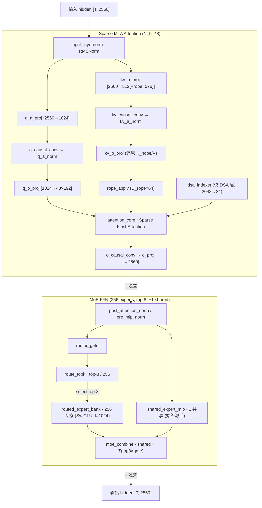

# openPangu-2.0-Flash 架构参考（Sparse MLA + DSA/SWA + 256-Expert MoE）

v 20260716 · 型号：**openPangu-2.0-Flash**（华为 ascend-tribe 开源）

> **数据来源（source-verified）**：本文规格全部取自仓库内经源码/config 校验的 canonical schema
> `model-architecture/openpangu-2.0-flash/outputs/model_architecture.json`
> 与校验报告 `model_architecture_validation.md`（extract 自官方 `config.json` + `openPangu-2.0-Infer` 源码，commit `1676856`）。
>
> ⚠️ **命名务必区分**：本模型 **不是** Pangu Pro MoE 72B（arXiv 2505.21411，GQA + MoGE 64专家/8组）。
> 那是另一个模型。二者在注意力机制、专家数、层数、hidden 维度上**全部不同**，切勿混用参数。
> 见文末《与 Pangu Pro MoE 72B 的区别》。
>
> ⚠️ **未从本地取到的量（标记为「待补」）**：总参数量 / 激活参数量 / 训练数据量 / rope_theta 数值 / 训练精度 / routed_scaling_factor。
> 本地 checkout 的 safetensors 是 Git LFS 指针文件，未下载全权重，故这些量本文不臆造。

## 1. 骨架

```
openPangu-2.0-Flash
│
├─ token_embedding: Vocab Parallel Embedding (vocab 151552 × hidden 2560)
│
├─ decoder: 46 × DecoderLayer (L0~L45)
│   └─ 每层 = mHC 注意力分支(S_mhc=4 流) + FFN，FFN 类型按层号二选一
│   │
│   │  【注意力类型按层混合（hybrid）】
│   │   ├─ DSA 层（16 层）: L0,3,6,9,…,45（每 3 层 1 个）→ 走 DSA Indexer 稀疏选择
│   │   └─ SWA 层（30 层）: 其余层 → 滑动窗口注意力
│   │
│   │  【FFN 类型按层分段】
│   │   ├─ L0~L1  : Dense MLP（first_k_dense=2）
│   │   └─ L2~L45 : MoE FFN（256 路由专家 + 1 共享）
│   │
│   │   单层内部结构：
│   │   ├─ input_layernorm — Input RMSNorm
│   │   │
│   │   ├─ Sparse MLA Attention（多头潜在注意力，N_h=48）
│   │   │   ├─ q_a_proj      — Q Latent Linear  [2560 → R_q=1024]
│   │   │   ├─ q_causal_conv — Q Causal Conv1D（短卷积，配合 MoME 状态）
│   │   │   ├─ q_residual_add + q_a_norm — Q Add / Q LayerNorm
│   │   │   ├─ q_b_proj      — Q Up Linear     [1024 → N_h·D_qk = 48×192 = 9216]
│   │   │   ├─ kv_a_proj     — KV Latent Linear [2560 → R_kv=512, +rope → 576]
│   │   │   ├─ kv_causal_conv + kv_residual_add + kv_a_norm
│   │   │   ├─ kv_b_proj     — KV Up Linear（还原 K_nope / V）
│   │   │   ├─ rope_apply    — Apply RoPE（D_rope=64 维）
│   │   │   ├─ dsa_indexer   — DSA Indexer（仅 DSA 层；K_index=2048 候选，N_index=24 选中）
│   │   │   ├─ attention_core— Sparse FlashAttention
│   │   │   ├─ o_causal_conv + o_residual_add
│   │   │   └─ o_proj        — Output Projection [→ 2560]
│   │   │       · param_sink_state：128 个可学习 Sink Token（缓解极大激活值）
│   │   │
│   │   ├─ post_attention_norm — Post Attention RMSNorm（+ 残差）
│   │   ├─ pre_mlp_norm        — Pre MLP RMSNorm
│   │   │
│   │   ├─ FFN Choice ──┬─ Dense MLP（L0~L1）
│   │   │               │   ├─ dense_gate_up [2560 → I_dense=9216 ×2]
│   │   │               │   ├─ dense_silu    — SiLU Multiply (SwiGLU)
│   │   │               │   └─ dense_down    [9216 → 2560]
│   │   │               │
│   │   │               └─ MoE FFN（L2~L45）
│   │   │                   ├─ router_gate       — Router Gate（W_router=3）
│   │   │                   ├─ route_topk         — TopK Router：top_k=8 / E=256
│   │   │                   ├─ routed_expert_bank — 256 路由专家（SwiGLU，I_moe=1024）
│   │   │                   │       每专家: gate_up [2560→1024×2] → SiLU → down [1024→2560]
│   │   │                   ├─ shared_expert_mlp  — 1 个共享专家 MLP（E_shared=1，始终激活）
│   │   │                   └─ moe_combine        — 共享输出 + Σ(top8 路由专家 × 门控)
│   │   │
│   │   ├─ post_mlp_norm   — Post MLP RMSNorm（+ 残差）
│   │   └─ block_post_norm — Block Post RMSNorm（可选）
│   │
│   · 每层专家并行运行时：expert_parallel_state（EP 切分 256 专家）
│
├─ final_norm — Final RMSNorm
├─ lm_head    — LM Head [2560 → vocab 151552] → logits
│
└─ MTP module: Multi Token Predictor（N_mtp=3，层 46/47/48）
    ├─ mtp_input_norms — MTP Input Norms
    ├─ mtp_eh_proj     — MTP EH Projection
    ├─ mtp_decoder_layer — 复用 DecoderLayer 模板
    └─ mtp_shared_head → mtp_logits（额外预测后续 3 个 token）
```

## 2. Sparse MLA 注意力详解（区别于 GQA / MHA）

openPangu-2.0-Flash 用 **Sparse MLA（多头潜在注意力 + 稀疏注意力核）**，
并在 Q/KV/O 三处引入 **Causal Conv1D** 短卷积（配合 MoME 状态），这是它区别于常规 MLA 的显著特征。

```
标准 MLA（如 DeepSeek）:  X → 低秩下投影(latent) → 上投影还原 Q/K/V
openPangu Flash MLA:      X → 低秩下投影 → Causal Conv1D → 残差 → LayerNorm → 上投影

  Q 路：  X[2560] → q_a_proj[→1024] → causal_conv → +res → q_a_norm → q_b_proj[→48×192]
  KV 路： X[2560] → kv_a_proj[→512(+rope64=576)] → causal_conv → +res → kv_a_norm → kv_b_proj
  头维度：D_qk=192 = D_nope(128) + D_rope(64)，D_v=128，N_h=48 头

Partial RoPE：仅 D_rope=64 / 192 维施加位置编码（rope_theta 待补）

Param Sink Token（原创）:
  128 个可学习 Sink Token（N_sink=128），吸收极大激活值，提升训练稳定性与后量化亲和。
```

### 注意力按层混合：DSA / SWA

```
46 层 decoder 的注意力不是同构，而是两种混合：

  DSA 层（Dynamic/Sparse Attention Indexer）  · 16 层 · L0,3,6,…,45（每 3 层）
    └─ dsa_indexer 先在 K_index=2048 个候选 key 中挑 N_index=24 个 → 稀疏 attention
       用于长上下文下压缩注意力代价（S_max=524288 = 512K）

  SWA 层（Sliding Window Attention）           · 30 层 · 其余层
    └─ 滑动窗口局部注意力
```

### mHC 注意力分支（S_mhc=4）

每层注意力外包一层 **mHC Attention Branch → … → mHC Attention Merge**，`S_mhc=4` 表示 4 条流；
schema 层面确认其存在与流数，内部语义（multi-head-Cache / multi-Head-Channel 等）本地资料未给全，暂不展开释义。

## 3. 单层 MoE DecoderLayer（L2~L45 核心层）



## 4. 关键参数（全部 source-verified）

| 符号 | 参数 | 值 | 来源 |
|---|---|---|---|
| L | 主 decoder 层数 | **46**（Dense L0-1 + MoE L2-45） | schema / config |
| H | hidden_dim | **2560** | 同上 |
| V | vocab | **151552** | 同上 |
| N_h | 注意力头数 | **48** | 同上 |
| — | 注意力机制 | **Sparse MLA + Causal Conv1D** | source |
| D_qk / D_v | 头维度 | **192**（nope 128 + rope 64）/ **128** | 同上 |
| R_q / R_kv | MLA 低秩 | Q **1024** / KV **512**（+rope=**576**） | 同上 |
| — | 注意力按层混合 | DSA **16** 层（indexer 2048→24）/ SWA **30** 层 | repeats/branches |
| N_sink | Sink Token 数 | **128** | symbol |
| S_mhc | mHC 流数 | **4** | symbol |
| I_dense | Dense FFN 中间维 | **9216**（SwiGLU） | 同上 |
| I_moe | MoE 专家中间维 | **1024**（SwiGLU） | 同上 |
| E / E_shared | 专家数 | **256** 路由 + **1** 共享 | 同上 |
| top_k | 路由 top-k | **8** / 256 | 同上 |
| K_index / N_index | DSA indexer | 候选 **2048** → 选 **24** | 同上 |
| S_max | 最大上下文 | **524288**（512K） | config |
| N_mtp | MTP 层数 | **3**（层 46/47/48） | 同上 |
| — | 总参数 / 激活参数 | **待补**（本地未下载全权重） | — |
| — | 训练数据 / 精度 / rope_theta | **待补** | — |

## 5. 独特设计要点

1. **MLA + Causal Conv1D**：在 Q/KV/O 低秩路径上加入因果短卷积（`q/kv/o_causal_conv`）与残差+LayerNorm，配合 `MoME State`。区别于 DeepSeek 纯低秩 MLA。
2. **DSA/SWA 混合注意力**：1/3 层用 DSA indexer（2048 候选选 24）做稀疏长程注意力，2/3 层用滑动窗口，服务 512K 超长上下文。
3. **256 专家标准 MoE + 1 共享**：`top-8/256`，专家并行（EP）切分；**无 MoGE 分组均衡约束**（那是 Pro MoE 的特性，本模型没有）。
4. **Param Sink Token ×128**：可学习 sink token 抑制极大激活值。
5. **3 层 MTP**：多 token 预测，额外预测后续 3 个 token（Pro MoE 仅 1 层）。
6. **多重 RMSNorm**：input / post-attention / pre-mlp / post-mlp / block-post / final 多处 RMSNorm。

## 6. 与 Pangu Pro MoE 72B 的区别（防混淆）

> 此前 `Pangu-2.0-flash架构参考.md`（旧文件）实际写的是 **Pangu Pro MoE 72B**，与本模型不是同一个。核对如下：

| 维度 | **openPangu-2.0-Flash**（本文/source-verified） | Pangu Pro MoE 72B（arXiv 2505.21411） |
|---|---|---|
| 注意力 | **Sparse MLA + Causal Conv1D** | GQA 64Q/4KV |
| DSA/SWA 混合 | ✅ 16 DSA / 30 SWA | ✗ |
| hidden | **2560** | 4608 |
| vocab | **151552** | 153600 |
| 层数 | **46**（Dense 0-1 + MoE 2-45） | 48（Dense 0-3 + MoE 4-47） |
| 路由专家 | **256** | 64（MoGE 8 组×8） |
| 共享专家 | **1** | 4 |
| top_k | 8 | 8（每组 1） |
| MoGE 分组均衡 | **无** | ✅ 核心特性 |
| MTP | **3** 层 | 1 层 |
| 最大上下文 | **512K** | 128K |
| 总参数/激活 | 待补 | 72B / 16.5B |

---

### 附：数据溯源
- canonical schema：`model-architecture/openpangu-2.0-flash/outputs/model_architecture.json`（`schema_version: model_architecture.v1`）
- 校验报告：`.../model_architecture_validation.md`
- 源码根：`openPangu-2.0-Infer/.../models/pangu/pangu_v2_moe.py`、`layers/attention/npu_pangu.py`、`pangu_v2_moe_mtp.py`、`layers/fused_moe/layer.py`
- 官方仓库：`ascend-tribe/openPangu-2.0-Flash`（gitcode，commit `1676856`）
