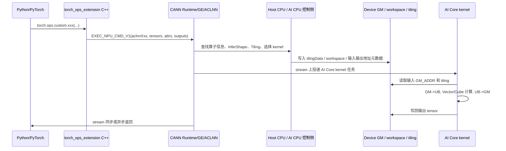

# AI CPU 与 AI Core 的通信关系、指令关系：给算子开发初学者的产品视角说明

本文基于两个本地仓库整理：

- `/Users/yin/gitcode/asc-devkit-master`：Ascend C API、指令层 API、示例与构建工具。
- `/Users/yin/gitcode/cann-recipes-infer-master`：推理融合算子、PyTorch 自定义算子接入、PTO 算子示例。

目标不是复述硬件手册，而是帮助刚开始做算子开发的人建立一个能落地的心智模型：**谁负责决策，谁负责搬数据，谁负责计算，AI CPU 和 AI Core 之间到底是“谁命令谁”还是“通过任务和内存协同”。**

## 先给结论

AI CPU 和 AI Core 不是“CPU 一条一条给 AI Core 发加法/乘法指令”的关系。更准确的理解是：

- **AI CPU / Host CPU / CANN Runtime** 做编排：识别算子、检查 shape/dtype、选择实现、计算 tiling、准备 workspace、生成任务描述，把 kernel 任务放到 stream 上。
- **AI Core** 做高吞吐计算：读取输入 GM 地址和 tiling 数据，按 block/task 并行执行已经编译好的 kernel 指令。
- **通信载体** 不是函数调用栈，而是 **stream 任务队列、GM/UB/workspace/tiling buffer、event/notify 同步资源、OPP 算子信息库**。
- **指令关系** 是“CPU 侧选择和下发 kernel 任务，AI Core 执行 kernel 内部指令流水”。AI Core 内部真正执行的是 Vector、Cube、Scalar、MTE 等流水线指令。

可以把它看成一个产品系统：

| 角色 | 产品类比 | 主要职责 | 在代码里的典型位置 |
|---|---|---|---|
| Host CPU | App 服务端 / 调用入口 | Python、PyTorch、ACL 发起调用，管理 device、stream、内存 | `torch_ops_extension/custom_ops/csrc/*.cpp`、Ascend C 示例里的 `aclrt*` |
| AI CPU | 设备侧调度/控制协处理器 | 部分 shape/tiling/控制类任务、AI CPU 算子、复杂图或 PTO/KFC 类编排 | `op_host/*_tiling.cpp`、PTO 里的 `SetAttachedStreamInfos` |
| AI Core | 执行引擎 | 运行 `__aicore__` kernel，执行 vector/cube/data-copy 指令 | `op_kernel/*.cpp`、`.asc` kernel |
| GM | 共享货架 | 输入输出 tensor、workspace、tiling 数据所在全局内存 | `GM_ADDR`、`GlobalTensor` |
| UB/L1/L0 | AI Core 内部工作台 | 单核内部搬入、计算、搬出 | `TPipe`、`TQue`、`LocalTensor`、`__ubuf__` |

## 一张端到端链路图



这张图里最关键的一点是：**AI CPU/Host CPU 准备“任务和参数”，AI Core 执行“已经编译成设备指令的 kernel”。** CPU 侧不会在运行时逐元素指挥 AI Core。

## 普通 Ascend C 算子的三层结构

在 `cann-recipes-infer-master/ops/ascendc` 下，一个融合算子通常被拆成三块：

```text
src/<op_name>/
  op_host/      # 算子注册、InferShape、Tiling、平台信息读取
  op_kernel/    # AI Core kernel，真正的计算实现
torch_ops_extension/
  custom_ops/
    csrc/       # PyTorch NPU 侧实现注册，调用 ACLNN
    converter/  # torch.compile/图模式下转 GE custom_op
```

以 `RmsNormDynamicQuant` 为例：

- `op_host/rms_norm_dynamic_quant_def.cpp` 声明输入、输出、attr，并通过 `this->AICore().AddConfig("ascend910b")`、`AddConfig("ascend910_93")` 声明这是 AI Core 算子。
- `op_host/rms_norm_dynamic_quant_tiling.cpp` 读取 shape、dtype、UB 大小、AI Core 数量，调用 `context->SetBlockDim(...)`、`context->SetTilingKey(...)`，并把 tiling 数据保存到 raw tiling buffer。
- `op_kernel/rms_norm_dynamic_quant.cpp` 定义 `extern "C" __global__ __aicore__ void rms_norm_dynamic_quant(...)`。kernel 里通过 `GET_TILING_DATA` 读取 tiling，通过 `TILING_KEY_IS(1/2/3)` 选择不同实现。
- `torch_ops_extension/custom_ops/csrc/npu_rms_norm_dynamic_quant.cpp` 在 PyTorch NPU 后端里构造输出 tensor，然后调用 `EXEC_NPU_CMD_V1(aclnnRmsNormDynamicQuant, ...)`。
- `torch_ops_extension/custom_ops/converter/npu_rms_norm_dynamic_quant.py` 在图模式下把 PyTorch op 转成 GE 的 `custom_op("RmsNormDynamicQuant", ...)`。

产品化理解：

| 阶段 | 解决的问题 | 交付物 |
|---|---|---|
| 注册 | “这个产品叫什么，支持什么输入输出？” | op type、dtype、format、attr、SoC 支持 |
| InferShape | “用户给了这些输入，输出长什么样？” | 输出 shape/dtype |
| Tiling | “这次请求怎么切，多少核跑，每核跑多少？” | blockDim、tilingKey、tilingData、workspace size |
| Kernel | “每个 AI Core 拿到一块活后怎么干？” | AI Core 指令流水 |
| Framework 接入 | “PyTorch 用户怎么调到它？” | `torch.ops.custom.xxx`、converter、ACLNN 调用 |

## AI CPU 到 AI Core 传了什么

更准确地说，CPU 侧没有直接传“VADD 指令”给 AI Core，而是传了以下几类东西：

| 传递内容 | 作用 | 代码信号 |
|---|---|---|
| kernel 选择 | 选哪个 op、哪个 SoC、哪个 binary/实现 | `AICore().AddConfig(...)`、OPP 包 |
| blockDim | 启动多少个 AI Core block | `context->SetBlockDim(...)`、kernel 里的 `GetBlockIdx()` |
| tilingKey | 选择 kernel 内哪条实现分支 | `context->SetTilingKey(...)`、`TILING_KEY_IS(...)` |
| tilingData | 每核/每循环/每 tile 的切分参数 | `SaveToBuffer(...)`、`GET_TILING_DATA(...)` |
| workspace size | 临时内存需求 | `context->GetWorkspaceSizes(...)` |
| tensor 地址 | 输入输出的 GM 地址 | `GM_ADDR`、`GlobalTensor.SetGlobalBuffer(...)` |
| stream/event/notify | 调度顺序和跨任务同步 | `aclrtStream`、PTO 的 `SetAttachedStreamInfos` / `SetSyncResInfos` |

这些内容共同构成一次 kernel 任务的“订单”。AI Core 拿到订单后，按照 kernel 代码和 tiling 参数独立执行。

## AI Core 内部真正执行什么指令

`asc-devkit-master/docs/api/c_api/README.md` 把 AI Core 上的流水分成多类：

| 流水 | 可以粗略理解为 | 典型工作 |
|---|---|---|
| `PIPE_S` | 标量/控制流水 | 标量计算、控制类操作 |
| `PIPE_V` | Vector 流水 | `Add`、`Mul`、`Exp`、`Reduce` 等矢量计算 |
| `PIPE_M` | Cube/矩阵流水 | Matmul/MMAD 类矩阵计算 |
| `PIPE_MTE2` | 搬入流水 | GM -> UB/L1/L0 |
| `PIPE_MTE3` | 搬出流水 | UB/L1 -> GM |
| `PIPE_MTE1` | 内部搬运流水 | L1 -> L0A/L0B/UB 等 |
| `PIPE_FIX` | Fixpipe | Cube 结果搬出/格式处理等 |

`asc-devkit-master/docs/asc_c_api_contributing.md` 明确说明 C API 是指令层 API，直接对应一条或多条硬件指令。比如：

- `asc_copy_gm2ub_sync(...)` 属于数据搬入，走 MTE2。
- `asc_add_sync(...)` 属于 Vector 计算，走 V。
- `asc_copy_ub2gm_sync(...)` 属于数据搬出，走 MTE3。

所以 AI Core 的高性能来自三件事：

1. **多核并行**：`blockDim` 决定启动多少个 block，kernel 内用 `GetBlockIdx()` 找到当前核处理的数据范围。
2. **核内流水并行**：CopyIn、Compute、CopyOut 可以分别走 MTE2、V/Cube、MTE3。
3. **局部内存复用**：数据从 GM 搬到 UB/L1/L0 后，在 AI Core 内部高带宽处理，最后再写回 GM。

## 最小心智模型：CopyIn、Compute、CopyOut

Ascend C 入门 Add 示例的核心逻辑是：

```text
Global Memory 输入 x/y
        |
        | CopyIn: MTE2
        v
Local Memory / UB
        |
        | Compute: Vector 或 Cube
        v
Local Memory / UB
        |
        | CopyOut: MTE3
        v
Global Memory 输出 z
```

这也是绝大多数 AI Core 算子的底层套路。复杂算子只是把这个套路扩展成更多 tile、更多 pipeline、更多分支、更多临时 buffer。

以产品经理视角看，这个模型解决了一个核心体验问题：**用户希望输入一个大 tensor，拿到一个结果；硬件实际需要把大 tensor 拆成很多小块，让多个 AI Core 并行搬、算、写。** Tiling 就是把“用户视角的大任务”转成“硬件视角的可执行任务包”。

## AI CPU 的位置：控制面，而不是主算力面

初学者容易把 AI CPU 理解成“AI Core 的老板，实时下发每条计算指令”。这不准确。

更好的说法是：

- **AI CPU 偏控制面**：适合做分支多、控制复杂、shape/tiling/同步/调度类工作，或执行 AI CPU 算子。
- **AI Core 偏数据面**：适合做高吞吐、规则化、批量的 tensor 计算。

在 `asc-devkit-master/tools/build/opbuild` 里能看到 `--aicpu`、`--aicore`、`--hostcpu` 三种构建/生成模式。`op_generator_factory.cpp` 里也把 `cpu_cfg` 和 AI Core 生成逻辑分开处理，这说明 CANN 把 CPU 类算子和 AI Core 算子视为不同执行后端。

在普通融合算子里，`op_host` 的 tiling 逻辑经常表现为 CPU 侧准备参数；在一些图模式或设备侧编排场景里，tiling/control 可能放到 AI CPU 上。`op_proto_generator.cpp` 里出现了 `TILING_ON_HOST` 和 `TILING_ON_AICPU` 的 placement 生成逻辑，说明 tiling 可以有 Host/AI CPU 侧位置差异。

## PTO/KFC 例子：AI CPU 参与编排的更明显信号

`cann-recipes-infer-master/ops/pypto` 的 PTO 算子比普通 Ascend C 算子更能看到 AI CPU 参与控制的痕迹。

例如 `lightning_indexer_pto/op_host/lightning_indexer_proto.cpp` 里设置了：

- attached stream 名称：`pto aicpu kfc server`
- reuse key：`pto kfc_stream`
- sync resource：`SYNC_RES_NOTIFY`

产品视角可以这样理解：

```text
普通 AI Core 算子：
  CPU 侧算好 tiling -> stream 上启动 AI Core kernel -> AI Core 写回输出

PTO / KFC 类复杂图算子：
  需要一个设备侧控制服务/附加 stream 协调多个 kernel、同步资源、动态 tile 或多阶段执行
```

这类场景中 AI CPU 更像“设备侧执行协调员”。它参与调度和同步，但核心矩阵/向量吞吐仍主要落在 AI Core kernel 上。

## 指令关系：从 Python API 到硬件流水

下面用一条调用链串起来：

```text
Python 调 custom op
  -> torch_ops_extension 注册的 C++ NPU 实现
  -> EXEC_NPU_CMD_V1(aclnnXxx, ...)
  -> CANN/GE 根据 op type 找 OPP 注册信息
  -> InferShape / Tiling / workspace / blockDim / tilingKey
  -> Runtime 在 stream 上 launch AI Core kernel
  -> AI Core kernel 读取 GM_ADDR + tiling
  -> kernel 内部执行 MTE2/V/Cube/MTE3 等流水指令
  -> 输出写回 GM
```

其中有两层“指令”要分清：

| 层级 | 谁看得见 | 是什么 |
|---|---|---|
| 调度指令 | Runtime/CPU 侧 | “启动哪个 kernel、多少核、在哪个 stream、依赖谁” |
| AI Core 指令 | 设备 kernel 内部 | “MTE2 搬入、Vector/Cube 计算、MTE3 搬出、SetFlag/WaitFlag 同步” |

算子开发者大多数时候写的是第二层的抽象形式：`DataCopy`、`Add`、`TPipe/TQue`、`asc_add`、`asc_sync`。编译器和 CANN 工具链把它们变成 AI Core 能执行的设备指令。

## 初学者最容易混淆的 8 个点

1. **`op_host` 不等于 Host CPU 独占，也不等于 AI CPU 独占。** 它是“算子控制面代码”的目录名，具体运行位置取决于 CANN 图执行、tiling placement 和算子类型。
2. **AI CPU 不负责高吞吐 tensor 计算。** 如果你的核心逻辑是大规模向量/矩阵计算，目标应是 AI Core。
3. **`AICore().AddConfig(...)` 是声明执行后端支持。** 它告诉 CANN 这个 op 有 AI Core 实现，并支持哪些 SoC。
4. **`SetBlockDim` 是并行度，不是 tensor shape。** shape 是用户数据形状，blockDim 是这次任务启用多少个 AI Core block。
5. **`tilingKey` 是 kernel 内部分支选择器。** 它常用来区分 normal、single row、slice D 等实现路径。
6. **GM 是全局内存，不是 AI Core 的高速工作区。** 高性能通常要求把 GM 数据搬到 UB/L1/L0 再算。
7. **同步不是默认全自动。** `TQue/TPipe` 能简化队列同步；低层 C API 或手写 pipeline 时仍要理解 `MTE2_V`、`V_MTE3`、`PipeBarrier` 等依赖。
8. **PyTorch 自定义 op 和 AI Core kernel 是两层交付物。** Python 能调通不代表 kernel 高效；kernel 高效也需要注册、converter、安装 OPP/whl 才能被框架稳定发现。

## 读代码时按这个顺序走

建议初学者不要一上来钻进 kernel 优化，按这条路径读：

1. 先读 `docs/*.md`：确认这个算子的功能、输入输出、约束。
2. 再读 `torch_ops_extension/custom_ops/csrc/<op>.cpp`：看 Python 用户怎么调用，输出 tensor 怎么构造。
3. 再读 `op_host/<op>_def.cpp`：看 op type、dtype、format、SoC 支持。
4. 再读 `op_host/<op>_tiling.cpp`：看 shape 如何转成 blockDim、tilingKey、tilingData、workspace。
5. 最后读 `op_kernel/<op>.cpp` 和具体 `.h/.hpp`：看每个 AI Core block 如何 CopyIn、Compute、CopyOut。

## 一个实用判断：这段代码属于控制面还是数据面

| 你看到的代码 | 多半属于 |
|---|---|
| `REG_OP`、`OpDef`、`InferShape`、`InferDataType` | 控制面 |
| `context->SetBlockDim`、`SetTilingKey`、`SaveToBuffer` | 控制面到数据面的参数桥 |
| `extern "C" __global__ __aicore__` | 数据面入口 |
| `GET_TILING_DATA`、`TILING_KEY_IS` | 数据面读取控制面参数 |
| `DataCopy`、`TPipe`、`TQue`、`LocalTensor` | AI Core 核内数据流 |
| `asc_add`、`asc_mmad`、`SetFlag/WaitFlag` | AI Core 指令抽象 |
| `EXEC_NPU_CMD_V1(aclnn...)` | 框架到 CANN runtime 的调用桥 |
| `torchair.ge.custom_op(...)` | 图模式 converter |

## 对算子开发的产品洞察

从产品经理视角，CANN/Ascend C 的设计是在平衡三类用户诉求：

1. **算法开发者想快**：最好像写 PyTorch 一样调用一个 op。所以需要 `torch_ops_extension`、converter、ACLNN 封装。
2. **算子开发者想稳**：需要明确的 op 注册、shape 推导、tiling 数据结构、版本和 SoC 配置。
3. **性能工程师想榨干硬件**：需要能控制 GM/UB/L1/L0、Vector/Cube/MTE 流水、mask、stride、double buffer、blockDim。

所以你会看到同一个算子被拆成很多层。这不是“复杂炫技”，而是在同时服务易用性、正确性和性能。

## 最短记忆版

```text
AI CPU / Host CPU：算任务怎么跑
AI Core：把任务高速跑完
GM / tiling / workspace / stream：两者协同的协议
Ascend C API：把你的 kernel 代码映射到 AI Core 指令流水
Tiling：把用户的大 tensor 请求切成 AI Core 可消费的小任务
```

如果只记一句话：

> AI CPU 和 AI Core 的关系不是“逐条指令遥控”，而是“控制面准备任务，数据面执行 kernel；通过 stream、GM、tiling、workspace 和同步资源协同”。

## 本地参考入口

- Ascend C API 层级选择：`/Users/yin/gitcode/asc-devkit-master/docs/asc_how_to_choose_api.md`
- C API 指令层说明：`/Users/yin/gitcode/asc-devkit-master/docs/asc_c_api_contributing.md`
- C API 流水类型：`/Users/yin/gitcode/asc-devkit-master/docs/api/c_api/README.md`
- DoubleBuffer 原理：`/Users/yin/gitcode/asc-devkit-master/docs/guide/技术附录/概念原理和术语/性能优化技术原理/DoubleBuffer.md`
- Ascend C Add 入门：`/Users/yin/gitcode/asc-devkit-master/docs/guide/入门教程/快速入门/基于SIMD编程/Add自定义算子开发.md`
- cann-recipes Ascend C 算子目录说明：`/Users/yin/gitcode/cann-recipes-infer-master/ops/ascendc/README.md`
- RMSNormDynamicQuant 示例：
  - `ops/ascendc/src/rms_norm_dynamic_quant/op_host/rms_norm_dynamic_quant_def.cpp`
  - `ops/ascendc/src/rms_norm_dynamic_quant/op_host/rms_norm_dynamic_quant_tiling.cpp`
  - `ops/ascendc/src/rms_norm_dynamic_quant/op_kernel/rms_norm_dynamic_quant.cpp`
  - `ops/ascendc/torch_ops_extension/custom_ops/csrc/npu_rms_norm_dynamic_quant.cpp`
- PTO/KFC 调度信号：
  - `ops/pypto/src/lightning_indexer_pto/op_host/lightning_indexer_proto.cpp`
  - `ops/pypto/src/lightning_indexer_pto/op_host/lightning_indexer_def.cpp`
  - `ops/pypto/README.md`
