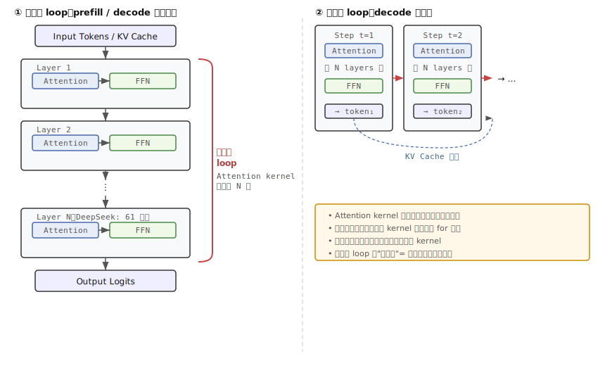
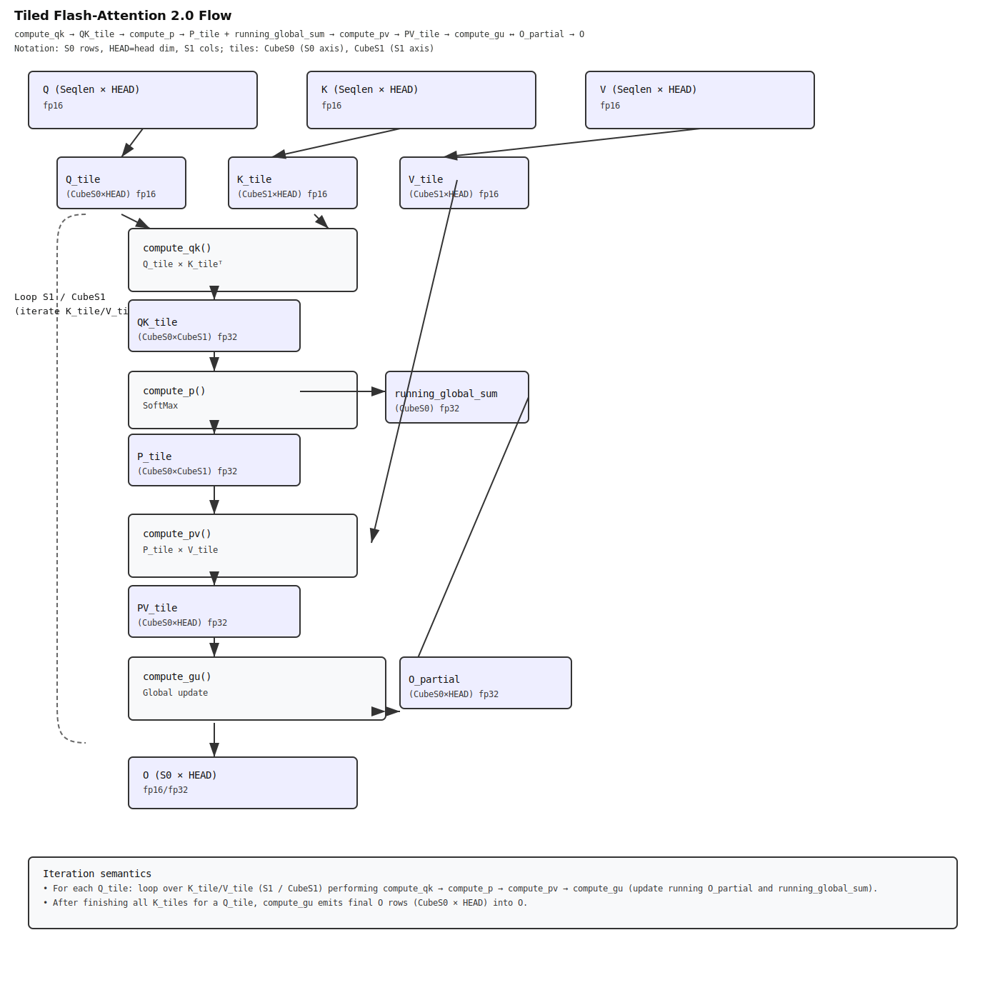

# Loop、循环体与 ControlFlow 研究笔记

**模型在架构层面的 loop、算子源码里的 loop、tile 带来的逐块遍历，以及编译后的 controlflow，分别是什么关系？**

---

## 阅读地图

这篇文档建议按下面的顺序读：

1. 先建立"四层 loop"的总框架，避免把不同层次的重复混在一起。
2. 再看源码层 loop 和 DeepSeek 的真实 token 循环案例。
3. 再看 tile 遍历 loop，以及 Sparse Flash Attention 这种"算法本身就建立在 tile 循环上"的情况。
4. 最后看这些 loop 怎样在编译后落成 controlflow、path 和 expression buffer。

四层汇总和 PTO 启发在本节末尾，四层详解从第 1 章开始。

## 四层 loop 的总览

在 DeepSeek 和 PyPTO 里，"循环"至少有四层：

```
模型层 loop
  源码层 loop
    tile 遍历 loop
      编译后的 controlflow
```

它们分别回答的是四个完全不同的问题：

| 层级 | 它在回答什么 |
|------|------------|
| 模型层 loop | 为什么同类 kernel 会反复被调用 |
| 源码层 loop | 一个 kernel 怎样分批处理 token、head 或 cache block |
| tile 遍历 loop | 同一批数据在核内怎样被切成小块逐块算完 |
| 编译后的 controlflow | 这些循环最终怎样变成 path、分支和可调度的控制骨架 |

### 四层汇总

| 层级 | 它在回答什么 | DeepSeek 里的例子 | 最容易误解成什么 |
|-----|------------|-----------------|---------------|
| 模型层 loop | 为什么同类 kernel 会反复出现 | decoder layer 重复、decode 每步重复 | 误以为源码里写了很多 for |
| 源码层 loop | 一个 kernel 怎样分批处理数据 | `t_idx`、`batch_idx`、`s2_idx` | 误以为这已经等于最终执行任务 |
| tile 遍历 loop | 这一批数据怎样在核内被逐块算完 | cube tile / vec tile 遍历 | 误以为只是配置，不算 loop |
| 编译后的 controlflow | 这些循环最终保留成哪些 path 和分支 | `PATH0_6/8/10...`、`IsLoopBegin/End` | 误以为它是源码 AST 的直接投影 |

### 对 PTO 的直接启发

**第一：给 loop 打"层级标签"。**
要让用户一眼知道当前看到的是模型层重复、源码层循环，还是 tile 遍历。

**第二：把 `path magic` 和 `loop step` 的关系解释出来。**
否则用户只会看到一堆 `PATH0_6/8/10` 文件名，不知道它们对应哪种展开档位。

**第三：不要把 controlflow 图包装成"源码流程图"。**
它应该被明确描述成"编译器保留下来的控制骨架"。

---

## 什么叫"循环体"

循环体就是 `for` 下面那整段会被重复执行的模板。

```python
for idx in pypto.loop(b_loop):
    t0_sub = input0[b_offset:b_offset_end, ...]
    t1_sub = input1[b_offset:b_offset_end, ...]
    out_sub = t0_sub + t1_sub
```

真正被重复的不是某一行，而是这一整段模板。每次迭代只是在"换一个 idx，再执行同样的模板"。

---

## 1. 第一层：模型架构层的 loop


模型层 loop 离具体源码最远，但对产品理解最重要，因为它解释了"为什么同一类 kernel 会在整网里反复出现"。

在大模型里，最典型的有两类：

- **层重复：** decoder layer 一层一层重复很多次，这是一种模块复用
- **时间步重复：** decode 阶段每生成一个 token，都会再跑一轮 attention、MLP、norm 等计算

这一层的 loop 不一定对应源码里真的写了一个 `for`，更多是一种架构级重复关系。


---

## 2. 第二层：源码里的 loop，才是开发者真正写出来的循环

进入 PyPTO kernel 以后，loop 才变成源码对象。官方 API 主要有：

- `pypto.loop` — 定义普通循环
- `pypto.loop_unroll` — 带展开档位的循环
- `pypto.is_loop_begin` — 判断当前迭代是否为循环开始
- `pypto.is_loop_end` — 判断当前迭代是否为循环结束

对应文档：
[pypto-loop.md](https://gitcode.com/cann/pypto/blob/master/docs/api/controlflow/pypto-loop.md) /
[pypto-loop_unroll.md](https://gitcode.com/cann/pypto/blob/master/docs/api/controlflow/pypto-loop_unroll.md) /
[pypto-is_loop_begin.md](https://gitcode.com/cann/pypto/blob/master/docs/api/controlflow/pypto-is_loop_begin.md) /
[pypto-is_loop_end.md](https://gitcode.com/cann/pypto/blob/master/docs/api/controlflow/pypto-is_loop_end.md)

### 2.1 `pypto.loop`

`pypto.loop` 最接近"普通循环"，通常用来表示"把某一维数据按批次处理完"。

官方定义：「定义一个循环操作，实现 python 当中的 for 循环功能」
——[pypto-loop.md](https://gitcode.com/cann/pypto/blob/master/docs/api/controlflow/pypto-loop.md)

```python
for idx in pypto.loop(b_loop):
    ...
```

这层 loop 的业务含义通常是：**这一批数据太大，不能一次全算完，要按某个外层维度分批处理。**

### 2.2 `pypto.loop_unroll`

`loop_unroll` 不是简单"多跑几次"，而是允许开发者同时准备多种展开档位，让编译器在不同场景下选择不同 path。

官方定义：「`pypto.loop_unroll` 是一个支持循环展开的循环迭代器函数，功能与 `pypto.loop` 类似，增加了 `unroll_list` 参数支持多个展开方式」
——[pypto-loop_unroll.md](https://gitcode.com/cann/pypto/blob/master/docs/api/controlflow/pypto-loop_unroll.md)

**`loop` vs `loop_unroll` 的关键区别（来自官方 FAQ）：**

- 使用 `loop(unroll_list=[2])` 时，展开逻辑是框架自动重复 body，用户每次只处理 step=1 的步长
- 使用 `loop_unroll(unroll_list=[2])` 时，body 签名带 `unroll_length` 参数，用户自己处理 k 个步长

官方原则：「如果可以一次处理多个 i，使用 `loop_unroll` 会更高效；如果一次只能处理 1 个 i，则需要使用 `loop`」
——[faq.md](https://gitcode.com/cann/pypto/blob/master/docs/tutorials/appendix/faq.md)

在 DeepSeek 里使用 `loop_unroll` 非常重要，因为很多 kernel 在 decode 小 batch 和 prefill 大 batch 下，最合适的展开粒度完全不同。

### 2.3 一个很容易忽略的细节：即使没写 loop，前端也可能插入隐式 loop

官方 FAQ 专门说明：即使开发者没有显式写 `for`，前端也会默认插入 `pypto.loop(1)` 作为执行骨架。

> 官方原文：「实际是在构图阶段前端会隐式的在 function 开始的位置插入一个 loop，循环次数为 1」
> ——[faq.md](https://gitcode.com/cann/pypto/blob/master/docs/tutorials/appendix/faq.md)

```python
# 等价关系：
@pypto.jit
def foo(a, b, c):
    c[:] = a + b

# 等价于：
@pypto.jit
def foo(a, b, c):
    for i in pypto.loop(1):
        c[:] = a + b
```

另外，官方还提醒：「框架当前不会自动进行 `loop(1)` 合并，因此在实际使用中，建议用户手动合并 `loop(1)`，以提高效率」

> **源码里看不到 loop，不等于后面的控制流图里一定没有 loop。**

---

### 2.4 DeepSeek 真实案例一：Indexer Prolog 的 token 循环

最适合看的真实例子：
[lightning_indexer_prolog_quant_impl.py](https://gitcode.com/cann/pypto/blob/master/models/deepseek_v32_exp/lightning_indexer_prolog_quant_impl.py)

源码里的核心循环：

```python
for t_idx, unroll_length in pypto.loop_unroll(
    0, t, 1,
    name="IndexerPrologQuantQuantLoop",
    idx_name="tIdx",
    unroll_list=unroll_list,
):
    t_tile = unroll_length
    ...
```

业务意思：

```
从第 t_idx 个 token 开始
这次按 t_tile 个 token 为一批处理
处理完这一批，再继续下一批
```

循环体表达的是：**"处理一批 token 的完整 Query / Key / Weight 计算模板"。**

#### 2.4.1 为什么这段 loop 不是普通循环

对应配置文件
[deepseekv32_lightning_indexer_prolog_quant.py](https://gitcode.com/cann/pypto/blob/master/models/deepseek_v32_exp/deepseekv32_lightning_indexer_prolog_quant.py)
里，真实给的是：

```python
unroll_list=[32, 16, 8, 4, 2, 1]
```

这意味着源码层面虽然只写了一条 loop，但编译器实际上会准备 6 种候选跑法：

| 档位 | 一次处理 token 数 |
|-----|----------------|
| 1 | 32 |
| 2 | 16 |
| 3 | 8 |
| 4 | 4 |
| 5 | 2 |
| 6 | 1 |

> **源码 loop 是"一个模板"，不是"只有一种执行粒度"。**

#### 2.4.2 真实产物证明这 6 种档位确实存在

本地真实输出 `Pass_00_RemoveRedundantReshape` 目录里可以直接看到 6 个 path 文件：

```
...PATH0_6.json
...PATH0_8.json
...PATH0_10.json
...PATH0_12.json
...PATH0_14.json
...PATH0_16.json
```

在 `kernel_aicpu/controlFlow_host_*.cpp` 里，能看到这组真实映射：

| loop step（token 数） | path magic |
|---------------------:|----------:|
| 32 | 6 |
| 16 | 8 |
| 8 | 10 |
| 4 | 12 |
| 2 | 14 |
| 1 | 16 |

> **重要：文件名里的 `PATH0_6 / 8 / 10...` 不是展开因子本身，而是 path 的 magic 编号；真正的展开因子，要看 controlFlow 代码里的 step。**

---

## 3. 第三层：tile 遍历 loop

这层最容易被忽视，但如果要理解性能问题，就必须单独拿出来。

`TileShape` 表面上只是一个切块配置，实际上它天然对应"逐块遍历"。如果原始 tensor 比单个 tile 大，那么框架最终就必须：

```
切出很多小 tile
逐块搬运
逐块计算
逐块写回
```

这就是一种执行意义上的 loop。

官方文档：
[tiling.md](https://gitcode.com/cann/pypto/blob/master/docs/tutorials/development/tiling.md) /
[loops.md](https://gitcode.com/cann/pypto/blob/master/docs/tutorials/development/loops.md)

### 3.1 tile loop 和源码 loop 的区别

- **源码 loop** 关心的是"按哪一批 token / head / block 来组织业务处理"
- **tile loop** 关心的是"这一批数据在核内怎么被继续切细并覆盖完整张量"

举个最简单的例子：

- 外层 `t_idx` loop 可能表示"这次处理 8 个 token"
- 但这 8 个 token 对应的 matmul、dequant、rope、hadamard，在核内还会继续按各自的 cube tile 或 vec tile 再切很多块

所以同一批 token，到了图和泳道图上，常常会被拆成很多节点和任务。这不是因为源码里多写了几层 `for`，而是因为 **TileShape 本身就要求逐块遍历。**

### 3.2 在 DeepSeek 里，这层 loop 常常藏在算子内部

DeepSeek 的很多 kernel 会显式设置：

```python
pypto.set_cube_tile_shapes(...)
pypto.set_vec_tile_shapes(...)
```

这意味着 `Query-Linear`、`Dequant`、`Hadamard`、`RoPE` 这些语义片段，都会各自按不同 tile 粒度运行。

> **不要把"源码只看到一层 loop"误读成"执行上只有一层重复"。**

---

### 3.3 DeepSeek 真实案例二：Sparse Flash Attention 的多层嵌套 loop

源码：[sparse_flash_attention_quant_impl.py](https://gitcode.com/cann/pypto/blob/master/models/deepseek_v32_exp/sparse_flash_attention_quant_impl.py)

这个文件同时说明两件事：为什么循环直接在 tile 上而不是 tensor 上，以及 `is_loop_begin / is_loop_end` 在真实 kernel 里到底解决什么问题。




#### 3.3.1 为什么直接在 tile 上而不是 tensor 上

**标准 Attention 的内存问题：**

做 `softmax(Q·Kᵀ)·V` 时，朴素做法是先把完整的 `Q·Kᵀ` 中间矩阵算出来，再做 softmax，再乘 V。但这个矩阵大小是 `S × S`。序列长度 4096 时，一个 head 的中间矩阵就是 4096 × 4096 × 4 bytes ≈ 64MB，远超 AI Core 片上 SRAM 容量（通常 ≤ 1MB 量级）。

**Flash Attention 的解法：**

Flash Attention 不存这个大矩阵。改成每次只取一小块 K 和 V 进来，用"在线 softmax"公式把这一块的贡献叠加到 running state 上，跑完所有块后得到等价于全局 softmax 的正确结果。

这意味着：**tile 遍历本身就是算法**，不是对算法的优化包装，没有它就没有 Flash Attention。

#### 3.3.2 五层嵌套 loop 的业务语义

`sparse_flash_attention_quant_compute_flash` 函数（第 271 行起）有 5 层：

```python
for batch_idx in pypto.loop(0, batch_size_sym, 1, name="FLASH_LOOP_L0_idx"):
    # L0: 第几条请求（batch 维）
    for slc_idx in pypto.loop(0, s1_sym, 1, name="FLASH_LOOP_L1_s1_SA"):
        # L1: 当前 query 在 sequence 上的第几个位置
        for n_kv_idx in pypto.loop(0, n_kv_sym, 1, name="FLASH_LOOP_L2_n_kv_SA"):
            # L2: 第几个 KV head
            for group_idx in pypto.loop(0, g_loop_sym, 1, name="FLASH_LOOP_L3_g_SA"):
                # L3: head 内第几个 group（GQA / MQA 的 query group）
                # ↑ running state 在这一层定义，跨 L4 迭代持久
                oi_update = pypto.tensor([cur_group_tile, dn], pypto.DT_FP32, "oi_update")
                li_update = pypto.tensor([1, cur_group_tile], pypto.DT_FP32, "li_update")
                mi_update = pypto.tensor([1, cur_group_tile], pypto.DT_FP32, "mi_update")

                for s2_idx, _ in pypto.loop_unroll(0, bn_per_batch, 1,
                    name="FLASH_LOOP_L4_s2_SA", unroll_list={1}):
                    # L4（最内层）: 第几个 KV cache block，这就是图里标注的 S1 loop
                    ...
```

L0–L3 是业务维度的外层循环，**running state 在 L3 外面定义**，说明它跨越了整个 L4 的所有迭代，是 Flash Attention 在线累积的核心。

L4 是 `loop_unroll`，`unroll_list={1}` 表示这里没有多档位展开（KV block 数量是动态的，固定为 1），每次迭代处理一个大小为 `s2_tile` 的 KV block。

#### 3.3.3 每次 L4 迭代的循环体（"模板"）

每次迭代取一块 K 和 V，固定做四步：

```python
# 步骤 1：取这块 K 和 V（Sparse PagedAttention：按 topk_indices 从 KV cache 中 gather）
kn = gather_in_ub(k_nope_2d_view, cur_topk_indices, cur_block_table, ...)
kr = gather_in_l1(key_rope_2d, cur_topk_indices, cur_block_table, ...)

# 步骤 2：Q × Kᵀ，算这块的 attention score
sij = pypto.matmul(qi, kj_view, pypto.DT_FP32, a_trans=False, b_trans=True)
# sij shape: (cur_group_tile, cur_s2_tile)

# 步骤 3：这块的局部 softmax 统计量
sij_scale = pypto.mul(sij, softmax_scale)
tilda_mij = pypto.amax(sij_scale, dim=-1, keepdim=True)  # 当前块的行最大值 (group_tile, 1)
tilda_pij = pypto.exp(pypto.sub(sij_scale, tilda_mij))   # exp(score - max)
tilda_lij = pypto.sum(tilda_pij, dim=-1, keepdim=True)   # 当前块的 exp sum (group_tile, 1)

# 步骤 4：P × V，算这块对输出的贡献
q1 = pypto.matmul(tilda_pij_f16, vj, pypto.DT_FP32)
# q1 shape: (cur_group_tile, dn)
```

步骤 1–4 是每次迭代结构相同的"模板"。**分叉只发生在步骤 4 之后**：如何把这块的贡献合并进 running state。

#### 3.3.4 is_loop_begin / is_loop_end 在这里的真实逻辑，以及它到底在解决什么

running state 的读写策略因迭代位置而不同（第 374 行起）：

**首块（`is_loop_begin`）——不需要在线修正，直接初始化：**

```python
if pypto.cond(pypto.is_loop_begin(s2_idx)):
    oi_tmp = q1                   # 直接用这块结果，无需和之前合并
    oi_update[:] = oi_tmp         # 存进 running state，尚未归一化
    li_update[:] = tilda_lij      # 记录这块的 exp sum
    mi_update[:] = tilda_mij      # 记录这块的行最大值
```

**中间块和尾块（`else`）——在线 softmax 修正（第 389 行）：**

```python
else:
    oi = oi_update   # 读出之前所有块的累积输出
    li = li_update   # 读出之前的 exp sum
    mi = mi_update   # 读出之前的行最大值

    # 用当前块的 max 重新校准之前所有块的贡献
    mi_new = pypto.maximum(mi, tilda_mij)
    t2 = pypto.exp(pypto.sub(mi, mi_new))        # 老结果的衰减系数
    t4 = pypto.exp(pypto.sub(tilda_mij, mi_new)) # 新这块的放缩系数

    li_new = pypto.add(pypto.mul(t2, li), pypto.mul(t4, tilda_lij))  # 修正后的 exp sum
    q3 = pypto.mul(oi, pypto.reshape(t2, [cur_group_tile, 1]))        # 老 O 按新 max 重新缩放
    q2 = pypto.mul(q1, pypto.reshape(t4, [cur_group_tile, 1]))        # 新这块的贡献
    oi_tmp = pypto.add(q3, q2)   # 合并，仍未归一化

    oi_update[:] = oi_tmp
    li_update[:] = li_new
    mi_update[:] = mi_new
```

**尾块额外归一化并写出（`is_loop_end`，嵌套在首块和 else 两个分支内）：**

```python
    if pypto.cond(pypto.is_loop_end(s2_idx)):
        oi_update[:] = pypto.div(oi_tmp, pypto.reshape(li_new, [cur_group_tile, 1]))
        # ↑ 除以最终 exp sum，才是真正的 softmax 归一化输出
        oi_update_4_dim = pypto.cast(pypto.reshape(oi_update, [1, 1, cur_group_tile, dn]), dtype)
        pypto.assemble(oi_update_4_dim, oi_offset, attention_out)  # 写入全局输出
```

**特殊情况：首块 = 尾块（只有一个 KV block）：**

首块分支内嵌套了 `is_loop_end` 判断，处理 `bn_per_batch == 1` 的情况：直接用 `tilda_lij_reduce` 归一化，跳过在线修正。

汇总成一张表：

| 迭代位置 | 读 running state | 写 running state | 归一化并写出 |
|---------|----------------|----------------|------------|
| 首块（begin，非 end） | ✗ 不读 | ✓ 初始化写入 | ✗ |
| 首块 = 尾块（begin & end） | ✗ 不读 | ✓ 写入 | ✓ 除以 `tilda_lij_reduce` |
| 中间块（非 begin，非 end） | ✓ 读入并在线修正 | ✓ 更新 | ✗ |
| 尾块（非 begin，end） | ✓ 读入并在线修正 | ✓ 更新 | ✓ 除以 `li_new` |

这套判断并不是 PyPTO 独有语法糖，它对应的是一个很明确的循环边界语义。

官方定义：
- `is_loop_begin`：「判断当前迭代是否为循环的开始」
- `is_loop_end`：「判断当前迭代是否为循环的结束」

官方用途：「为了支持关键算子 FA 的编译优化，提供了两个特殊的函数 `pypto.is_loop_begin()` 和 `pypto.is_loop_end()` 用于优化条件分支」
——[faq.md](https://gitcode.com/cann/pypto/blob/master/docs/tutorials/appendix/faq.md)

对应的 C++ 版本在 `incre_flash_attention.cpp` 里更直白：

```cpp
for (int bn = 0; bn < bnPerBatch; bn++) {
    if (bn == 0) {
        oiUpdate = (bnPerBatch == 1 ? Div(oiTmp, tildaLij) : oiTmp);
        liUpdate = tildaLij;
        miUpdate = tildaMij;
        continue;
    }

    auto miNew = Maximum(mi, tildaMij);
    auto t2 = Exp(Sub(mi, miNew));
    auto t4 = Exp(Sub(tildaMij, miNew));
    auto liNew = Add(Mul(t2, li), Mul(t4, tildaLij));
    auto oiTmp = Add(Mul(oi, t2), Mul(q1, t4));
    oiUpdate = (bn == bnPerBatch - 1 ? Div(oiTmp, liNew) : oiTmp);
    liUpdate = liNew;
    miUpdate = miNew;
}
```

这里：

- `bn == 0` 就是 `is_loop_begin`
- `bn == bnPerBatch - 1` 就是 `is_loop_end`

所以 controlflow 里很多 `if`，本质上不是"业务判断"，而是**同一个循环在首块、中间块、尾块位置上，执行模板不同**。这也是为什么 controlflow 图往往比源码表面看到的 `if` 更多。

#### 3.3.5 这张图对应四层分类里的哪层

上面的流程图和这里的 L4 loop 都描述同一件事：

| 层级 | 对应情况 |
|-----|---------|
| **源码层 loop（第二层）** | `FLASH_LOOP_L4_s2_SA`，`pypto.loop_unroll(0, bn_per_batch, 1, unroll_list={1})` |
| **tile 遍历 loop（第三层）** | 每次迭代取一个 `s2_tile × dn` 的 KV block，正是 tile 遍历的含义 |

**两层在这里是重叠的**——源码 loop 本身就在遍历 KV tile，不是两件分开的事。图里的"S1 / CubeS1 loop"是硬件感知的 tile 粒度视角，源码里的 `FLASH_LOOP_L4_s2_SA` 是业务视角，描述的是同一个循环。

---

## 4. 第四层：编译后的 controlflow

很多人第一次看控制流图时，会下意识以为它就是 Python `for/if` 的图形版。实际上不是。中间至少发生了几件事：

1. **普通 `range/list/tuple` 循环，前端直接展开** ——不是每个 Python `for` 都会留下来
2. **前端可能补一层隐式 `pypto.loop(1)`** ——源码没写 loop，也不代表后面没有 loop 骨架
3. **`loop_unroll` 把一条 loop 变成多条 path** ——控制流里的 path 数可能远多于源码里的循环层数
4. **tile 遍历继续放大任务数** ——控制流和执行图通常比源码"更碎"

以下基于真实编译产物
`output_deepseek/kernel_aicpu/controlFlow_dev_13801420179101682564.cpp`
做逐层拆解。

---

### 4.1 controlflow 编译成什么

controlflow 被编译成一个独立的 **ARM64 共享库**（`.so`），在 AI CPU 上运行，入口函数签名是：

```cpp
// controlFlow_dev_13801420179101682564.cpp
uint64_t ControlFlowEntry(
    void        *ctx,              // 设备执行上下文
    uint64_t    *symbolTable,      // 动态状态表：存 loop 变量、形状维度等
    CallRootEntryType callRootList[3], // 三个运行时回调函数指针
    DevStartArgsBase *startArgs    // 输入输出 tensor 指针和 workspace
)
```

三个回调函数（`callRootList`）是 controlflow 唯一能调用外部的通道：

| 索引 | 宏名 | 作用 |
|-----|------|------|
| `[0]` | `RUNTIME_RootAlloc(funcKey)` | 为指定 path 分配一个 expression buffer（exprList） |
| `[1]` | `RUNTIME_RootStitch(funcKey)` | 把填好 exprList 的 path 提交给设备执行队列 |
| `[2]` | `RUNTIME_CallLog(...)` | 日志 |

这个函数没有传统 AI Core 的 cube/vec 指令，**它本身在 CPU 上顺序执行，只负责组织 path 的分发顺序和数据参数**，AI Core 上的实际计算在 `RootStitch` 提交后异步进行。

---

### 4.2 Path 是什么

对照 Indexer Prolog 的 `unroll_list=[32, 16, 8, 4, 2, 1]`，编译器生成了 7 条 path（PATH0 是初始化路径，PATH1–PATH6 对应 6 种展开档位）：

| funcKey | 对应 path | loop step | loop 范围 |
|--------|----------|----------|---------|
| 0 | PATH0 | — | `[0, 1)` 只跑一次，初始化用 |
| 1 | PATH1 | 32 | `[0, (size/32)*32)` |
| 2 | PATH2 | 16 | `[(size/32)*32, (size/16)*16)` |
| 3 | PATH3 | 8  | `[(size/32)*32, (size/8)*8)` |
| 4 | PATH4 | 4  | `[(size/32)*32, (size/4)*4)` |
| 5 | PATH5 | 2  | `[(size/32)*32, (size/2)*2)` |
| 6 | PATH6 | 1  | `[(size/32)*32, size)` |

运行时，controlflow 会按顺序从 PATH1 开始跑尽量大步长的档位，逐步缩小 step 处理尾部剩余，最终 PATH6（step=1）兜底，做到完整覆盖任意大小的 `size`。

这也解释了为什么文件名里 `PATH0_6 / PATH0_8 / PATH0_10...` 是 magic 编号而不是展开因子本身——magic 是 funcKey，真正的 step 藏在 controlflow 代码的循环步长里。

---

### 4.3 数据如何流动：expression buffer

每次 `RootStitch` 提交 path 时，需要告诉 AI Core 这次迭代的所有参数——tensor 指针、loop 变量当前值、派生下标等。这些参数通过 **expression buffer（exprList）** 传递。

```cpp
// 以 PATH1（step=32）为例，每次迭代：
LOOP(VAR_tIdx, 0, (size / 32) * 32, 32) {           // C++ for 循环，step=32
    uint64_t *exprList1 = RUNTIME_RootAlloc(1ULL);   // 为 PATH1 分配 exprList

    RUNTIME_SetExpr(exprList1,  0, ARG_IN_0);        // 输入 tensor 0 的指针
    RUNTIME_SetExpr(exprList1,  1, ARG_IN_1);        // 输入 tensor 1 的指针
    RUNTIME_SetExpr(exprList1, 10, VAR_tIdx);         // 当前 tIdx 值
    RUNTIME_SetExpr(exprList1, 11, VAR_tIdx + 1);    // tIdx+1（展开后的派生下标）
    RUNTIME_SetExpr(exprList1, 12, VAR_tIdx + 2);
    // ... 一直到 tIdx+31，共 50 个 expression（PATH1 比其他 path 多，因为展开了 32 次）
    RUNTIME_SetExpr(exprList1, 41, VAR_tIdx + 31);

    RUNTIME_RootStitch(1ULL);                         // 提交，AI Core 异步执行
}
```

`symbolTable` 是跨迭代的全局状态表，存储动态运行时值：

| symbolTable 索引 | 含义 |
|----------------|------|
| `[9]` | `VAR_dummy`（初始化 loop 的虚拟变量） |
| `[10]` | `VAR_tIdx`（当前 tile index，每次 step 后更新） |
| `[11]` | `ARG_IN_0` 的 shape dim[0]（`size`），用于计算各 path 的循环边界 |
| `[12+]` | 其他输入的 shape 维度和常量 |

循环边界本身也是动态计算的，来自 `expression_0.h` 里的宏：

```cpp
// 计算 (size - 0) / 32 * 32，即 PATH1 的 end
#define EXPR_LOOP_BES_5_0_CALC  (RUNTIME_GetInputShapeDim(ARG_IN_0, 0))  // size
#define EXPR_LOOP_BES_5_1_CALC  (EXPR_LOOP_BES_5_0_USE - 0)
#define EXPR_LOOP_BES_5_2_CALC  (EXPR_LOOP_BES_5_1_USE / 32)
#define EXPR_LOOP_BES_5_3_CALC  (EXPR_LOOP_BES_5_2_USE * 32)
```

这套机制让同一份 controlflow binary 能处理任意动态 shape 的输入。

---

### 4.4 "指令"是什么

controlflow 没有传统意义上的 `CALL / JUMP / IF` 硬件指令集，它本质上是一段在 ARM CPU 上跑的 C++ 程序，"指令"是三类 C++ 函数调用：

| 操作 | 对应代码 | 语义 |
|-----|---------|------|
| 分配参数槽 | `RUNTIME_RootAlloc(funcKey)` | 为 funcKey 对应的 path 申请一块 exprList 内存 |
| 填参数 | `RUNTIME_SetExpr(exprList, idx, value)` | 把 tensor 指针或 loop 变量写进 exprList |
| 提交执行 | `RUNTIME_RootStitch(funcKey)` | 把 exprList 连同 path 一起提交到 AI Core 任务队列 |
| 结束信号 | `RUNTIME_RootStitch(-1)` | 告知运行时所有 path 已提交完毕 |
| 提前退出 | 返回值 `CACHESTOP_RETURN` | 运行时发现可以复用缓存结果，提前终止 |

`RootStitch` 是唯一的同步点：它提交后可以立即返回继续下一个 loop 迭代，也可以因 `CACHESTOP` 提前中止整个 controlflow。

---

### 4.5 从 ARM64 汇编看执行过程

编译产物同时生成了 `.s` 汇编，PATH1 的核心 loop 在汇编里的样子：

```asm
.L8:                               ; loop 顶部
    ldr  x3,  [x20]               ; 加载 runtimeCallList[0]（RootAlloc）
    mov  x1,  1                   ; funcKey = 1（PATH1）
    str  x22, [x28, 80]           ; symbolTable[10] = tIdx（更新 VAR_tIdx）
    mov  x0,  x21                 ; ctx
    blr  x3                       ; 调用 RootAlloc(ctx, 1) → 返回 exprList 指针到 x0

    cbz  x0,  .L2                 ; 若 alloc 失败则跳出

    ldr  x1,  [x28, 80]           ; 读 tIdx
    add  x1,  x1, 1               ; tIdx + 1
    str  x1,  [x0, 144]           ; exprList[18] = tIdx+1
    ; ... 依次计算并存入 tIdx+2 ~ tIdx+31

    ldr  x3,  [x20, 8]            ; 加载 runtimeCallList[1]（RootStitch）
    mov  x1,  1                   ; funcKey = 1
    mov  x0,  x21                 ; ctx
    blr  x3                       ; 调用 RootStitch(ctx, 1) → 提交 PATH1

    add  x22, x22, 32             ; tIdx += 32
    cmp  x19, x22                 ; 比较 tIdx 与 end
    bls  .L80                     ; tIdx >= end → 退出循环
    b    .L8                      ; 继续下一次迭代

; 最后提交 FINISH
    mov  x1,  -1                  ; RUNTIME_FUNCKEY_FINISH
    blr  x3                       ; RootStitch(ctx, -1)
    mov  x0,  0
    ret
```

可以看到 controlflow 在汇编层面就是普通的 ARM `blr`（函数调用）和 `b / bls`（条件跳转），没有任何 AI Core 专有指令，因为这段代码完全在 AI CPU 上执行。

---

### 4.6 编译流水线

从 PyPTO 源码到可运行的 controlflow `.so`，经过以下阶段（来源：`compile_control_bin.cpp`）：

```
PyPTO 前端 IR
  ↓ codegen
controlFlow_dev_*.cpp          ← 生成的 C++ controlflow
control_flow_kernel.cpp        ← 生成的 tiling wrapper
expression_0.h                 ← 动态 shape 计算宏
  ↓ aarch64-target-linux-gnu-g++ -O2 -fPIC -c
*.o 目标文件
  ↓ 链接 libpypto_ctrl_server.a（提供 RootAlloc/RootStitch 实现）
lib<funcName>_control.so       ← 最终加载到 AI CPU 上执行
```

---

> **总结：controlflow 不是源码 AST 的复印件。它是一段在 AI CPU 上顺序执行的 C++ 程序，通过 RootAlloc + SetExpr + RootStitch 三个动作，把"哪条 path、这次迭代的 loop 变量值、所有 tensor 指针"打包提交给 AI Core 异步执行。loop 结构、path 分发、expression 计算都在 CPU 侧发生；AI Core 只负责接收 exprList 并执行对应的 kernel。**

真实文件：
- `output_deepseek/kernel_aicpu/controlFlow_dev_13801420179101682564.cpp`
- `output_deepseek/kernel_aicpu/controlFlow_dev_13801420179101682564.cpp.s`
- `output_deepseek/kernel_aicpu/expression_0.h`
- `pypto-master/framework/src/machine/compile/compile_control_bin.cpp`
- `pypto-master/framework/src/interface/machine/device/tilefwk/aicpu_runtime.h`

---

## 参考资料

| 文档 | 链接 |
|------|------|
| pypto-loop.md | [gitcode.com](https://gitcode.com/cann/pypto/blob/master/docs/api/controlflow/pypto-loop.md) |
| pypto-loop_unroll.md | [gitcode.com](https://gitcode.com/cann/pypto/blob/master/docs/api/controlflow/pypto-loop_unroll.md) |
| pypto-is_loop_begin.md | [gitcode.com](https://gitcode.com/cann/pypto/blob/master/docs/api/controlflow/pypto-is_loop_begin.md) |
| pypto-is_loop_end.md | [gitcode.com](https://gitcode.com/cann/pypto/blob/master/docs/api/controlflow/pypto-is_loop_end.md) |
| loops.md | [gitcode.com](https://gitcode.com/cann/pypto/blob/master/docs/tutorials/development/loops.md) |
| tiling.md | [gitcode.com](https://gitcode.com/cann/pypto/blob/master/docs/tutorials/development/tiling.md) |
| faq.md | [gitcode.com](https://gitcode.com/cann/pypto/blob/master/docs/tutorials/appendix/faq.md) |
| lightning_indexer_prolog_quant_impl.py | [gitcode.com](https://gitcode.com/cann/pypto/blob/master/models/deepseek_v32_exp/lightning_indexer_prolog_quant_impl.py) |
| deepseekv32_lightning_indexer_prolog_quant.py | [gitcode.com](https://gitcode.com/cann/pypto/blob/master/models/deepseek_v32_exp/deepseekv32_lightning_indexer_prolog_quant.py) |
| sparse_flash_attention_quant_impl.py | [gitcode.com](https://gitcode.com/cann/pypto/blob/master/models/deepseek_v32_exp/sparse_flash_attention_quant_impl.py) |
| page_attention.cpp | [gitcode.com](https://gitcode.com/cann/pypto/blob/master/framework/src/operator/models/deepseek/page_attention.cpp) |
| incre_flash_attention.cpp | [gitcode.com](https://gitcode.com/cann/pypto/blob/master/framework/src/operator/models/deepseek/incre_flash_attention.cpp) |

本地真实产物（仅本地可用）：

- `output_deepseek/Pass_00_RemoveRedundantReshape/`（可见 6 个 PATH0\_N 文件）
- `output_deepseek/kernel_aicpu/controlFlow_host_*.cpp`（loop step ↔ path magic 映射）
