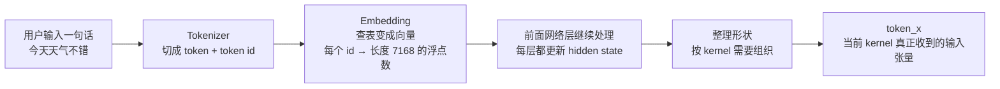
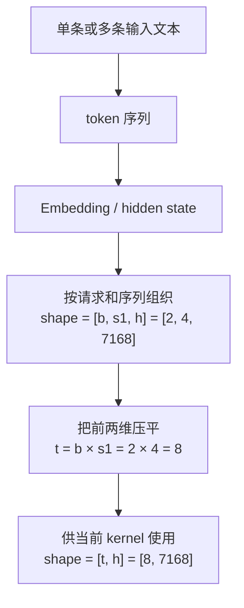

# 基于 DeepSeek V3.2 EXP 的 PyPTO 前端六步过程分析 —— Python 代码，是怎样一步步变成初始计算图的？

本文主要基于以下官方材料和真实案例展开：
- PyPTO 官方总览：[README.md](https://gitcode.com/cann/pypto/blob/master/README.md)
- PyPTO 前端开发文档：[python/pypto/frontend/developer_doc_zh.md](https://gitcode.com/cann/pypto/blob/master/python/pypto/frontend/developer_doc_zh.md)
- `pypto.frontend.jit` 官方文档：[docs/api/pypto-frontend-jit.md](https://gitcode.com/cann/pypto/blob/master/docs/api/pypto-frontend-jit.md)
- `pypto.frontend.dynamic` 官方文档：[docs/api/pypto-frontend-dynamic.md](https://gitcode.com/cann/pypto/blob/master/docs/api/pypto-frontend-dynamic.md)
- 精度调试文档中关于 `tensor_graph` 的说明：[docs/tutorials/debug/precision.md](https://gitcode.com/cann/pypto/blob/master/docs/tutorials/debug/precision.md)
- 真实案例：[models/deepseek_v32_exp/README.md](https://gitcode.com/cann/pypto/blob/master/models/deepseek_v32_exp/README.md)
- 真实代码：[models/deepseek_v32_exp/mla_prolog_quant_impl.py](https://gitcode.com/cann/pypto/blob/master/models/deepseek_v32_exp/mla_prolog_quant_impl.py)

## 1. 背景

根据 PyPTO 官方 README，PyPTO 是一个面向 AI 加速器的高性能编程框架。它的核心思想是：开发者先用更接近算法思维的 Python 接口描述张量计算，然后框架再把这些高层描述逐步翻译成更接近硬件执行的中间表示，最后生成可以在目标平台上运行的代码。

这意味着，当前工具如果只展示最终的 Pass DAG，其实只覆盖了整个链路的后半段。它能够帮助分析"编译器优化之后的图长什么样"，但无法回答另外一个对产品和调试都很重要的问题：一段 Python 代码，是怎样一步步变成初始计算图的？

## 2. 术语表 ！！重要

| 术语 | 解释 |
|------|------|
| `AST`（抽象语法树）| 可以把它理解成"Python 代码的语法结构图"。它关心的是代码是怎么写的，比如这里是一个函数定义，那里是一个 `for` 循环，这里是一个函数调用，而不是关心最终要不要发起一次 `matmul`。 |
| `IR`（中间表示）| 可以把它理解成"编译器内部真正拿来处理和优化的图"。它比源码更接近执行，也比最终机器代码更容易分析。官方 README 里也强调了 PyPTO 是通过多层 IR 逐步向下编译的。 |
| `惰性执行`（Lazy Execution）| 指的不是偷懒执行，而是"先不编译，等第一次真正调用时再编译"。官方前端开发文档和 `entry.py` 都明确说明了这一点：`JitCallableWrapper` 会把真正的 parse 和 compile 延迟到第一次 `__call__`。 |
| `kernel` | 在这里不是操作系统里的"内核"，而是"一个被 `@pypto.frontend.jit` 修饰、可以被编译并执行的算子入口函数"。对产品经理来说，可以把它理解为"一个可以单独观察、单独编译、单独执行的计算单元"。例如 `mla_prolog_quant_kernel(...)` 就是一个 kernel。 |
| `动态维度` | 指的是某个 shape 维度在运行时才知道具体数值。官方 `pypto.frontend.dynamic` 文档把它定义为 `SymbolicScalar`，典型场景就是 batch size、序列长度这类在不同请求间会变化的维度。 |
| `X`（token_x / x_in）| `X` 是数学公式里的记号，表示隐藏状态矩阵。到了代码里，它通常会写成 `token_x` 或 `x_in`。这两个名字不是新的算法对象，只是数学公式 `X` 的代码变量名。DeepSeek README 已经明确写了：MLA Prolog 的输入是 hidden state `X`，而代码里的 `token_x` 是这个输入张量的实现名。 |
| `隐藏状态` | 可以理解成"大模型在当前阶段对一个 token 的内部数值理解"。它不是汉字、单词，也不是 token id，而是一串浮点数。模型每往后算一层，这串数都会被更新一次，所以叫"状态"。<br><br>如果非常粗暴地类比：大模型收到用户输入的原始文本 → tokenizer 变成 token → embedding 变成第一版向量 → 经过前面若干层网络处理 → 得到当前这一层看到的 hidden state。<br><br>所以代码里的 `X` 是隐藏状态矩阵，本质上是在说：这不是原始文本数据，而是"模型当前拿在手里的特征向量集合"。`上层网络` 就是"在这个算子之前，模型已经算过的那些部分"。对 `mla_prolog_quant_compute(...)` 来说，`X` 是它的输入，说明在它之前，已经有别的模块把文本一路处理成了 `[t,h]` 的张量，然后把这个结果交给它。 |
| `tensor` | **开发阶段** → tensor 是"计算图节点"，开发者写的是声明式描述，有四个属性：`dtype`、`shape`、`format`（内存排布）、`name`。<br><br>**运行阶段** → tensor 是"内存里真实的数值块"。第一次调用时触发编译，走完整链路：Tensor Graph → Tile Graph → Block Graph → Execute Graph → NPU 可执行代码，最终以 MPMD 方式调度到 NPU 各处理器核。tensor 变成真实内存地址上的数组，框架在 Tile Graph 阶段自动把大 tensor 切分成能放进 L1/UB 缓存的小块执行。<br><br>**内存里的数值从哪来？** 数值来源分四类：① 输入激活（如 `token_x`）：前面层的计算输出，原始文本 → tokenizer → embedding → 若干层网络 → 当前算子；② 权重（如 `w_dq`, `w_uk`）：checkpoint 文件，运行前加载到设备内；③ 缓存（如 `kv_cache`）：前面时间步写入的状态；④ 辅助配置（如 `cos/sin`, `cache_index`）：按位置规则预生成，或运行时根据当前 token 位置算出。 |

### 2.1 从一句话到 `token_x`

前面术语里已经说过，`token_x` 不是原始文本，也不是 token id，而是当前 kernel 真正收到的一批数值向量。很多第一次接触这个链路的人，会在这里卡住：用户明明输入的是一句中文，为什么到了算子代码里会变成一个 `[t, h]` 的张量？下面把这条链路拆成具体步骤，配上实际数值说清楚。



**第一步：Tokenizer 把文本切成 token id**

Tokenizer 会把这句话切成若干个 token。不必纠结它到底按"字""词"还是"子词"切，因为不同模型规则不同。把 token 理解成"模型内部识别的最小文本片段"就够了。

例如可能变成：

```text
["今天", "天气", "不错"]
```

然后每个 token 再映射成一个整数 id：

```text
[15432, 9821, 44107]
```

到这里，文本已经从"字串"变成了"整数序列"。

**第二步：Embedding 把 token id 变成向量**

整数 id 还不能直接表达语义，所以模型会查一张很大的表，叫 embedding table。可以把它理解成一本"模型词典"：

```text
token id → 一个长度为 h 的浮点向量
```

假设隐藏维度 `h = 7168`，那每个 token id 都会被查成一个长度 7168 的数值向量：

```text
15432 → [0.12, -0.03, 1.44, ... 共 7168 个数]
9821  → [-0.88, 0.57, 0.09, ... 共 7168 个数]
44107 → [0.31, 0.22, -1.17, ... 共 7168 个数]
```

这一步之后，原来的一句话就不再是"3 个 token id"，而是"3 行向量"。如果只看单条输入，张量大致是：

```text
[seq_len, hidden_size] = [3, 7168]
```

**第三步：前面网络继续处理，这些向量会不断更新**

embedding 只是"第一版向量"。模型不会拿 embedding 直接做完所有事，而是会经过前面若干层网络继续处理，例如 norm、linear、attention、mlp、residual add 等。每经过一层，token 对应的向量都会被更新。

所以"hidden state"的意思就是：某个 token 在当前这一步、当前这一层时的内部数值表示。

如果当前这个 kernel 不是模型的第一层，那么它拿到的 `token_x` 往往已经不是最原始的 embedding 了，而是：

```text
embedding
→ 前面若干层网络加工后
→ 到达当前算子时的 hidden state
```

因此，`token_x` 更准确的定义是：某些 token 在"到达当前 kernel 时"的隐藏状态矩阵。当 graph 工具里出现 `token_x` 节点时，把它理解成"当前 kernel 的输入激活矩阵"，而不是"一句话"或"一个词"。

### 2.2 shape 为什么会从 `[b, s1, h]` 变成 `[t, h]`

理解了 `token_x` 的来源之后，下一个常见疑问就是：为什么很多资料一会儿写 `token_x` 是 `[b, s1, h]`，一会儿又写成 `[t, h]`？这并不是两种完全不同的数据，而是同一批数据在不同观察角度下的两种写法。



**第四步：如果有 batch，就把多句话放在一起**

真实推理时，通常不止一句话，可能一次处理多条请求，这就是 batch。

三个维度的含义：

- `b`：batch size，一次处理几条请求
- `s1`：这一阶段参与计算的 token 数
- `h`：hidden size，每个 token 的向量长度

假设有 2 条输入，每条都参与 4 个 token 的计算，hidden size 为 7168：

```text
b = 2, s1 = 4, h = 7168
→ shape = [2, 4, 7168]
```

它的意思不是"8 个汉字"，而是：

```text
第 1 条请求有 4 个位置，每个位置有一条长度 7168 的 hidden state 向量
第 2 条请求有 4 个位置，每个位置有一条长度 7168 的 hidden state 向量
```

**第五步：reshape 成 `[t, h]`，把 batch 边界抹掉**

很多 kernel 在实现时，会把前两维合并：

```text
t = b × s1 = 2 × 4 = 8
token_x.shape = [8, 7168]
```

这样做不是因为语义变了，而是因为对很多算子来说，更关心的是"当前总共有多少个 token 位置要算"，而不是这些 token 来自第几条请求。第一维的 8，不再强调 batch 边界，而是强调"当前共有 8 行 hidden state 要参与这个 kernel 的计算"。

**`token_x` 里的数值长什么样？**

`token_x` 本质上就是很多浮点数，例如：

```text
token_x[0] = [0.12, -0.03, 1.44, ...]   # 第 1 个 token 的 hidden state
token_x[1] = [-0.56, 0.91, 0.08, ...]   # 第 2 个 token 的 hidden state
...
token_x[7] = [0.77, -0.34, 0.52, ...]   # 第 8 个 token 的 hidden state
```

这些数不是人工写进去的，也不是直接来自文本字符，而是模型前面的计算一步一步算出来的。更准确地说：

```text
文本      → 用户语言
token id  → 离散编号
embedding → 连续数值表示（初始版本）
token_x   → 当前算子收到的连续数值表示（经过前面若干层加工后）
```

这也是为什么文档里会反复强调：图里看到的一行，不是一个汉字本身，也不是一个 token id，而是"某个 token 在当前网络阶段对应的一条 hidden state 向量"。只有先明白 `token_x` 真正在表示什么，后面开发者看到 matmul、reshape、cache 写回这些图节点时，才会知道它们处理的是哪一类数据，以及 shape 的变化到底在说明什么。

## 3. 为什么选 DeepSeek V3.2 EXP 这个案例

这次分析不应该用一个过于简单的玩具样例，否则看不出 graph 工具的真正价值。`mla_prolog_quant_impl.py` 之所以合适，是因为它同时包含了前端六步里最关键的元素。

它有动态维度：

```python
t = pypto.frontend.dynamic("t")
```

它有真正的前端入口：

```python
@pypto.frontend.jit(...)
def mla_prolog_quant_kernel(...):
    ...
```

它有控制流和计算图构造：

```python
for bs_offset, unroll_length in pypto.loop_unroll(...):
    ...
    pypto.set_semantic_label("Assemble_qNorm")
    pypto.assemble(...)
```

它还有大量可以映射为图节点的 PyPTO 原语，例如：

```python
pypto.matmul(...)
pypto.reshape(...)
pypto.view(...)
pypto.transpose(...)
pypto.scatter_update(...)
```

从产品视角看，这意味着这个案例足够"真实且复杂"，可以同时验证下面几件事情：

1. 源码面板是否真的有价值。
2. 深层父子群组是否真的需要。
3. 动态维度和首次调用状态是否真的值得单独展示。
4. 初始 IR 是否应该和后续 Pass 图分开看。

## 4. 六步流程的总览

PyPTO 官方前端开发文档把整个前端过程概括成六个阶段。把它翻译成面向产品的语言，可以理解成下面这张"从代码到图"的路线图。

| 阶段 | 官方名称 | 通俗理解 | 产物更像什么 |
|------|----------|----------|-------------|
| 1 | Source 提取 | 先把函数源码和行号取出来 | 带行号的源码对象 |
| 2 | Python AST | 把源码解析成标准 Python 语法树 | 语法结构树 |
| 3 | Doc AST | 把语法树整理成更稳定、统一的前端语义树 | 标准化语义树 |
| 4 | Liveness Analysis | 分析变量什么时候最后一次被使用 | 生命周期标注 |
| 5 | Parser / IR 生成 | 把语义树真正翻译成初始计算图 | 初始 IR / tensor graph |
| 6 | Lazy Execution | 第一次调用时再绑定动态维度并编译执行 | 首次调用状态图 |

这六步里，前四步主要解决"理解代码"的问题，第五步开始进入"理解计算图"的问题，第六步则是在回答"这张图什么时候、以什么 shape 被真正激活"。

## 5. 六步过程，逐步解释

### 5.1 第一步：Source 提取

官方前端文档把第一步定义为 Source 提取。对应实现里，`diagnostics.py` 中的 `Source` 类会调用 Python 的 `inspect.getfile()` 和 `inspect.getsourcelines()`，把被装饰函数的源码提取出来，并且修正 AST 节点的行号和列号。

这个阶段最容易被误解。它不是"读取文件内容"这么简单，它真正的价值是给后面每一个阶段都保留源码位置信息。没有这个锚点，后面的 AST 节点、IR 节点就很难再和具体代码行对应起来。

对于 graph 工具来说，这一步不应该直接画成普通 DAG。更合适的方式，是把它当成"源码定位层"。用户在这个层里最关心的问题通常不是"这条边连到哪"，而是"这个节点到底对应哪几行代码"。

从产品设计上看，这一步更像"代码地图"：

```python
def mla_prolog_quant_compute(...):
    ...
    for bs_offset, unroll_length in pypto.loop_unroll(...):
        ...
        pypto.set_semantic_label("Assemble_qNorm")
        pypto.assemble(q_norm, [bs_offset, 0], q_norm_out)
```

当用户点到一个节点时，界面应该能够高亮这段代码，而不是只显示一个抽象的节点 ID。

所以，Source 阶段的正确 UI 不是"再造一张运算图"，而是建立"源码和后续所有图节点之间的可追溯关系"。

### 5.2 第二步：Python AST

第二步是 Python AST。官方文档里把它描述为：使用内置的 `ast.parse()` 将源码解析成 Python 标准抽象语法树。

如果用非编译器语言来解释，这一步做的事情就是：先别急着想执行，先把代码的"语法骨架"看清楚。比如：

- 这里是一个函数定义
- 这里是一条赋值语句
- 这里是一个 `for` 循环
- 这里是一次函数调用
- 这里是 `return`

它关心的是"代码是怎样组织的"，而不是"这次调用最终会不会形成一个 `matmul` 节点"。

拿真实案例来说，下面这段代码在 AST 里一定非常关键：

```python
for bs_offset, unroll_length in pypto.loop_unroll(
    0, t, 1, name="MLA_BS_LOOP", idx_name="bs_offset", unroll_list=unroll_list
):
    ...
```

因为它告诉前端：这里存在一个循环结构，而且这个循环不是普通 Python 业务逻辑，而是后面会被前端特殊处理的计算控制流。

这里要特别回答一个常见疑问：`Python AST` 和 `loop / unroll / controlflow` 到底是什么关系？

答案是，`Python AST` 先只负责看见"语法上有一个 `for`"。它看到的大概是这样一种结构：

```text
For
  target = (bs_offset, unroll_length)
  iter = Call(pypto.loop_unroll, ...)
  body = [
    x_view = pypto.view(...),
    q_kv = pre_compute_2d(...),
    pypto.assemble(...),
    ...
  ]
```

也就是说，在 AST 这一层里：

- `loop` 和 `loop_unroll` 首先都只是"某个调用出现在 `for ... in ...` 的迭代器位置"。
- `controlflow` 首先也只是语法结构，比如 `for`、`if`、`return`。
- `循环体` 指的就是 `for` 缩进下面那一整段 `body`。在这个例子里，循环体就是"一次处理一块 token tile 所需的全部操作"，包括 `view`、`matmul`、`transpose`、`assemble`、`scatter_update` 等。

真正让这个 `for` 变成"带有 PyPTO 语义的循环"的，是后面的 parser 执行过程，而不是 AST 本身。

官方 `loop_unroll` 文档和 FAQ 还给了一个更进一步的理解方式。`loop_unroll` 不是普通 Python for 循环优化语法糖，而是一个"会生成多种展开路径"的控制流原语。比如 `unroll_list=[1, 2, 4]` 时，框架会为 1 倍、2 倍、4 倍展开分别生成路径。也就是说，开发者源码里只写了一份循环体，但编译器后面可能会生成多条不同的执行路径。这个信息在 AST 层还看不出来，在后面的 Initial IR / controlflow 视图里才应该被真正看见。

这一点对产品设计很关键。因为它说明：

```text
Python AST 适合回答"代码结构是什么"
Initial IR / Controlflow 适合回答"这个结构后来被翻译成了什么控制流图"
```

所以在 graph 工具中，Python AST 阶段的主视图应该更像"结构树"，而不是"数据流图"。如果这个阶段还沿用 Pass DAG 那种 op-tensor-op 的表示，就会把语法结构信息抹掉。

换句话说，这一步最应该回答的问题是：

```text
这段代码有哪些语法块？
哪些语句属于同一个循环体？
哪些调用只是普通 Python 调用，哪些调用已经带有 PyPTO 语义？
```

### 5.3 第三步：Doc AST

官方前端开发文档把第三步称为 Doc AST。官方解释是：把 Python AST 节点转换为一个更稳定的抽象层，用来隔离 Python 版本变化，并提供统一的接口供后续 Parser 使用。

这一步对产品经理来说其实很关键，因为它解释了"为什么不能只画 Python AST"。标准 Python AST 是通用语法树，它适合表达 Python 语法，但不适合直接承载 PyPTO 的前端语义。

通俗地说，Doc AST 的职责是把"这是一段 Python 写法"进一步整理成"这是一段前端真正关心的语义结构"。

官方前端开发文档列出了实现这一层的两个核心模块：

- `parser/doc.py`：Python AST 与 doc AST 之间的双向转换注册系统，提供 `parse()`、`to_doc()`、`from_doc()` 等接口，支持 visitor/transformer 模式，并允许为新节点类型注册转换函数。
- `parser/doc_core.py`：定义核心 AST 节点类，包含 `AST`、`NodeVisitor`、`NodeTransformer` 基类，以及语句节点（FunctionDef、Assign、For、If、Return 等）和表达式节点（BinOp、Call、Name、Constant 等）。

这一层最重要的不是名字，而是作用。它至少应该完成三件事：

1. 给节点分配稳定 ID，方便跨阶段映射。
2. 统一不同 Python 写法带来的差异。
3. 把后续生成 IR 所需的语义信息提前挂到节点上。

例如下面这段语句：

```python
pypto.set_semantic_label("Assemble_qNorm")
pypto.assemble(q_norm, [bs_offset, 0], q_norm_out)
```

在 Python AST 里它只是两个普通调用；但在标准化之后，它更像是：

- 一条"为后续算子设置语义标签"的元信息语句
- 一条"把局部结果写回输出张量"的前端语义语句

对 graph 工具来说，这一步是一个很重要的分界线。它把"代码写法"变成"前端语义"。没有这一步，后面的 IR 节点就会显得像凭空冒出来。

### 5.4 第四步：Liveness Analysis

第四步是活性分析，也就是 Liveness Analysis。官方前端文档对它的定义很明确：`LivenessAnalyzer` 会遍历 AST，找出变量最后一次被使用的位置，从而支持自动内存管理。

这个词第一次听起来会很抽象，但其实意思并不复杂。它回答的是一个非常实际的问题：

```text
某个中间变量从哪里开始存在？
它在哪里被反复使用？
最后一次用完之后，什么时候可以释放？
```

例如在 `mla_prolog_quant_compute(...)` 中，像 `q_tmp`、`q_nope_new_trans`、`k_nope_split` 这样的中间量，并不会一直有用。它们往往只在局部片段内被消费。一旦最后一次使用结束，前端就有机会把这些变量标记为"可以删除"。

这一步的重要性在于，它解释了"前端为什么不是简单地把 Python 调用列表翻译成图"。前端不仅在建图，还在分析图中对象的生命周期。对于大张量和复杂 kernel，这直接关系到内存占用和调试可解释性。

如果 graph 工具要把这一步体现出来，最好的方式不是单独再开一张完全独立的图，而是在已有结构上做叠加。例如：

- 在语句节点上显示 `defined here`、`last used here`
- 在右侧详情面板中显示某个变量的 `defs / uses / last_use`
- 在 IR 视图中把超过最后使用点之后的链路变淡

这样用户就能很直观地理解：前端不是只会"生成图"，它还会"判断图里哪些中间结果已经没有价值"。

### 5.5 第五步：Parser / Initial IR 生成

第五步是最接近当前 graph 工具能力的一步。官方前端文档把它描述为：`Parser` 遍历前面的语义树，维护上下文和表达式求值，并最终生成 PTO IR。

如果把前四步比作"读懂代码"，那么这一步就是"真正开始造图"。

而且这里有一个对产品设计非常重要的官方依据。精度调试文档中明确提到了 `tensor_graph`，并把它描述为"前端初始计算图模拟计算后的中间数据"。这说明在官方体系里，前端阶段确实存在一层可以独立观察的"初始计算图"，它不等于后面某个优化 Pass 的图。

这也是为什么我们不能只盯着 Pass JSON。对于想理解"Python 是怎么变成图"的用户来说，第五步才是最关键的展示目标。

这一节要重点回答另一个最容易卡住的问题：`Parser / Initial IR 生成 / 真正开始造图` 到底是什么意思？

很多人第一次听到"parser 生成 IR"时，会误以为 parser 在做一件很神秘的事，好像它手里拿着 AST，然后凭空把一堆图节点画出来。实际上更直观的理解是：

```text
parser 一边读受限的 Python 代码
一边在当前上下文里执行这些 pypto 调用
于是这些 pypto 调用就在后台真正把图节点和张量关系建出来
```

换句话说，parser 不是"把 Python 代码翻译成另一段 Python 代码"，而是"把一段受控的 Python 代码，解释执行成一张初始计算图"。

用一个极简例子来看，会更容易理解：

```python
@pypto.frontend.jit
def toy_kernel(
    x: pypto.Tensor((t, h), pypto.DT_BF16),
    w: pypto.Tensor((h, m), pypto.DT_BF16),
    out: pypto.Tensor((t, m), pypto.DT_BF16),
) -> None:
    y = pypto.matmul(x, w, x.dtype)
    pypto.assemble(y, [0, 0], out)
    return
```

这段代码在 parser 看来，大致会发生下面几件事。

第一，读取函数签名。`get_signature()` 会从类型注解里拿到输入和输出张量定义，也就是"这个 kernel 接受什么 tensor、返回什么 tensor、shape 和 dtype 是什么"。

第二，创建函数壳。`_visit_function_def()` 会进入 `with pypto.function(node.name, *tensor_input_args, *output_args)` 这个上下文，也就是开始创建一个真正的 PTO function。这里还有一个很值得记住的细节：parser 会用 `for _ in pypto.loop(1):` 把函数体包起来。也就是说，即使你的代码里没有显式写循环，前端内部也会把函数体放进一个"单次循环体"里。这和官方 FAQ 里提到的"隐式插入 loop"是对得上的。

第三，逐句访问函数体。例如：

```python
y = pypto.matmul(x, w, x.dtype)
```

parser 做的不是字符串替换，而是：

1. 访问右侧表达式 `pypto.matmul(...)`
2. 在当前上下文里把 `x`、`w` 查出来
3. 真正调用 `pypto.matmul(...)`
4. 这个调用返回一个新的 tensor 对象，并在 PTO function 里留下一个 `MatMul` 操作节点
5. 再把返回的 tensor 绑定到变量名 `y`

于是，对用户来说是"一行 Python 赋值"；对图来说则变成了：

```text
x ----\
       MatMul ----> y
w ----/
```

再看下一句：

```python
pypto.assemble(y, [0, 0], out)
```

这句会被解释成"把局部结果 `y` 写回到更大的输出张量 `out` 的某个偏移位置"。因此图里不会只是多一个普通函数调用，而会出现一个带写回语义的 `Assemble` 节点。这也是为什么 `assemble` 在循环场景下很关键，因为它经常就是"把本轮 tile 的结果写回整体输出"的那一步。

如果把上面的例子进一步压缩成一句话，可以得到一个很直观的对应关系：

```text
Python 里的变量
-> parser 上下文里的名字绑定
-> Initial IR 里的 tensor 边

Python 里的 pypto.matmul / reshape / view / transpose / assemble
-> Initial IR 里的 operation 节点

Python 里的 for / if
-> Initial IR 里的 controlflow 结构
```

所以，`Parser / Initial IR` 真正想表达的不是"开始做更底层的复杂事情"，而是：

```text
从这一步开始，前端不再只是在理解代码写法
而是在真的构造一张可执行、可继续优化的初始计算图
```

在 DeepSeek 这个案例里，下面这些前端原语都应该能比较自然地映射到初始 IR 节点：

```python
pypto.matmul(...)
pypto.reshape(...)
pypto.view(...)
pypto.transpose(...)
pypto.assemble(...)
pypto.scatter_update(...)
```

与此同时，像 `pypto.set_semantic_label("Assemble_qNorm")` 这种调用，不一定要变成独立的算子节点，但它应该作为 metadata 挂到后续真正的运算节点上。否则图里会失去对源码意图的解释能力。

这一层才是真正适合复用当前 `pto/test` 原型布局能力的阶段。因为它已经开始具备计算节点、张量边、控制流 group、深层父子群组以及横向 / 竖向布局切换这些图工具真正需要的元素。

如果竖排模式要参考 TensorBoard，那么普通 tensor 最适合在这一层和第六层被压缩成 edge data，而不是在更前面的 AST 阶段就这样做。

### 5.6 第六步：Lazy Execution

第六步是惰性执行。官方文档和 `entry.py` 都说明了核心事实：`JitCallableWrapper` 不会在函数刚定义时立刻把所有事情都做完，而是会在第一次真实调用时再去创建 `Parser`、执行 `parse()`、绑定动态维度、调用 `execute()`，并进入编译 / 运行流程。

这一点对不熟悉编译器的人来说非常容易忽略，因为从用户表面体验上看，只是"定义了一个 Python 函数，然后像普通函数一样调用"。但在内部，第一次调用前后其实发生了非常大的状态变化。

对于 `mla_prolog_quant_p(...)` 这个案例来说，`t = pypto.frontend.dynamic("t")` 是最典型的观察点。调用前，`t` 只是一个符号；调用后，它会和真实输入的 shape 建立绑定关系。

这意味着 graph 工具不应该把第六步画成一张普通运算图，而应该更像一个"状态对比视图"。它最适合回答的问题是：

```text
首次调用前，这个 kernel 哪些维度还是符号？
首次调用时，动态维度是怎样绑定到真实输入 shape 的？
这次调用有没有触发真正的 parse / compile？
当前是命中缓存还是重新编译？
运行模式是 NPU 还是 SIM？
```

因此第六步更适合做"前后对比"或"状态面板"，而不是再复制一张和第五步差不多的 DAG。

为了把这一节真正讲明白，下面把你最可能卡住的五个问题一次说透。

先说 `kernel`。在这里，`kernel` 指的就是被 `@pypto.frontend.jit` 修饰之后、可以被编译和执行的函数。例如：

```python
@pypto.frontend.jit(...)
def mla_prolog_quant_kernel(...):
    ...
```

这个 `mla_prolog_quant_kernel` 就是一个 kernel。它不是操作系统里的 kernel，也不是 CUDA kernel 那种更底层的概念，而是 PyPTO 前端里的"算子入口"。

再说"首次调用前，哪些维度还是符号"。以 `t = pypto.frontend.dynamic("t")` 为例，在第一次真正调用之前，`t` 只是一个 `SymbolicScalar`。这意味着前端知道有这么一个维度名字叫 `t`，但还不知道它到底等于 1、128 还是 1024。于是像 `token_x_shape = (t, h)` 这样的 shape，在首次调用前本质上还是"带符号的 shape 模板"。

那"动态维度是什么"呢？可以把它理解成"运行时才揭晓的 shape 参数"。在这个案例里，`t` 表示合并后的 token 数，README 明确给了定义：`t = b * s1`。所以对前端来说，`t` 不是一个普通 Python 整数常量，而是"需要等输入真的拿到手之后，才能确认的维度"。

接下来是"首次调用时，动态维度怎样绑定到真实输入 shape"。从 `parser.py` 和 `entry.py` 的代码可以看出，PyPTO 的做法不是让用户手写 `t = 128`，而是从真实输入 tensor 的 shape 里反推。以 `token_x: pypto.Tensor((t, h), ...)` 为例，如果这次调用传进来的 `token_x` 实际 shape 是 `[128, 7168]`，那前端就会把 `t` 绑定到第 0 轴的 128。后面输出张量里凡是用了 `t` 的地方，就可以据此推导出具体 shape。

再看"第一次调用会不会不触发 parse"。如果我们只看 Python 前端这层，答案应该分两种情况说。

第一种，是这个 wrapper 第一次真正面对一组新输入、底层也没有现成可用编译结果时。此时会触发真正的 parse / execute / compile。NPU 路径里，C++ binding 的 `LaunchKernelTorch` 会先看 `KernelModule` 里有没有匹配这组 tensor 规格的 `KernelBinary`，如果没有，就会回调 Python 侧的 `compile(torch_tensors, tensor_defs)`；而这个 `compile()` 里又会重新创建 parser，执行 `parse()`、绑定动态维度、执行 `execute()`。这就是"第一次调用触发真正编译"的典型情况。

第二种，是"第一次调用这个 Python 包装对象"，但底层已经有可复用缓存。此时前端可能不会重新完整编译。因为缓存至少有两层。

第一层是 Python 侧的 `KernelModule` 缓存。`JitCallableWrapper` 会根据源码、配置项、闭包变量、非 tensor 参数生成一个 cache key。如果这些都一样，就可能直接复用之前的 `KernelModule`。

第二层是 `KernelModule` 内部的 `KernelBinary` 缓存。C++ binding 会根据本次输入 tensor 的规格去找"有没有已经编译好的内核二进制"。有就直接复用，没有才重新编译。

如果把它翻译成产品能看懂的话，可以理解成：

```text
"命中缓存还是重新编译"
本质是在问：
这次调用能不能直接复用之前为相同源码和相同输入规格准备好的编译结果？
```

这也是为什么一个好的 graph 工具不应该只告诉用户"已编译"，而应该把缓存信息展开成更具体的状态，比如：

- 复用的是同一个 `KernelModule`，还是新建了一个
- 复用的是已有 `KernelBinary`，还是重新编译了二进制
- 控制流缓存是否命中

最后说 `NPU` 和 `SIM`。这两个词和你熟悉的 `AICPU / AI Core / Cube / Vector` 不是同一层级的概念。

`NPU` 说的是"运行模式在真实昇腾硬件上执行"。在这个模式下，底层会走真实设备执行链路，里面当然会涉及 AI Core、AI CPU、调度、workspace 等硬件细节。

`SIM` 说的是"运行模式在模拟器或代价模型路径上执行"。官方文档把它叫模拟器模式，Python 代码里对应的是 `_cost_model_run_once_data_from_host(...)`。它的意义主要是开发、验证和调试，不等于"在普通 CPU 上做正式生产执行"。

所以更准确的关系是：

```text
NPU / SIM = 两种运行模式
AICPU / AICore = NPU 硬件内部的执行角色
Cube / Vector = 更底层的算力/指令使用维度
```

这也说明，第六步不是"再看一张图"，而是"看这个 kernel 现在处在什么运行状态"。

## 6. 为什么这个功能对开发者真的有用

你最后问到一个非常关键的问题：用户在同一个 DeepSeek kernel 上切换 `Source`、`Python AST` 和 `Initial IR`，到底对写出一个性能优秀的算子有什么实际作用？

答案是，有，而且不是"锦上添花"的那种作用，而是很直接的定位和优化价值。

先看正确性。很多前端问题并不是到了 Pass 图才暴露，而是在更早阶段就已经埋下了。例如：

- `assemble` 的 offset 写错了，导致 tile 写回位置不对
- `view` / `reshape` 的 shape 推导错了，后面算子都在"合法但错误"的形状上运行
- 某段代码以为在处理 `q_nope`，实际语义标签挂到了别的算子上

如果只能看 Pass 图，用户很容易以为是某个后端优化 Pass 改坏了图；但如果能把 `Source`、`Python AST` 和 `Initial IR` 对齐，往往会更早发现"问题其实在源码写法或前端建图阶段"。

再看性能。性能问题很多时候不是一句"这个 matmul 慢"就能解释的，而是要看它前后包了什么。

例如在 DeepSeek 这种案例里，开发者真正关心的不只是有没有 `MatMul_qNope_wUk`，还关心：

- 这个 `matmul` 外面有没有多余的 `reshape / transpose`
- 它是不是被放在一个过小的 loop body 里，导致调度开销偏大
- `loop_unroll` 的写法有没有把循环体做大，还是反而引入过多路径
- `if / cond` 和 `unroll` 叠加后，是否导致编译路径数激增

以 `lightning_indexer_prolog_quant` 为例，这四类问题在 Initial IR 图里各自长什么样，以及开发者该怎么验收，分开说清楚。

---

**验收一：matmul 外面有没有多余的 reshape / transpose**

在正确写法里，紧贴 `MATMUL` 节点的上游，只应该出现"为当前 tile 切片"的 `VIEW`，而不应该出现"为了凑形状而加的额外 `RESHAPE` 或 `TRANSPOSE`"。

`lightning_indexer_prolog_quant` 里有三处 `MATMUL`，Initial IR 图里各自的上游链路如下：

```text
Query-Linear
  in_q_norm_in  →  VIEW(tile 切片)  →  MATMUL
  t_w_qb        ──────────────────────────↗
  ✓ 没有多余 reshape，VIEW 只做 offset 取片

Key-Linear
  in_x_in  →  VIEW(tile 切片)  →  MATMUL
  t_wk     ────────────────────────↗
  ✓ 干净，同上

Query-Hadamard
  q_concat     ─────────────────────────────  MATMUL
  hadamard_q_in  →  RESHAPE([1,hd,hd])  →  ↗
  ✓ RESHAPE 是合法的 broadcast 扩维，不是多余的
```

对比一个典型的问题写法：

```text
x_in  →  RESHAPE  →  TRANSPOSE  →  RESHAPE  →  MATMUL
```

如果图里出现这种"三连"，开发者可以立刻定位：`TRANSPOSE` 本身说明矩阵方向在源码写的时候就不对，`RESHAPE` 是在围绕这个方向错误做补救；这种写法通常比直接在源码里把矩阵维度对齐要多出明显的搬运开销。

**验收方式**：在 Initial IR 图里，点开任意一个 `MATMUL` 节点，向上追溯两到三跳。如果看到的全是 `VIEW`（offset 切片），问题不在这里；如果看到 `TRANSPOSE` 或连续两个 `RESHAPE`，需要回到源码确认矩阵维度是否写错。

---

**验收二：matmul 是不是被放在一个过小的 loop body 里**

`lightning_indexer_prolog_quant` 里有两个 `for` loop，层级和体量差距很大：

```text
LOOP_RESHAPE（外层，单次执行）
  body：7 个 RESHAPE op，处理权重张量的形状对齐
  特点：只跑一次，开销可忽略，节点数少

loop_unroll（主计算 loop）
  body：约 100 个 op，覆盖 Q / K / W 三条支路的完整计算
  特点：按 t_tile 分档，每档编译一条路径
```

"loop body 过小"的问题通常是开发者把原本可以合并进主 loop 的算子，单独拆成了一个只循环一两次的小 loop。Initial IR 图里这种问题的特征是：

```text
loop_A（body：2-3 op，迭代次数小）
loop_B（body：80+ op，迭代次数大）
```

`loop_A` 的每次迭代都会产生一次调度唤醒和上下文切换开销。如果 `loop_A` 处理的结果只是给 `loop_B` 准备输入，而且 `loop_A` 的迭代次数极小（比如 `pypto.loop(0, 1, 1)` 只跑一次），那这个 loop 存在本身不是问题，但如果它的迭代次数和 `loop_B` 一样大，反而说明两者本应合并进同一个 loop body。

**验收方式**：在 Initial IR 图里，展开每个 loop group，数一下 body 里的 op 节点数量和这个 loop 的迭代次数（来自源码的 `pypto.loop(start, end, step)` 参数）。op 数量 ÷ 迭代次数越小，调度开销占比越高。正常情况下，主计算 loop 的 body 应该包含最多的 op。

---

**验收三：loop_unroll 的写法有没有把路径数控制在合理范围**

`loop_unroll` 的 `unroll_list` 参数决定了编译器会为这个 loop 生成几条独立的展开路径。每条路径对应一种 `t_tile` 取值，框架会分别为每种 `t_tile` 编译一套最优 tiling 参数。

```python
pypto.loop_unroll(0, t, 1,
    name="IndexerPrologQuantQuantLoop",
    idx_name="tIdx",
    unroll_list=unroll_list)
```

如果 `unroll_list = [1, 2, 4]`，Initial IR 图里这个 loop group 会展开成 3 个子图，每个子图的 body 结构完全相同，只是 `t_tile` 的符号取值不同。3 条路径 × 约 100 个 op，编译时间和图的节点总量都在可接受范围内。

问题出现在 `unroll_list` 过长时，例如：

```python
unroll_list = [1, 2, 3, 4, 5, 6, 7, 8, 16, 32]
```

10 条路径 × 100 op，Initial IR 图里会出现 10 个几乎完全相同的 loop body 子图，编译时间会线性增大，而实际运行时真正命中的路径往往只有 2-3 条。

路径数过多还有另一个隐患：每条路径都需要独立的 Pass 优化，如果 `cycle_upper_bound` 或 `l1_reuse_map` 等参数在每条路径上的最优值不同，编译器需要为 10 条路径分别搜索，调优成本会明显上升。

**验收方式**：在 Initial IR 图里，找到 `loop_unroll` group 的展开视图，数一下展开后的子图数量。通常 3-5 条路径是合理的；超过 6 条时，需要回到源码评估 `unroll_list` 的覆盖区间是否必要。

---

**验收四：if / cond 和 unroll 叠加后路径数是否激增**

`lightning_indexer_prolog_quant` 的 loop body 里没有显式的 `if / cond`，这是这份代码写得比较干净的地方之一。但如果在循环体内加入条件分支，路径数会乘法式增长。

假设循环体内有下面这段：

```python
if t_tile == 1:
    # decode 路径：m 很小，搬运 bound
    pypto.set_cube_tile_shapes([1, 1], [64, 128], [64, 128])
else:
    # prefill 路径：compute bound
    pypto.set_cube_tile_shapes([4, 8], [64, 128], [64, 128])
```

配合 `unroll_list = [1, 2, 4]`，Initial IR 图里这个 loop group 就会展开成 `3 × 2 = 6` 条路径，而不是 3 条。每条路径都要经历完整的 Pass 优化，编译时间和图节点数翻倍。

更常见的问题是多个 `if` 嵌套：

```text
loop_unroll(unroll_list=[1,2,4])
  └─ if t_tile == 1:
       └─ if h > 4096:
            ...
```

`3 × 2 × 2 = 12` 条路径，图里会出现 12 个几乎完全重复的子图，而其中很多路径在真实推理时根本不会被执行。

**验收方式**：在 Initial IR 图里，如果看到同一个 loop group 的展开子图数量 > `len(unroll_list)`，说明循环体内存在条件分支。展开子图数量除以 `len(unroll_list)` 的结果，就是循环体内分支带来的路径倍增系数。理想情况下这个系数为 1；超过 2 时，需要评估是否可以把分支移出循环体，或者通过 `set_cube_tile_shapes` 的参数动态化来消除显式 `if`。

---

这些问题如果只看最终 Pass 图，往往已经离源码太远了；而在 `Python AST + Initial IR` 的组合视图里，反而更容易看懂"性能问题到底是从哪种代码结构长出来的"。

还有一个非常现实的价值，是区分"前端问题"还是"后端问题"。

如果 `Initial IR` 就已经和源码预期不一致，那么继续盯 Pass 图意义不大；因为后面的所有优化，都是在一张一开始就不对的图上做的。反过来，如果 `Initial IR` 是对的，而某个 Pass 之后开始不对，那问题范围就被大大缩小了。

对产品来说，这意味着这个功能不是单纯为"理解代码"服务，而是服务于三类具体任务：

1. 解释为什么这段 Python 最后会长成这张图。
2. 帮助定位错误是出在源码、前端建图，还是后续编译优化。
3. 帮助理解性能瓶颈究竟来自控制流结构、数据切分，还是后端执行。

所以，如果把这个功能做对，它的价值并不是"多了一个更学术的视图"，而是让用户第一次能真正回答下面这类问题：

```text
我这段算子代码为什么会编成这样？
慢，到底是慢在循环结构，还是慢在后端？
错，到底是源码写错了，还是某个 Pass 改坏了？
动态 shape 频繁触发重新编译，是不是我这个 kernel 的写法导致的？
```

## 7. 最后的判断

站在产品角度，这六步的意义不在于"把编译器内部名词原样搬进浏览器"，而在于建立一条真正可解释的链路：

```text
源码写了什么
-> 前端怎样理解它
-> 前端怎样分析变量生命周期
-> 前端怎样生成初始计算图
-> 第一次真实调用时这张图怎样被激活
```

只有把这条链路建立起来，graph 工具才不仅仅是"图画出来了"，而是真正具备了"帮助 PM、入门开发者和调试人员理解 PyPTO 前端"的价值。
