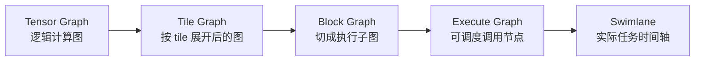

# Tiling、子图切分与泳道图之间的关系研究

这篇笔记专门研究一个很容易被低估、但对性能调优产品线非常关键的问题：

**为什么开发者改了一组 tile，不只是单个算子变快或变慢，连子图切分方式和泳道图形态都会跟着变化？**

如果这个问题不研究清楚，后面的性能调优界面就很容易停留在“看到现象”，却解释不出“为什么会这样”。开发者会看到泳道图里有气泡、任务碎、某些任务特别长，但工具给不出足够有因果感的说明。当前这个主题，就是要把这条因果链完整串起来。

## 1. 先把三个对象分清楚：tile、子图、泳道图

很多时候讨论会混在一起，是因为这三个概念在开发者脑中没有被明确区分。

`tile` 是切块策略。  
它决定一块张量计算在 `L0 / L1 / UB` 等片上资源里是怎么被切开的。对 matmul 来说，它体现为 `mL0 / mL1 / kL0 / kL1 / nL0 / nL1`；对 vector 操作来说，它体现为若干维度上的切分大小。

`子图` 是编译器在 Tile Graph 之后，为了调度和执行而形成的执行单元。  
在工具文档里，Tile Graph 会继续被切成若干 Block Graph 子图，而 Execute Graph 则把这些子图当成可调度调用节点去组织。[`查看计算图.md`](/Users/yin/gitcode/pypto-master/docs/tools/computation_graph/查看计算图.md)

`泳道图` 是这些执行单元真正被调度到 AIC/AIV 线程之后的时间展开图。  
它展示的不是“逻辑依赖关系”，而是“任务什么时候开始、持续多久、前后有什么空隙”。[`查看泳道图.md`](/Users/yin/gitcode/pypto-master/docs/tools/swimlane_graph/查看泳道图.md)

把这三者压缩成一句话就是：

```text
tile 决定怎么切块
子图决定怎么组织成执行单元
泳道图决定这些执行单元最终怎么在时间轴上跑
```

## 2. 为什么 tile 不只是“算子内部参数”

如果只从接口层看，tile 很像一个局部参数。例如：

```python
pypto.set_cube_tile_shapes([128, 128], [64, 256], [256, 256], enable_multi_data_load=True)
pypto.set_vec_tile_shapes(64, 512)
```

从表面上看，这只是在告诉编译器“这次 matmul 怎么切”或者“这个 vector 操作怎么切”。但官方性能调优文档和 DeepSeek 的真实样例已经说明，事情并没有这么简单。

官方文档在介绍性能调优时，明确把“调整 Tiling 配置”和“调整计算图编译策略”放在一起讨论，指出这些配置项共同作用于子图切分和子图合并。[`performance.md`](/Users/yin/gitcode/pypto-master/docs/tutorials/debug/performance.md)

其中最重要的一句话可以翻译成：

```text
tile 不是只影响单个 op 的局部效率
它还会影响编译器如何把 op 们组合成子图
```

这件事在 DeepSeek 的 QuantIndexerProlog 案例里说得更直接。官方案例明确写到：

- 反量化和 RoPE 没有合并到同一同构子图，导致 vector 任务多而稀疏，出现大量气泡；
- 根本原因是 `TileShape` 设置不合理；
- 通过调整相关计算中的 Tile，使相关计算中的 Tile 保持一致，pass 就会把它们切到同样一个同构子图里；
- 打开 `L1Reuse` 之后，一些 cube 子图又会被进一步合并，从而减少右矩阵重复搬运。

这几句话非常关键，因为它们说明 tile 至少在同时影响两层结构：

第一层是**微观计算效率**。  
也就是某个 matmul、dequant、rope、softmax 在单个 tile 上跑得快不快。

第二层是**宏观图结构形态**。  
也就是这些 op 能不能被识别成同构子图、有没有机会合并、最后形成多少个执行任务。

所以，对产品来说，tile 不能再被理解成“高级设置面板里的一个数值”。它更像是一个会同时改写：

```text
单 op 切块方式
+ 子图边界
+ 子图同构率
+ 任务数
+ 搬运次数
+ 泳道图中的气泡分布
```

的联合控制杆。

## 3. 真实编译链路里，tile 是在哪些阶段开始发挥作用的

这件事可以借助官方计算图文档来理解。

在工具文档里，PyPTO 计算图分为四个主要阶段：

- Tensor Graph
- Tile Graph
- Block Graph
- Execute Graph

Tensor Graph 还是比较接近用户写的计算逻辑，还没有真正按 tile 展开。  
Tile Graph 才开始体现“原本一块大张量，被切成许多 tile”的结果。  
再往后，Tile Graph 会被切成 Block Graph 子图。  
最后，Execute Graph 再把这些子图组织成实际调度的调用节点。[`查看计算图.md`](/Users/yin/gitcode/pypto-master/docs/tools/computation_graph/查看计算图.md)

如果把这条链再往下接到泳道图，就会变成：



这条链最重要的产品含义是：

**tile 不只属于 Tile Graph，它的影响会一路向后传导到 Block Graph、Execute Graph 和 Swimlane。**

所以，如果我们的工具只在 Tile Graph 阶段显示 tile，而不把它和后面的子图、任务关联起来，开发者其实仍然看不到最关键的因果关系。

## 4. 从官方案例看，tile 为什么会改变“子图切分”

QuantIndexerProlog 的官方性能案例，是当前最适合拿来解释这件事的真实例子。[`performance_case_quantindexerprolog.md`](/Users/yin/gitcode/pypto-master/docs/tutorials/debug/performance_case_quantindexerprolog.md)

这个案例里，典型场景是：

```text
Batch = 4
MTP1
KV Cache = 64k
```

官方首先判断：这个场景计算量并不大，未必能打满所有核，主要瓶颈在搬运。

然后它观察到：

1. vector 任务既多又稀疏；
2. 反量化和 RoPE 没有并进同一个同构子图；
3. 右矩阵存在重复搬运；
4. L1 Reuse 没有充分发挥作用。

接下来的调优顺序也非常有代表性：

**第一轮先调 vector tile。**  
这里的目标不是先让单个 vector op 最快，而是让一批相关 op 使用兼容的 tile，从而满足同构子图合并的条件。结果是任务数减少、气泡减少，泳道图更连续。

**第二轮再调 cube tile。**  
案例里明确说，这个实现的 `m=8`，所以默认的 cube tile 不贴当前场景。于是把 `m` 改成更合适的值，把 `k` 拉大，把 `n` 重新调整，结果 cube 段更贴当前 workload。

**第三轮打开 L1Reuse。**  
这一步的收益不只是“某个 op 更快”，而是让原本分散的 cube 子图可以合并，从而减少右矩阵重复搬运。

如果用一句特别通俗的话总结这个案例：

```text
先把零散的小工序拼成更连续的大工序
再把最重的矩阵乘切得更贴当前形状
最后让重复搬运的原料尽量留在片上复用
```

这其实已经是一个非常完整的“tile -> 子图 -> 泳道图”因果链了。

## 5. 从实现侧看，除了 tile，本地还有哪些参数在一起影响子图

如果只看模型样例代码，开发者并不是只在改 tile，还会一起改一些 pass 选项。

在 DeepSeek 的样例里，可以看到这类参数反复出现：

- `cube_l1_reuse_setting`
- `vec_nbuffer_mode`
- `vec_nbuffer_setting`
- `mg_copyin_upper_bound`
- `pg_upper_bound`
- `pg_lower_bound`
- `pg_skip_partition`

这些参数之所以重要，是因为它们本身就是“怎么切子图、怎么合子图”的控制杆。

例如在官方性能调优文档中：

- `pg_*` 一类参数更像切分控制；
- `vec_nbuffer_*` 更像 AIV 向量子图的合并控制；
- `cube_l1_reuse_*` 更像 AIC cube 子图的数据复用与合并控制。[`performance.md`](/Users/yin/gitcode/pypto-master/docs/tutorials/debug/performance.md)

而在实现里，像 [`n_buffer_merge.cpp`](/Users/yin/gitcode/pypto-master/framework/src/passes/tile_graph_pass/graph_partition/n_buffer_merge.cpp) 这种 pass，已经直接在根据 hash、输入搬运量、mergeNum 等信息做子图合并了。

对产品来说，这意味着下一步研究不应该只问“tile 改了没”，而应该问：

```text
当前这组 tile
+ 当前这组 pass 配置
= 最终子图形态
```

这也是为什么未来的调优界面不能只做一个“Tile 配置面板”。它至少还需要一个“子图编译策略面板”或者“合并策略说明卡”。

## 6. 当前工具如果要把这件事讲清楚，最缺什么

基于现有工具路线和官方文档，我认为当前最缺的不是更多图，而是**跨层解释能力**。

现在已经能看到：

- Pass DAG
- 局部源码图
- 架构图

但还缺下面这条解释链：

```text
这组 tile 为什么导致 Tile Graph 这样展开
这组展开为什么导致 Block Graph 切成这些子图
这些子图为什么在泳道图上变成这样的气泡和长条
```

如果这条链不补，用户看到的就永远是三个割裂的现象：

- 图变大了
- 子图变多了
- 泳道图有气泡了

却不知道它们之间到底是什么关系。

## 7. 针对 graph 工具，我建议的可视化表达方式

这个主题研究到最后，不能只停在概念层，必须落到“前端怎么画”。我建议第一版不要贪大，而是做三件最有价值的表达。

### 7.1 做“Profile Diff”视图，而不是只看单一泳道图

性能调优真正需要的，不是只看一张泳道图，而是比较：

```text
Profile A：默认 tile
Profile B：修改后的 tile
```

建议 front-end 在同一语义标签下，能同时展示：

- 子图数变化
- 同构率变化
- 任务数变化
- 气泡长度变化
- 关键语义标签对应任务时长变化

这个能力的价值在于，它第一次把“改参数”和“看结果”直接连了起来。

### 7.2 在 Execute Graph 和 Swimlane 之间做稳定跳转

官方工具里已经有从泳道图跳回计算图的机制，核心锚点包括：

- `rootHash`
- `leafHash`
- `callOpMagic`
- `Subgraphid`
- `semantic_label`

这些字段正好可以拿来做前端的跨视图联动。[`泳道图跳转到计算图.md`](/Users/yin/gitcode/pypto-master/docs/tools/swimlane_graph/泳道图跳转到计算图.md) [`查看泳道图.md`](/Users/yin/gitcode/pypto-master/docs/tools/swimlane_graph/查看泳道图.md)

建议第一版至少做到：

- 在泳道图点一个任务，能高亮对应 Execute Graph 调用节点
- 再从调用节点下钻到对应 Block Graph
- 在 Block Graph 上高亮这一批任务所属的语义标签

这样用户才能真正看到“一个泳道图上的长条，背后到底是哪一类子图”。

### 7.3 做一张“原因卡片”，明确告诉用户为什么会碎

这个能力尤其适合 topic 2。

当用户点到某个气泡多、任务碎的区域时，工具应该尽量生成一种可读的解释，例如：

```text
当前 Sa_V0 / Sa_V1 相关 vector op 未合并到同构子图
可能原因：
1. 相邻 op 的 vec tile 不一致
2. vec_nbuffer_mode 当前关闭或合并数过小
3. pg_upper_bound 限制了更大的子图合并
```

哪怕第一版解释不够完整，只要能做到“现象 -> 可能原因”的桥接，就已经比只展示图和时长有价值很多。

## 8. 针对 topic 2，我建议前端优先采集哪些数据

如果要把这个研究落到工具里，前端侧至少要有下面几类数据字段：

第一类是 tile 配置快照。  
不能只知道“图长什么样”，还要知道当时用了哪一组：

- `cube_tile_shapes`
- `vec_tile_shapes`
- `unroll_list`
- `tile_bs`

第二类是 pass 配置快照。  
包括：

- `cube_l1_reuse_setting`
- `vec_nbuffer_mode / setting`
- `pg_upper_bound / lower_bound / skip_partition`
- `mg_copyin_upper_bound`

第三类是跨层映射锚点。  
包括：

- `semantic_label`
- `subgraph_id`
- `rootHash`
- `leafHash`
- `callOpMagic`

第四类是结果指标。  
包括：

- 子图总数
- 同构率
- Block Graph / Execute Graph 健康报告
- 泳道图任务总数
- 气泡密度
- 某语义标签任务总时长

这些数据一旦齐了，topic 2 基本就能从“研究稿”转成“产品原型”。

## 9. 对 topic 2 的最终判断

如果只保留一句结论，我的判断是：

**tiling 之所以值得单独研究，不是因为它只是一个高级性能参数，而是因为它会反过来改写子图切分和任务时间轴；而这条“tile -> 子图 -> 泳道图”的因果链，正是当前 graph 工具最缺的解释能力。**

## 参考资料

- [`performance.md`](/Users/yin/gitcode/pypto-master/docs/tutorials/debug/performance.md)
- [`performance_case_quantindexerprolog.md`](/Users/yin/gitcode/pypto-master/docs/tutorials/debug/performance_case_quantindexerprolog.md)
- [`查看计算图.md`](/Users/yin/gitcode/pypto-master/docs/tools/computation_graph/查看计算图.md)
- [`查看健康报告.md`](/Users/yin/gitcode/pypto-master/docs/tools/computation_graph/查看健康报告.md)
- [`查看泳道图.md`](/Users/yin/gitcode/pypto-master/docs/tools/swimlane_graph/查看泳道图.md)
- [`查看性能报告.md`](/Users/yin/gitcode/pypto-master/docs/tools/swimlane_graph/查看性能报告.md)
- [`泳道图跳转到计算图.md`](/Users/yin/gitcode/pypto-master/docs/tools/swimlane_graph/泳道图跳转到计算图.md)
- [`三栏联动视图.md`](/Users/yin/gitcode/pypto-master/docs/tools/three_column/三栏联动视图.md)
- [`n_buffer_merge.cpp`](/Users/yin/gitcode/pypto-master/framework/src/passes/tile_graph_pass/graph_partition/n_buffer_merge.cpp)
