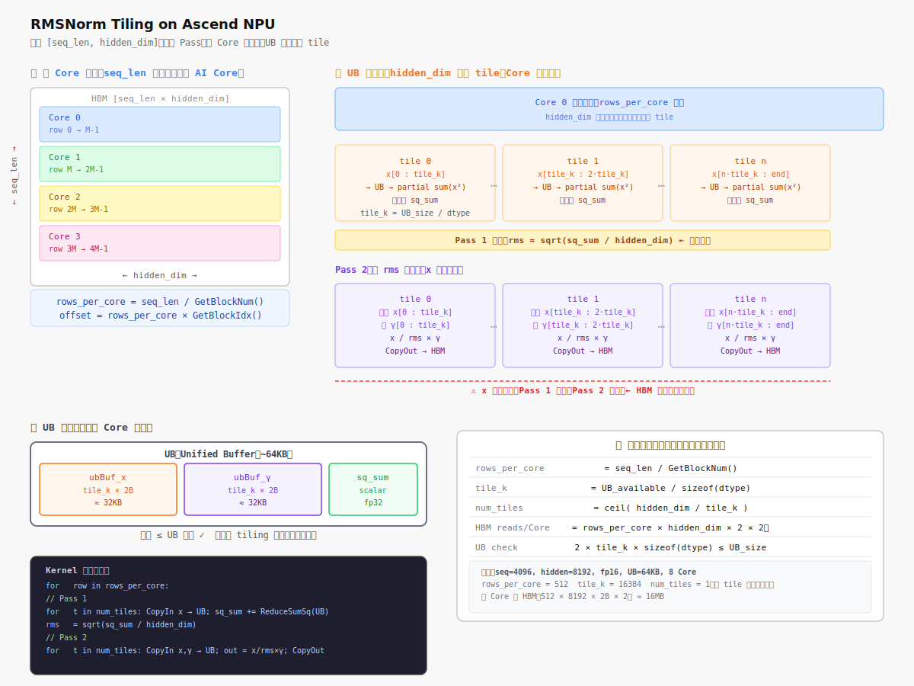

# RMSNorm Tiling on Ascend NPU 研究笔记

> 背景：听算子开发者访谈时整理。开发者在手画循环切分图，解释如何在 Ascend AI Core 上实现均方根归一化（RMSNorm）的 Kernel。

---

## 一、RMSNorm 是什么

RMSNorm 是现代大模型（LLaMA、DeepSeek 系列）替代 LayerNorm 的标准归一化组件。

**公式：**

$$\text{RMSNorm}(x) = \frac{x}{\text{RMS}(x)} \cdot \gamma$$

$$\text{RMS}(x) = \sqrt{\frac{1}{n} \sum_{i=1}^{n} x_i^2}$$

与 LayerNorm 的区别：**不减均值，只除以均方根**，计算更简洁，效果相当。

**输入 shape：** `[seq_len, hidden_dim]`，对每一行（每个 token）的 hidden_dim 维做规约，得到一个标量 RMS，再用它归一化该行。

---

## 二、Ascend 的硬件约束：为什么要 Tiling

Ascend AI Core 只能处理 **UB（Unified Buffer）** 里的数据，无法直接访问 HBM（片外高带宽内存）。

```
HBM（片外，大但慢）
  ↕ DMA 搬运
UB（片上，小但快）← AI Core 只能在这里计算
```

UB 容量有限（几十 KB），而一个 RMSNorm 的输入 tensor 可能几百 MB，所以必须**切分（Tiling）**：分批把数据搬进 UB 算完再写回，循环直到处理完整个 tensor。

---

## 三、Tiling 的两个维度



### 维度 1：跨 Core 切分（多核并行）

RMSNorm 对每行独立计算，行与行之间没有依赖，天然可以并行。

```
总行数 seq_len，均分给所有 AI Core：
  Core 0 → row 0 ~ row M-1
  Core 1 → row M ~ row 2M-1
  Core 2 → ...
```

每个 Core 通过内置函数知道自己的分工：

```c
blockLength  = totalRows / GetBlockNum();  // 我负责几行
globalOffset = blockLength * GetBlockIdx(); // 我从第几行开始
```

### 维度 2：UB 内切分（单 Core 内 tile 循环）

每个 Core 负责的行里，hidden_dim 如果比 UB 大，还需要沿列方向再切：

```
tile_k = UB 可用空间 / sizeof(fp16)
num_tiles = ceil(hidden_dim / tile_k)
```

**"把 UB 装满"** = 让 tile_k 尽量接近 UB 上限，减少循环次数，降低 HBM 带宽压力。

---

## 四、两趟计算的核心挑战

RMSNorm **不能一趟完成**，必须两趟：

| 趟次 | 做什么 | 输入 | 输出 |
|------|--------|------|------|
| Pass 1 | 累加 x_i²，算出 RMS 标量 | 每行 x | rms（标量） |
| Pass 2 | 用 RMS 归一化，乘以 γ | 同行 x + γ 权重 | 归一化结果 |

**关键代价：x 要读两遍。** Pass 1 算完 RMS，Pass 2 必须重新从 HBM 把同一行的 x 再搬一次。这就是访谈里开发者手画循环图的核心问题——如何安排两趟读写，最小化 HBM 带宽浪费。

---

## 五、当 hidden_dim 装不进 UB（"轴比较长"）

当 hidden_dim 很大（比如 8192），单个 tile 装不下整行，Pass 1 本身也要内部分 tile 累加：

**Pass 1（分 tile 累加平方和）：**

```
partial_sq_sum = 0
for k = 0, tile_k, 2*tile_k, ...:
    搬入 x[k : k+tile_k] → UB
    UB 内：partial_sq_sum += sum(x_i²)  ← 向量 reduce
rms = sqrt(partial_sq_sum / hidden_dim)
```

**Pass 2（分 tile 归一化）：**

```
for k = 0, tile_k, 2*tile_k, ...:
    搬入 x[k : k+tile_k] → UB        ← x 再读一遍
    搬入 γ[k : k+tile_k] → UB
    UB 内：output[k:] = x / rms * γ
    CopyOut：写回结果
```

---

## 六、Kernel 侧的完整结构

**Kernel 侧做的事**就是把上面的循环用 AscendC 写出来：

```c
class RMSNormKernel {
  void Init() {
    rows_per_core = totalRows / GetBlockNum();
    tile_k        = UB_CAPACITY / sizeof(half);   // UB 装满
    num_tiles     = ceil(hidden_dim / tile_k);
    row_offset    = rows_per_core * GetBlockIdx();
  }

  void Process() {
    for (int row = 0; row < rows_per_core; row++) {
      // === Pass 1：算 RMS ===
      float sq_sum = 0;
      for (int t = 0; t < num_tiles; t++) {
        CopyIn(row_offset + row, t * tile_k, tile_k);  // HBM → UB
        sq_sum += ReduceSumSquare(ubBuf, tile_k);       // UB 内向量 reduce
      }
      float rms = sqrt(sq_sum / hidden_dim);

      // === Pass 2：归一化 ===
      for (int t = 0; t < num_tiles; t++) {
        CopyIn(row_offset + row, t * tile_k, tile_k);  // x 再搬一遍
        CopyInGamma(t * tile_k, tile_k);               // γ 搬进来
        Normalize(ubBuf, rms, gammaBuf, tile_k);       // UB 内：/ rms * γ
        CopyOut(row_offset + row, t * tile_k, tile_k); // 写回 HBM
      }
    }
  }
}
```

---

## 七、开发者手画的图是在算什么

```
给定条件：
  seq_len = 4096, hidden_dim = 8192
  dtype = fp16 (2 bytes)
  UB 可用 = 64KB = 65536 bytes
  AI Core 数 = 8

Step 1：跨 Core 分行
  rows_per_core = 4096 / 8 = 512 行

Step 2：UB 内 tile 大小
  tile_k = 65536 / 2 = 32768 个元素
  但还要留空间给 γ 和中间 buffer，实际约 tile_k ≈ 16384

Step 3：每行的 tile 数
  num_tiles = ceil(8192 / 16384) = 1   ← 刚好一个 tile 能装下

Step 4：一个 Core 的总 HBM 读取量
  Pass 1 读 x：512 行 × 8192 × 2B = 8MB
  Pass 2 读 x：同上 8MB
  Pass 2 读 γ：8192 × 2B ≈ 16KB（γ 可以缓存，忽略不计）
  ─────────────────────────────────
  总读取：~16MB / Core

Step 5：确认 UB 布局（画图的核心）
  ubBuf_x:     tile_k × 2B = 32KB
  ubBuf_gamma: tile_k × 2B = 32KB
  中间 acc:    少量 scalar
  合计 ≤ 64KB ✓
```

---

## 八、NZ 格式的影响

RMSNorm 涉及矩阵计算时，数据可能以 **NZ 格式**（Fractal 格式）存在 UB 里：

- 普通行主序是 **ND 格式**
- Cube Unit（矩阵乘法硬件）要求 **NZ 格式**：把矩阵分成 16×16 小块存储，消除 bank conflict

RMSNorm 是向量 reduce 操作，主要走 **Vector Unit** 而不是 Cube Unit，所以通常保持 ND 格式。但如果 RMSNorm 和矩阵乘法算子融合（kernel fusion），就需要在 UB 内做 ND ↔ NZ 格式转换。

---

## 九、参考

| 概念 | 含义 |
|------|------|
| UB（Unified Buffer） | Ascend AI Core 片上 SRAM，算子计算的"工作台" |
| HBM | 片外高带宽内存，容量大但访问慢 |
| Tiling | 把大 tensor 切成能装进 UB 的小块，循环处理 |
| GetBlockIdx() | 当前 Core 的编号（0 ~ blockNum-1） |
| GetBlockNum() | 总 Core 数（由 kernel launch 参数决定） |
| NZ / Fractal | Ascend 适配 Cube Unit 的矩阵数据排布格式 |
| AR（AllReduce） | 跨 Core 的规约通信，把各 Core 的 partial 结果汇总 |
