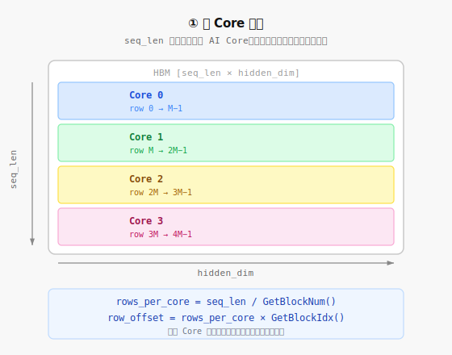
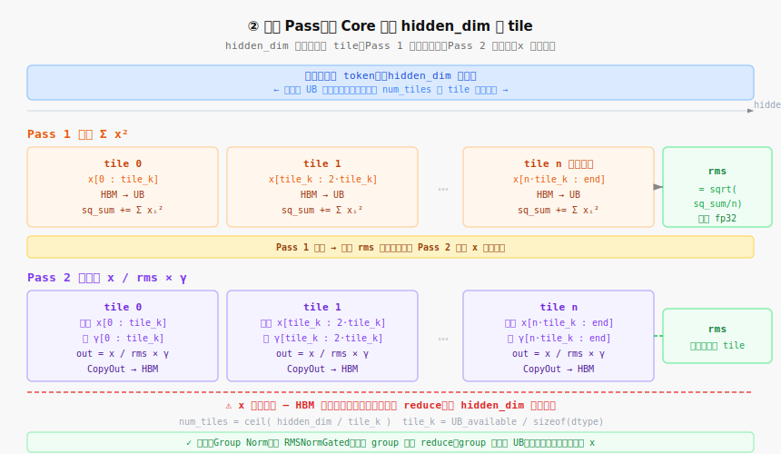
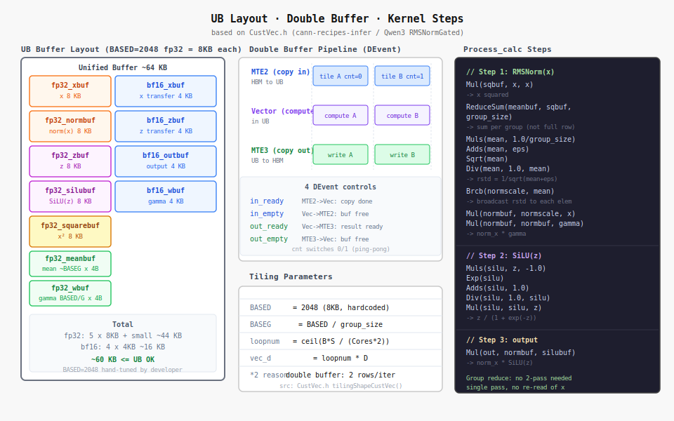

# RMSNorm Tiling on Ascend NPU 研究笔记

> 背景：听算子开发者访谈时整理。开发者在手画循环切分图，解释如何在 Ascend AI Core 上实现均方根归一化（RMSNorm）的 Kernel。

---

## 来源

| 来源 | 说明 | 链接 |
|------|------|------|
| DeepSeek V3.2 推理源码 | `model.py` RMSNorm 实现，含 fused residual 变体 | 本地 `deepseekv3.2源码/inference_副本/model.py` L272–306 |
| GitCode cann-recipes-infer | 华为官方 CANN 推理配方仓库，含多个模型的真实 AscendC kernel | https://gitcode.com/cann/cann-recipes-infer |
| RMSNormGated kernel（Qwen3） | `CustVec.h`，含 tiling 计算、double buffer、Group Norm 融合实现 | `cann-recipes-infer/models/qwen3-next/ops/gated_delta_net/rmsnormgated/op_kernel/CustVec.h` |
| CANN 高阶 API 文档（RmsNorm Tiling） | `GetRmsNormTilingInfo` / `RmsNormTiling` 结构字段说明 | https://www.hiascend.com/document/detail/zh/canncommercial/80RC3/apiref/ascendcopapi/atlasascendc_api_07_0738.html |
| DeepSeek V3.2 AscendC 算子指南 | DeepSeek V3.2 在 910B 上的算子开发说明（PyPTO / TileLang / AscendC 三条路径） | `cann-recipes-infer/docs/models/deepseek-v3.2-exp/deepseek_v3.2_exp_ascendc_operator_guide.md` |
| MindSpore AscendC 自定义算子开发 | AscendC kernel 开发官方教程，含 tiling / CopyIn / CopyOut 用法 | https://www.mindspore.cn/tutorials/experts/zh-CN/r2.3.1/operation/op_custom_ascendc.html |

---

## 一、RMSNorm 是什么

RMSNorm 是现代大模型（LLaMA、DeepSeek 系列）替代 LayerNorm 的标准归一化组件。

**公式：**

$$\text{RMSNorm}(x) = \frac{x}{\text{RMS}(x)} \cdot \gamma$$

$$\text{RMS}(x) = \sqrt{\frac{1}{n} \sum_{i=1}^{n} x_i^2}$$

与 LayerNorm 的区别：**不减均值，只除以均方根**，计算更简洁，效果相当。

**输入 shape：** `[seq_len, hidden_dim]`，对每一行（每个 token）的 hidden_dim 维做规约，得到一个标量 RMS，再用它归一化该行。

---

## 二、Ascend 的硬件约束：为什么要 Tiling

Ascend AI Core 只能处理 **UB（Unified Buffer）** 里的数据，无法直接访问 HBM（片外高带宽内存）。

```
HBM（片外，大但慢）
  ↕ DMA 搬运
UB（片上，小但快）← AI Core 只能在这里计算
```

UB 容量有限（几十 KB），而一个 RMSNorm 的输入 tensor 可能几百 MB，所以必须**切分（Tiling）**：分批把数据搬进 UB 算完再写回，循环直到处理完整个 tensor。

---

## 三、Tiling 的两个维度

**图 1　跨 Core 切分**



**图 2　两趟 Pass 循环结构**



### 维度 1：跨 Core 切分（多核并行）

RMSNorm 对每行独立计算，行与行之间没有依赖，天然可以并行。

```
总行数 seq_len，均分给所有 AI Core：
  Core 0 → row 0 ~ row M-1
  Core 1 → row M ~ row 2M-1
  Core 2 → ...
```

每个 Core 通过内置函数知道自己的分工：

```c
blockLength  = totalRows / GetBlockNum();  // 我负责几行
globalOffset = blockLength * GetBlockIdx(); // 我从第几行开始
```

### 维度 2：UB 内切分（单 Core 内 tile 循环）

每个 Core 负责的行里，hidden_dim 如果比 UB 大，还需要沿列方向再切：

```
tile_k = UB 可用空间 / sizeof(fp16)
num_tiles = ceil(hidden_dim / tile_k)
```

**"把 UB 装满"** = 让 tile_k 尽量接近 UB 上限，减少循环次数，降低 HBM 带宽压力。

---

## 四、两趟计算的核心挑战

RMSNorm **不能一趟完成**，必须两趟：

| 趟次 | 做什么 | 输入 | 输出 |
|------|--------|------|------|
| Pass 1 | 累加 x_i²，算出 RMS 标量 | 每行 x | rms（标量） |
| Pass 2 | 用 RMS 归一化，乘以 γ | 同行 x + γ 权重 | 归一化结果 |

**关键代价：x 要读两遍。** Pass 1 算完 RMS，Pass 2 必须重新从 HBM 把同一行的 x 再搬一次。这就是访谈里开发者手画循环图的核心问题——如何安排两趟读写，最小化 HBM 带宽浪费。

---

## 五、当 hidden_dim 装不进 UB（"轴比较长"）

当 hidden_dim 很大（比如 8192），单个 tile 装不下整行，Pass 1 本身也要内部分 tile 累加：

**Pass 1（分 tile 累加平方和）：**

```
partial_sq_sum = 0
for k = 0, tile_k, 2*tile_k, ...:
    搬入 x[k : k+tile_k] → UB
    UB 内：partial_sq_sum += sum(x_i²)  ← 向量 reduce
rms = sqrt(partial_sq_sum / hidden_dim)
```

**Pass 2（分 tile 归一化）：**

```
for k = 0, tile_k, 2*tile_k, ...:
    搬入 x[k : k+tile_k] → UB        ← x 再读一遍
    搬入 γ[k : k+tile_k] → UB
    UB 内：output[k:] = x / rms * γ
    CopyOut：写回结果
```

---

## 六、Kernel 侧的完整结构

**Kernel 侧做的事**就是把上面的循环用 AscendC 写出来：

```c
class RMSNormKernel {
  void Init() {
    rows_per_core = totalRows / GetBlockNum();
    tile_k        = UB_CAPACITY / sizeof(half);   // UB 装满
    num_tiles     = ceil(hidden_dim / tile_k);
    row_offset    = rows_per_core * GetBlockIdx();
  }

  void Process() {
    for (int row = 0; row < rows_per_core; row++) {
      // === Pass 1：算 RMS ===
      float sq_sum = 0;
      for (int t = 0; t < num_tiles; t++) {
        CopyIn(row_offset + row, t * tile_k, tile_k);  // HBM → UB
        sq_sum += ReduceSumSquare(ubBuf, tile_k);       // UB 内向量 reduce
      }
      float rms = sqrt(sq_sum / hidden_dim);

      // === Pass 2：归一化 ===
      for (int t = 0; t < num_tiles; t++) {
        CopyIn(row_offset + row, t * tile_k, tile_k);  // x 再搬一遍
        CopyInGamma(t * tile_k, tile_k);               // γ 搬进来
        Normalize(ubBuf, rms, gammaBuf, tile_k);       // UB 内：/ rms * γ
        CopyOut(row_offset + row, t * tile_k, tile_k); // 写回 HBM
      }
    }
  }
}
```

---

**图 3　UB 布局 · 参数推导 · Kernel 主循环**



## 七、开发者手画的图是在算什么

```
给定条件：
  seq_len = 4096, hidden_dim = 8192
  dtype = fp16 (2 bytes)
  UB 可用 = 64KB = 65536 bytes
  AI Core 数 = 8

Step 1：跨 Core 分行
  rows_per_core = 4096 / 8 = 512 行

Step 2：UB 内 tile 大小
  tile_k = 65536 / 2 = 32768 个元素
  但还要留空间给 γ 和中间 buffer，实际约 tile_k ≈ 16384

Step 3：每行的 tile 数
  num_tiles = ceil(8192 / 16384) = 1   ← 刚好一个 tile 能装下

Step 4：一个 Core 的总 HBM 读取量
  Pass 1 读 x：512 行 × 8192 × 2B = 8MB
  Pass 2 读 x：同上 8MB
  Pass 2 读 γ：8192 × 2B ≈ 16KB（γ 可以缓存，忽略不计）
  ─────────────────────────────────
  总读取：~16MB / Core

Step 5：确认 UB 布局（画图的核心）
  ubBuf_x:     tile_k × 2B = 32KB
  ubBuf_gamma: tile_k × 2B = 32KB
  中间 acc:    少量 scalar
  合计 ≤ 64KB ✓
```

---

## 八、DeepSeek V3 Python 实现解析

源码位置：`deepseekv3.2源码/inference_副本/model.py` Line 272–306

```python
class RMSNorm(nn.Module):
    def __init__(self, dim: int, eps: float = 1e-6):
        self.weight = nn.Parameter(torch.ones(dim, dtype=torch.float32))  # γ

    def forward(self, x, residual=None):
        dtype = x.dtype
        if residual is None:
            x = x.float()
            var = x.pow(2).mean(-1, keepdim=True)   # Σx²/n = RMS²
            x = x * torch.rsqrt(var + self.eps)      # x / RMS，rsqrt = 1/sqrt
            return (self.weight * x).to(dtype)        # × γ，还原 dtype
        else:
            # Fused Residual Add + RMSNorm（两个算子合并成一次）
            x = residual = x.float() + residual.float()
            var = x.pow(2).mean(-1, keepdim=True)
            x = x * torch.rsqrt(var + self.eps)
            return (self.weight * x).to(dtype), residual.to(dtype)
```

**三个值得注意的细节：**

**① `rsqrt` 而非 `1/sqrt`**：`torch.rsqrt` 直接算倒数平方根，比 `1 / sqrt(var)` 少一步除法。Ascend Vector Unit 有专门的 `Rsqrt` 指令，映射到硬件更高效。

**② `eps = 1e-6`**：分母加小量防止 var=0 时除零，是数值稳定性保障。

**③ Fused Residual Add**：`forward` 接受可选 `residual` 参数，把 Add + Norm 合并成一个算子。Transformer 每层的结构是：

```
# 标准写法（两个算子，x 过两次内存）
x = x + residual
x = rmsnorm(x)

# Fused 写法（一个算子，x 在 UB 里只过一遍）
x, residual = rmsnorm(x, residual)
```

这正是 Kernel Fusion 的典型场景：residual add 的结果直接留在 UB，省掉一次 HBM 写回再搬入。

**使用位置（model.py）：**

```python
self.q_norm    = RMSNorm(q_lora_rank)   # MLA Q 投影后归一化
self.kv_norm   = RMSNorm(kv_lora_rank)  # MLA KV 投影后归一化
self.attn_norm = RMSNorm(args.dim)      # 每层 Attention 前
self.ffn_norm  = RMSNorm(args.dim)      # 每层 FFN 前
self.norm      = RMSNorm(args.dim)      # 最终输出层前
```

每个 Transformer block 有 2 个 RMSNorm，加上 MLA 内部的 q/kv norm，DeepSeek V3 共有大量 RMSNorm 调用，tiling 性价比极高。

---

## 九、GitCode 官方 Kernel 实现：RMSNormGated（Qwen3 真实源码）

源码位置：`cann-recipes-infer/models/qwen3-next/ops/gated_delta_net/rmsnormgated/op_kernel/CustVec.h`

这是 **RMSNormGated**，比普通 RMSNorm 多一步门控：

$$\text{out} = \text{RMSNorm}(x) \times \text{SiLU}(z) \times \gamma$$

Qwen3 把归一化和门控合并成一个 kernel，避免中间结果写回 HBM。

### Tiling 计算：`tilingShapeCustVec`

```cpp
constexpr int BASED = 2048;  // UB tile 大小：硬编码，不动态计算

void tilingShapeCustVec(int B, int S, int D, int G, float eps,
                         CustVecShapeInfo &shape) {
    shape.group_size = D / G;               // 每个 norm group 的宽度
    shape.BASED      = 2048;               // 每次搬多少 fp32 元素进 UB
    shape.BASEG      = 2048 / (D / G);     // 一个 tile 里几个 group
    shape.loopnum    = CeilDiv(B * S, GetBlockNum() * 2);  // 每 Core 几行
    shape.vec_d      = shape.loopnum * D;  // 每 Core 总元素数
}
```

**`BASED = 2048` 的含义：** 2048 个 fp32 = 8KB。UB 里同时存 bf16 和 fp32 双份 buffer（用于 double buffer），开发者手工计算后拍定为 2048，刚好不超 UB 上限。

**`loopnum × 2` 的含义：** `CeilDiv(B*S, GetBlockNum() * 2)` 中 `×2` 是为 double buffer 预留——外层循环每次处理 2 行，行数需要除以 2。

### 两层循环结构

```cpp
// 外层：遍历本 Core 负责的所有行（loopnum 行）
for (kernel_d = 0; kernel_d < ub_d; kernel_d += D) {
    // 内层：沿 D 轴切 tile，每次处理 BASED 个元素
    for (base_d = 0; base_d < D; base_d += BASED) {
        // 预取下一块（double buffer）
        // CopyIn → Cast → Compute → Cast → CopyOut
    }
}
```

### Double Buffer 流水线

用 4 个硬件事件（`DEvent`）驱动 MTE2（搬运）和 Vector（计算）重叠：

```
MTE2                    Vector                  MTE3
搬 tile A → UB  →→→    计算 tile A             写回 tile A → HBM
搬 tile B → UB（预取）  计算 tile B（等 A 写完）
```

`cnt` 在 0/1 之间切换，控制用哪半块 UB（ping-pong buffer）。

### UB 内实际 Buffer 布局

```
fp32_xbuf     [BASED]    8 KB   原始 x（fp32）
fp32_normbuf  [BASED]    8 KB   norm 后 x
fp32_zbuf     [BASED]    8 KB   门控 z（fp32）
fp32_squarebuf[BASED]    8 KB   x² 中间值
fp32_silubuf  [BASED]    8 KB   SiLU(z) 结果
fp32_meanbuf  [BASEG]    ~1 KB  每 group 的均值
bf16_xbuf     [BASED]    4 KB   bf16 搬运暂存
bf16_zbuf     [BASED]    4 KB
bf16_outbuf   [BASED]    4 KB
fp32_wbuf     [BASED/G]  4 KB   权重 γ
─────────────────────────────────────
合计                     ~59 KB ≤ UB ✓
```

### `Process_calc` 计算步骤

```cpp
// Step 1：RMSNorm(x)
Mul(squarebuf, xbuf, xbuf)              // x²
ReduceSum(meanbuf, squarebuf, group_size) // Σx² / group（按组规约）
Muls(meanbuf, meanbuf, 1.0/group_size)  // 均值
Adds(meanbuf, meanbuf, eps)             // + ε
Sqrt(meanbuf, meanbuf)                  // sqrt
Div(meanbuf, 1.0, meanbuf)             // 1/sqrt = rstd
Brcb(normscalebuf, meanbuf)            // 广播 rstd 到每个元素
Mul(normbuf, normscalebuf, xbuf)       // norm_x = x * rstd
Mul(normbuf, normbuf, wbuf)            // × γ

// Step 2：SiLU(z) = z * sigmoid(z) = z / (1 + exp(-z))
Muls(silubuf, zbuf, -1.0)
Exp(silubuf, silubuf)
Adds(silubuf, silubuf, 1.0)
Div(silubuf, 1.0, silubuf)            // sigmoid(z)
Mul(silubuf, silubuf, zbuf)           // z * sigmoid(z)

// Step 3：out = norm_x * silu(z)
Mul(outbuf, normbuf, silubuf)
```

**关键区别：Group Norm 绕过了两趟问题。** 普通 RMSNorm 对整个 hidden_dim 做 reduce，如果 hidden_dim > UB，必须两趟；而 RMSNormGated 对每个小 group（如 64 个元素）独立 reduce，group 很小，能在 UB 里一次完成，不需要写回 HBM 再重读。

### CANN 高阶 API（另一条路）

CANN 8.0 为标准 RMSNorm 提供了官方 API，自动计算 tiling：

```cpp
// 官方高阶 API（CANN 8.0+）
RmsNormTiling tilingData;
GetRmsNormTilingInfo(inputShape, &tilingData);

// 返回的结构字段：
// tilingData.bLength          // batch 大小
// tilingData.sLength          // seq_len
// tilingData.hLength          // hidden_dim（对齐后）
// tilingData.loopRound        // 每 Core 循环几轮
// tilingData.mainBsLength     // 主体 tile 的 B*S 大小
// tilingData.tailBsLength     // 尾块大小
// tilingData.reciprocalOfHLength  // 预算好的 1/hidden_dim
```

两条路的选择：
- **高阶 API**：开发效率高，适合标准场景
- **手写 kernel（如 CustVec.h）**：全控制，适合融合算子（如 RMSNormGated）或特殊 tiling 需求

---

## 十、NZ 格式的影响

RMSNorm 涉及矩阵计算时，数据可能以 **NZ 格式**（Fractal 格式）存在 UB 里：

- 普通行主序是 **ND 格式**
- Cube Unit（矩阵乘法硬件）要求 **NZ 格式**：把矩阵分成 16×16 小块存储，消除 bank conflict

RMSNorm 是向量 reduce 操作，主要走 **Vector Unit** 而不是 Cube Unit，所以通常保持 ND 格式。但如果 RMSNorm 和矩阵乘法算子融合（kernel fusion），就需要在 UB 内做 ND ↔ NZ 格式转换。

---

## 十一、参考

| 概念 | 含义 |
|------|------|
| UB（Unified Buffer） | Ascend AI Core 片上 SRAM，算子计算的"工作台" |
| HBM | 片外高带宽内存，容量大但访问慢 |
| Tiling | 把大 tensor 切成能装进 UB 的小块，循环处理 |
| GetBlockIdx() | 当前 Core 的编号（0 ~ blockNum-1） |
| GetBlockNum() | 总 Core 数（由 kernel launch 参数决定） |
| NZ / Fractal | Ascend 适配 Cube Unit 的矩阵数据排布格式 |
| AR（AllReduce） | 跨 Core 的规约通信，把各 Core 的 partial 结果汇总 |
