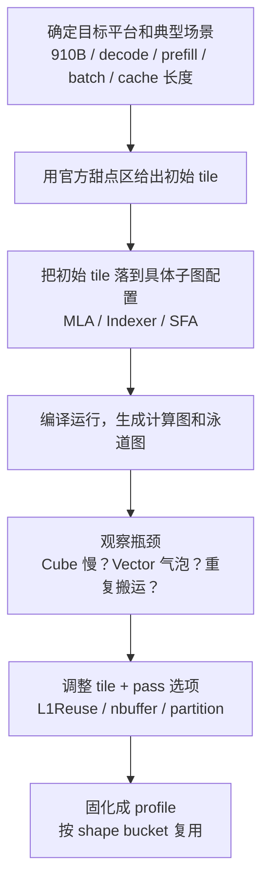

# DeepSeek 适配 910B 芯片时，Tiling 是怎样一步步确定的

这篇笔记想回答一个很具体、也很容易被误解的问题：当开发者把 DeepSeek 这类大模型适配到 910B 芯片上时，`tiling` 到底是怎么定出来的？

很多人第一次接触这个话题时，会自然地认为 tiling 就像一个简单参数，只要根据芯片规格套个公式就能算出来。这个理解不能说完全错，但它只适用于很小的一部分场景。对于 DeepSeek 这种真实的大模型算子，tiling 不是一个孤立的数字，而是一整套和芯片规格、输入 shape、子图切分、缓存复用、编译策略一起联动的执行策略。

更准确地说，开发者在 910B 上做 DeepSeek 适配时，通常不是"给整个模型定一套 tile"，而是把模型拆成几个关键子图，例如 MLA Prolog、Lightning Indexer Prolog、Sparse Flash Attention，然后为不同场景分别准备一组 tiling profile。`decode` 和 `prefill` 不一样，`batch=4, s1=2, s2=64k` 和 `batch=128, s1=4, s2=8k` 也不一样。最终部署时，系统按场景选用对应的 profile。

## 1. 先理解：tiling 在这里不是"模型参数"，而是"执行策略参数"

如果把大模型比作一条很长的生产线，那么 `token_x`、权重、KV cache 这些 tensor 是原料，算子是工位，而 tiling 更像"每次上多少料、切成多大一块、先送到哪个缓冲区、每个工位并行处理多少块"的排产方案。

因此，tiling 不决定数学上"算什么"，它决定工程上"怎么在这颗芯片上算得下、算得对、算得快"。

对于 PyPTO/CANN 这套体系，最常见的两类 tile 是：

- `Cube tile`：主要服务于 matmul 这类矩阵计算。
- `Vector tile`：主要服务于 norm、rope、dequant、cast、softmax、gather、scatter 这类向量或逐元素计算。

在接口层，官方文档把 matmul 的 tile 约定得很清楚：

```python
pypto.set_cube_tile_shapes(m, k, n, enable_multi_data_load=False, enable_split_k=False)
```

其中 `m / k / n` 对应的是 M、K、N 三个维度在 `L0` 和 `L1` 上的切分大小。对 DeepSeek 这类模型来说，很多看起来神秘的六元数组，本质上都只是这三个维度的展开写法：

```text
[mL0, mL1, kL0, kL1, nL0, nL1]
```

例如：

```python
q_linear=[16, 16, 512, 512, 128, 128]
```

就可以读成：

```text
M 方向切得较小
K 方向切得较大
N 方向切得中等
```

这很符合 DeepSeek 推理算子的常见特点：token 轴通常不大，但特征维和 cache 相关维度很大。

## 2. 为什么 910B 的具体规格，会直接影响 tiling

如果只从产品页面看，910B 这一代可以抓住几个对开发者最重要的事实：它是 A2 这一代的核心芯片形态，常见部署形态是 `8 x 64GB` 单机，支持 `BF16/FP16` 和 `INT8` 的高吞吐推理。对于大模型来说，这决定了能不能放得下、tp 要怎么切、量化是否必要。

如果进一步看编译器视角的本地平台配置，PyPTO 仓库里的 [`Ascend910B1.ini`](https://gitcode.com/cann/pypto/blob/master/framework/tests/ut/machine/stubs/compiler/data/platform_config/Ascend910B1.ini) 给出了更接近调优侧的参数：

```text
Cube Core   = 24
Vector Core = 48
AI CPU      = 4
Memory      = 64 GiB
L2          = 192 MiB
L1          = 512 KB
UB          = 192 KB
cube_freq   = 1850 MHz
```

这些数字非常关键。因为 tiling 不是抽象地"切一切"，它要同时满足几类约束：

1. **对齐约束**：矩阵分型要求外轴 16 对齐、内轴 32 字节对齐。

2. **Buffer 空间约束**：tile 不能大到塞不进 `L0A / L0B / L0C / L1 / UB`。

3. **并行度约束**：tile 太大，任务数不够，24 个 Cube Core 吃不满；tile 太小，又会带来大量重复搬运。

4. **带宽和复用约束**：L2、L1、UB 的命中情况不同，重复搬运代价也不同。

这也是为什么官方文档会强调，tiling 既要满足空间约束，又要兼顾算数强度、带宽利用率和分核数。参见：[`pypto-set_cube_tile_shapes.md`](https://gitcode.com/cann/pypto/blob/master/docs/api/config/pypto-set_cube_tile_shapes.md)、[`matmul_performance_guide.md`](https://gitcode.com/cann/pypto/blob/master/docs/tutorials/debug/matmul_performance_guide.md)

## 3. DeepSeek 开发者不是直接"算最优解"，而是先定义代表场景

真实部署里，最先确定的往往不是 tile，而是"我要优化哪一类请求"。

这是因为 DeepSeek 的不同阶段，问题规模差异很大。

| 场景 | 特征 | 瓶颈倾向 |
|------|------|---------|
| `decode` | token 数 `t` 小，KV cache 长，单次计算量小 | 搬运 bound |
| `prefill` | token 数多，matmul 更重 | compute bound |

因此，开发者通常先把线上会出现的请求分成若干 shape bucket，再分别调每一类 bucket。

例如在 [`deepseekv32_lightning_indexer_prolog_quant.py`](https://gitcode.com/cann/pypto/blob/master/models/deepseek_v32_exp/deepseekv32_lightning_indexer_prolog_quant.py) 里，小 batch、长 cache 的一组配置是：

```python
configs = IndexerPrologQuantConfigs(
    q_linear=[16, 16, 512, 512, 128, 128],
    q_hd=[32, 32, 128, 128, 128, 128],
    k_linear=[16, 16, 512, 512, 64, 64],
    w_linear=[16, 16, 1024, 1024, 32, 32],
    unroll_list=[32, 16, 8, 4, 2, 1],
    cube_l1_reuse_setting={1: 4},
    mg_copyin_upper_bound=2 * 1024 * 1024,
    pg_upper_bound=8192,
    block_size=128,
    t_sub_tile=1,
    chunk_size=2,
    vec_nbuffer_mode=0,
)
```

而大 batch 场景，会切换成：

```python
configs = IndexerPrologQuantConfigs(
    q_linear=[128, 128, 256, 256, 256, 256],
    q_hd=[128, 128, 64, 64, 128, 128],
    k_linear=[64, 64, 256, 256, 128, 128],
    w_linear=[32, 32, 512, 512, 64, 64],
    unroll_list=[128, 64, 32, 16, 8, 4, 2, 1],
    cube_l1_reuse_setting={1: 4, 3: 4},
    mg_copyin_upper_bound=2 * 1024 * 1024,
    pg_upper_bound=8192,
    block_size=128,
    t_sub_tile=2,
    chunk_size=1,
    vec_nbuffer_mode=0,
)
```

两组配置都不是"错"或"对"，它们只是适合不同的 workload。

## 4. 开发者定 tiling 的真实流程

把官方文档、官方样例和本地实现放在一起看，DeepSeek 适配 910B 时，开发者大致会按下面这条流程工作：



### 4.1 第一步：先用官方甜点区拿到"开箱可跑"的初始值

官方不要求开发者从零猜。相反，它先给出几组相对稳妥的起点。

例如 matmul 性能指南里，A2/A3 平台上 BF16/FP16 的常见起点包括：

```python
pypto.set_cube_tile_shapes([128, 128], [64, 256], [256, 256], enable_multi_data_load=True, enable_split_k=False)
pypto.set_cube_tile_shapes([256, 256], [64, 256], [128, 128], enable_multi_data_load=True, enable_split_k=False)
pypto.set_cube_tile_shapes([128, 128], [128, 512], [128, 128], enable_multi_data_load=True, enable_split_k=False)
```

这些配置背后的逻辑是：

- 尽量提高算数强度
- 尽量让 L0/L1 利用率高
- 尽量让 double buffer 和大包搬运可用
- 让 24 核平台有机会吃满

同样地，官方性能调优文档也给了 vector tile 的常见经验：单个 vector tile 大小大致控制在 `16KB–64KB`，尾轴满足 `32B` 对齐。参见：[`performance.md`](https://gitcode.com/cann/pypto/blob/master/docs/tutorials/debug/performance.md)

### 4.2 第二步：把"甜点区"翻译成 DeepSeek 子图自己的 tile 配置

DeepSeek 不是一个大而平的 graph，而是很多不同性质的子图。在官方样例里，至少能清楚看到三类配置结构体：

| 子图 | 配置结构体 | 源码 |
|------|-----------|------|
| MLA Prolog | `MlaTileConfig` | [`mla_prolog_quant_impl.py`](https://gitcode.com/cann/pypto/blob/master/models/deepseek_v32_exp/mla_prolog_quant_impl.py) |
| Lightning Indexer Prolog | `IndexerPrologQuantConfigs` | [`lightning_indexer_prolog_quant_impl.py`](https://gitcode.com/cann/pypto/blob/master/models/deepseek_v32_exp/lightning_indexer_prolog_quant_impl.py) |
| Sparse Flash Attention | `SaTileShapeConfig` | [`sparse_flash_attention_quant_impl.py`](https://gitcode.com/cann/pypto/blob/master/models/deepseek_v32_exp/sparse_flash_attention_quant_impl.py) |

例如在融合版 MLA + Indexer Prolog 的样例中，`decode` 小 `t` 场景会设置：

```python
mla_tile_config.tile_bs = 8
mla_tile_config.pre_quant_cube_tile = [16, 16, 256, 256, 128, 128]
mla_tile_config.q_vec_tile0 = 1
mla_tile_config.q_vec_tile1 = 32
mla_tile_config.k_vec_tile0 = 2
mla_tile_config.k_vec_tile1 = 512
mla_tile_config.unroll_list = [8, 4, 2, 1]
```

而 `prefill` 场景则会更倾向于：

```python
mla_tile_config.tile_bs = 16
mla_tile_config.pre_quant_cube_tile = [16, 16, 256, 256, 128, 128]
mla_tile_config.q_vec_tile0 = 32
mla_tile_config.q_vec_tile1 = 128
mla_tile_config.k_vec_tile0 = 32
mla_tile_config.k_vec_tile1 = 512
mla_tile_config.cube_l1_reuse_setting = {0: 2, 1: 1, 2: 1, 3: 4, 4: 4, 5: 1}
mla_tile_config.unroll_list = [32, 16, 8, 4, 2, 1]
```

差异本质上是在响应两种完全不同的 workload。

### 4.3 第三步：跑真实 case，真正看瓶颈在哪里

到了这一步，开发者才开始进入真正的"调优"。官方推荐先打开调试开关，跑出计算图和泳道图，再根据泳道图看瓶颈在哪里。参见：[`performance.md`](https://gitcode.com/cann/pypto/blob/master/docs/tutorials/debug/performance.md)

这里最重要的认识是：**tiling 不是只影响单个 op 的耗时，它还会影响编译器如何切分和合并子图。**

## 5. 为什么 tile 会反过来影响"子图分割"

如果只从字面理解，tile 好像只是"算子内部切块大小"。但在 PyPTO 这套体系里，tile 还会影响：

- 哪些 op 会被认为是同构、可合并
- 子图切得细还是粗
- 是否能触发 `L1ReuseMerge`、`NBufferMerge` 这类 pass
- 最终泳道图里任务是更连续还是更稀疏

在 [`performance_case_quantindexerprolog.md`](https://gitcode.com/cann/pypto/blob/master/docs/tutorials/debug/performance_case_quantindexerprolog.md) 里，官方明确指出：

1. 反量化和 RoPE 没有合并到同一子图，导致 vector 任务又多又稀疏，出现大量气泡。根本原因是 `TileShape` 设置不合理。
2. 通过调整相关计算中的 tile，使相关计算的 tile 保持一致，pass 就会把这些计算切到同样一个同构子图中。
3. 打开 `L1Reuse` 以后，一些原本分散的 cube 子图会被合并，从而减少右矩阵重复搬运。

tile 至少影响两层：

| 层级 | 影响范围 |
|------|---------|
| 微观执行效率 | 单个 matmul / rope / dequant 在单个 tile 上的速度 |
| 图结构形态 | 编译器最终生成几个子图、每个子图大小、子图之间气泡、是否能做复用合并 |

因此 tiling 对开发者来说，是一个同时改写以下五项的联合控制杆：

```text
算子内部切块方式
+ 子图切分边界
+ 子图合并机会
+ 数据搬运次数
+ 最终泳道图形态
```

## 6. 真实例子：QuantIndexerProlog 是怎样一步步调出来的

官方的 QuantIndexerProlog 性能优化案例非常适合用来理解"tiling 具体怎么定"。

典型场景：

```text
Batch = 4
MTP   = 1
KV Cache 长度 = 64k
```

官方给出的第一结论不是"算力不够"，而是：

> 计算量较小，不会打满所有核，**性能瓶颈在搬运上**

既然是搬运 bound，就意味着不能只盯着 FLOPS，而要优先看：

- vector 子图有没有碎片化
- 右矩阵有没有重复搬运
- L1/L2 复用够不够

调优路径分三轮：

| 轮次 | 调整对象 | 目标 |
|------|---------|------|
| 第一轮 | vector tile | 让反量化和 RoPE 使用兼容 tile，方便 pass 合并进同一同构子图，减少任务数和调度空隙 |
| 第二轮 | cube tile | 因为 `m=8`，默认 `[128,128]` 非最优；将 `m` 方向切到 16，`k` 拉到 512/1024，`n` 调成 64/32 |
| 第三轮 | 打开 L1Reuse | 合并有重复 GM→L1 搬运的 cube 子图，减少右矩阵重复搬运 |

用产品经理能理解的话描述：

```text
先把零散的小工序拼成更连续的大工序
再把最重的矩阵乘切得更符合当前这批数据
最后让能复用的原料尽量不要重复搬运
```

## 7. Sparse Flash Attention 的 tile 又在调什么

很多人容易把 tiling 理解成"只调 matmul 的 M/K/N"。但在 DeepSeek 的 attention 子图里，tile 还会控制另外两类节奏：

- 一次处理多少个 query group
- 一次处理多少个 key/value 位置

在 [`deepseekv32_sparse_flash_attention_quant.py`](https://gitcode.com/cann/pypto/blob/master/models/deepseek_v32_exp/deepseekv32_sparse_flash_attention_quant.py) 的样例里，官方给出的配置是：

```python
tile_config = SaTileShapeConfig(
    g_tile=128,
    s_kv_tile=2048,
    c1_tile_shape=[128, 128, 128, 128, 128, 128],
    v1_tile_shape=[8, 2048],
    c2_tile_shape=[128, 128, 128, 128, 128, 128],
    v2_tile_shape=[64, 128]
)
```

各字段含义：

| 字段 | 含义 |
|------|------|
| `g_tile` | 一次处理多少个 group |
| `s_kv_tile` | 一次处理多少个 key/value token |
| `c1_tile_shape` | 第一段 matmul 的 cube tile |
| `v1_tile_shape` | softmax 相关 vector tile |
| `c2_tile_shape` | 第二段 matmul 的 cube tile |
| `v2_tile_shape` | flash attention 更新段的 vector tile |

attention 的 tiling 本质是在调"数据推进节奏"，它既影响单段 matmul，也影响 top-k sparse attention 在长 cache 上的整体搬运方式。

## 8. 为什么最后会形成"多套 profile"，而不是"一套万能 tile"

PyPTO 前端生成编译缓存 key 时，会把非 tensor 参数一起放进去，而文档和代码都明确举了 `tiling` 作为典型例子。参见：[`entry.py`](https://gitcode.com/cann/pypto/blob/master/python/pypto/frontend/parser/entry.py)

这意味着：

```text
不同 tiling → 通常对应不同的编译结果
```

所以真实工程里，开发者做的不是：

```text
找一个适合所有 shape 的通用 tile
```

而是：

```text
为若干典型 shape bucket 各自固化一组 profile
运行时按场景命中 profile
```

你在代码里看到的多套 `q_linear / k_linear / w_linear / unroll_list / reuse_setting`，本质上就是多套 profile。

## 9. 能不能让 AI "自动算出最优 tiling"

答案不是简单的"能"或"不能"。

- **能做到**："AI 能不能大幅自动化 tiling，在很多场景里比人工调得更好？" → 完全可以，而且这很可能是未来主流。

- **难以做到**："能不能只靠一个闭式公式，一次性算出 DeepSeek 全部 kernel、全部场景、连带子图切分和调度一起的全局最优解？" → 很难。

原因在于，这里的优化问题同时包含：

- 硬件约束
- 编译器切分和合并行为
- 动态 shape
- cache 长度变化
- pass 触发条件
- 调度顺序
- 子图依赖关系

tile 一变，子图边界都可能跟着变。因此它通常不是"一个公式解出来"，而更像：

```text
解析模型
+ 编译器行为模型
+ 代价模型
+ 少量真实 profiling 反馈
+ 搜索或学习
```

联合工作后的结果。

事实上，PyPTO 本地实现里已经能看到"自动 tiling"的雏形：

- [`set_heuristic_tile_shapes.cpp`](https://gitcode.com/cann/pypto/blob/master/framework/src/passes/tensor_graph_pass/set_heuristic_tile_shapes.cpp) 会枚举和打分候选 tile
- [`derivation_tile_shape.cpp`](https://gitcode.com/cann/pypto/blob/master/framework/src/passes/tensor_graph_pass/derivation_tile_shape.cpp) 会做 tile 的推导与传播

这说明官方实现层面的思路也不是"纯人工拍脑袋"，而是"规则 + 启发式 + 人工调优"。

更准确的结论：

```text
AI 当然可以自动做 tiling
但最终输出物更可能是"按场景分桶的一组近优 profile"
而不是"一个万能的全局公式"
```

## 10. 最后，把整件事压缩成一句业务结论

**DeepSeek 适配 910B 时，tiling 不是单个算子的局部参数，而是同时影响算子切块、子图分割、数据复用和最终性能的一组场景化执行策略。**

真实工程里的工作方式通常是：

```text
先按目标场景分 bucket
再给每个关键子图选一组起始 tile
跑图、看泳道图、改 tile 和 pass
最后固化成 profile
```

## 参考资料

| 资源 | 链接 |
|------|------|
| PyPTO 官方总览 | [README.md](https://gitcode.com/cann/pypto/blob/master/README.md) |
| `pypto.set_cube_tile_shapes` API | [pypto-set_cube_tile_shapes.md](https://gitcode.com/cann/pypto/blob/master/docs/api/config/pypto-set_cube_tile_shapes.md) |
| Matmul 高性能编程指南 | [matmul_performance_guide.md](https://gitcode.com/cann/pypto/blob/master/docs/tutorials/debug/matmul_performance_guide.md) |
| 性能调优总览 | [performance.md](https://gitcode.com/cann/pypto/blob/master/docs/tutorials/debug/performance.md) |
| QuantIndexerProlog 性能优化案例 | [performance_case_quantindexerprolog.md](https://gitcode.com/cann/pypto/blob/master/docs/tutorials/debug/performance_case_quantindexerprolog.md) |
| DeepSeek V3.2 EXP README | [README.md](https://gitcode.com/cann/pypto/blob/master/models/deepseek_v32_exp/README.md) |
| MLA Prolog 样例 | [mla_prolog_quant_impl.py](https://gitcode.com/cann/pypto/blob/master/models/deepseek_v32_exp/mla_prolog_quant_impl.py) |
| Lightning Indexer Prolog 样例 | [lightning_indexer_prolog_quant_impl.py](https://gitcode.com/cann/pypto/blob/master/models/deepseek_v32_exp/lightning_indexer_prolog_quant_impl.py) |
| Sparse Flash Attention 样例 | [sparse_flash_attention_quant_impl.py](https://gitcode.com/cann/pypto/blob/master/models/deepseek_v32_exp/sparse_flash_attention_quant_impl.py) |
| DeepSeek 融合样例 | [deepseekv32_mla_indexer_prolog_quant.py](https://gitcode.com/cann/pypto/blob/master/models/deepseek_v32_exp/deepseekv32_mla_indexer_prolog_quant.py) |
| Lightning Indexer Prolog 量化样例 | [deepseekv32_lightning_indexer_prolog_quant.py](https://gitcode.com/cann/pypto/blob/master/models/deepseek_v32_exp/deepseekv32_lightning_indexer_prolog_quant.py) |
| 910B 平台配置（编译器视角） | [Ascend910B1.ini](https://gitcode.com/cann/pypto/blob/master/framework/tests/ut/machine/stubs/compiler/data/platform_config/Ascend910B1.ini) |
| 启发式 tiling pass | [set_heuristic_tile_shapes.cpp](https://gitcode.com/cann/pypto/blob/master/framework/src/passes/tensor_graph_pass/set_heuristic_tile_shapes.cpp) |
| Tile 推导 pass | [derivation_tile_shape.cpp](https://gitcode.com/cann/pypto/blob/master/framework/src/passes/tensor_graph_pass/derivation_tile_shape.cpp) |
| 编译缓存 key 生成 | [entry.py](https://gitcode.com/cann/pypto/blob/master/python/pypto/frontend/parser/entry.py) |
